# The Battle of Cannae: The Double Envelopment (សមរភូមិកានណៃ និងយុទ្ធសាស្ត្រឡោមព័ទ្ធ)

**Author:** ichamrong
**Date:** 2026-05-23
**Tags:** #history #war #strategy #hannibal #rome #cannae
**Category:** Wars & Histories
**Read Time:** ~10 min

---

## 📌 Table of Contents
- [១. បរិបទនៃសង្គ្រាម (Context of the War)](#១-បរិបទនៃសង្គ្រាម-context-of-the-war)
- [២. យុទ្ធសាស្ត្រ៖ ការឡោមព័ទ្ធទ្វេដង (The Strategy: Double Envelopment)](#២-យុទ្ធសាស្ត្រ-ការឡោមព័ទ្ធទ្វេដង-the-strategy-double-envelopment)
- [៣. ការប្រើប្រាស់យុទ្ធសាស្ត្រនេះឡើងវិញក្នុងប្រវត្តិសាស្ត្រ (Reused in History)](#៣-ការប្រើប្រាស់យុទ្ធសាស្ត្រនេះឡើងវិញក្នុងប្រវត្តិសាស្ត្រ-reused-in-history)
- [References](#references)

---

## ១. បរិបទនៃសង្គ្រាម (Context of the War)

**សមរភូមិកានណៃ (The Battle of Cannae)** កើតឡើងនៅឆ្នាំ ២១៦ មុនគ្រឹស្តសករាជ នៅក្នុងសង្គ្រាម Punic លើកទី២ រវាងចក្រភពរ៉ូម (Rome) និងកងទ័ពកាតាច (Carthage) ដែលដឹកនាំដោយមេទ័ពដ៏ឆ្នើមបំផុតម្នាក់ក្នុងប្រវត្តិសាស្ត្រឈ្មោះ **ហានីបល (Hannibal Barca)**។

ហានីបល បានដឹកនាំកងទ័ពនិងដំរីសឹក ឆ្លងកាត់ភ្នំអាល់ (Alps) ចូលទៅវាយប្រហារដល់បេះដូងនៃប្រទេសអ៊ីតាលី។ ដើម្បីបញ្ឈប់ការឈ្លានពាននេះ ចក្រភពរ៉ូមបានប្រមូលកងទ័ពដ៏ធំបំផុតរបស់ខ្លួនចំនួនជិត **៨៦,០០០ នាក់** ខណៈដែលកងទ័ពរបស់ហានីបល មានត្រឹមតែប្រហែល **៥០,០០០ នាក់** ប៉ុណ្ណោះ។ កងទ័ពរ៉ូម មានជំនឿចិត្តយ៉ាងមុតមាំថានឹងអាចកម្ទេចសត្រូវដោយប្រើប្រាស់ "កម្លាំងបុកទម្លុះចំកណ្តាល" ដោយសារពួកគេមានចំនួនទាហានច្រើនជាងជិតទ្វេដង។

---

## ២. យុទ្ធសាស្ត្រ៖ ការឡោមព័ទ្ធទ្វេដង (The Strategy: Double Envelopment)

ទោះបីជាមានទាហានតិចជាងក៏ដោយ ហានីបលបានរៀបចំទម្រង់ទ័ពយ៉ាងឆ្លាតវៃបំផុត។ យុទ្ធសាស្ត្រនេះត្រូវបានគេហៅថា **ការឡោមព័ទ្ធទ្វេដង ឬចលនាដង្កៀប (Pincer Movement / Double Envelopment)**។

**របៀបដែលយុទ្ធសាស្ត្រនេះដំណើរការ៖**
1. **ទម្រង់កោងចេញក្រៅ (The Convex Center):** ហានីបលបានដាក់ទាហានខ្សោយៗ (ទាហានស៊ីឈ្នួល) នៅកណ្តាល ហើយរៀបជាទម្រង់កោងបាញ់ទៅរកសត្រូវ ខណៈដែលទាហានឆ្នើមៗ (ទាហានជើងចាស់អាហ្វ្រិក) និងកងទ័លសេះ ត្រូវដាក់នៅសងខាងស្លាប (Flanks)។
2. **ការដកថយបែបបញ្ឆោត (Controlled Retreat):** នៅពេលកងទ័ពរ៉ូម ដែលមានទាហានច្រើនជាង បានវាយសម្រុកចំកណ្តាលយ៉ាងសន្ធាប់ ហានីបលបានបញ្ជាឱ្យទាហានកណ្តាលរបស់ខ្លួន **"ដកថយបន្តិចម្តងៗ"** ចូលទៅខាងក្រោយ ប៉ុន្តែមិនឱ្យបែកជួរឡើយ។ 
3. **រ៉ូមធ្លាក់ចូលក្នុងអន្ទាក់ (Falling into the Trap):** កងទ័ពរ៉ូមគិតថាខ្លួនកំពុងឈ្នះ ក៏រឹតតែរុញច្រានទៅមុខយ៉ាងជ្រៅ។ ពេលនោះ ទម្រង់កោងចេញក្រៅរបស់ហានីបល បានប្រែទៅជាទម្រង់កោងចូលក្នុង (Concave) រាងដូចអក្សរ U ដោយរុំព័ទ្ធកងទ័ពរ៉ូមពីកណ្តាល។
4. **ការបិទទ្វារ (Closing the Pincers):** ស្របពេលជាមួយគ្នានោះ កងទ័លសេះរបស់ហានីបលនៅសងខាងស្លាប បានវាយកម្ទេចកងទ័លសេះរបស់រ៉ូម ហើយបំបែកខ្លួនទៅវាយបិទពីខាងក្រោយកងទ័ពរ៉ូម។ កងទ័ពរ៉ូមជិត ៨ ម៉ឺននាក់ ត្រូវបានឡោមព័ទ្ធជុំជិតគ្រប់ទិសទី (គ្មានផ្លូវរត់) និងត្រូវបានកាប់សម្លាប់យ៉ាងសាហាវបំផុត។ រ៉ូមបាត់បង់ទាហានជាង ៥០,០០០ នាក់ក្នុងមួយថ្ងៃ ដែលជាការចាញ់សង្គ្រាមដ៏អាម៉ាស់បំផុតក្នុងប្រវត្តិសាស្ត្ររបស់ខ្លួន។

```mermaid
graph TD
    A["កងទ័ពរ៉ូម (Rome)<br/>ទាហាន ៨៦,០០០ នាក់"] -->|"វាយសម្រុកចំកណ្តាល"| B["កងទ័ពកណ្តាលរបស់ហានីបល<br/>ដកថយបន្តិចម្តងៗបញ្ឆោតសត្រូវ"]
    
    C["កងទ័ពស្លាបឆ្វេង<br/>(ទ័ពសេះកាតាច)"] -->|"វាយបិទពីចំហៀង<br>និងខាងក្រោយ"| A
    D["កងទ័ពស្លាបស្តាំ<br/>(ទ័ពសេះកាតាច)"] -->|"វាយបិទពីចំហៀង<br>និងខាងក្រោយ"| A
    
    B --> E["រ៉ូមធ្លាក់ចូលក្នុងរង្វង់<br/>អក្សរ U (ឡោមព័ទ្ធជុំជិត)"]
    C --> E
    D --> E
    
    E -->|"គ្មានផ្លូវរត់<br>ទាហានរ៉ូមត្រូវបានសម្លាប់<br>រង្គាល ៥០,០០០ នាក់"| F["កាតាចទទួលជ័យជម្នះ<br/>(Double Envelopment)"]
    
    style A fill:#e74c3c,color:#fff
    style B fill:#34495e,color:#fff
    style C fill:#f39c12,color:#fff
    style D fill:#f39c12,color:#fff
    style E fill:#8e44ad,color:#fff
    style F fill:#27ae60,color:#fff
```

---

## ៣. ការប្រើប្រាស់យុទ្ធសាស្ត្រនេះឡើងវិញក្នុងប្រវត្តិសាស្ត្រ (Reused in History)

យុទ្ធសាស្ត្រ "ឡោមព័ទ្ធទ្វេដង" របស់ហានីបល ត្រូវបានចាត់ទុកថាជា **"សិល្បៈសង្គ្រាមដ៏ល្អឥតខ្ចោះបំផុត (The Perfect Tactical Battle)"** ដែលមេទ័ពគ្រប់រូបប្រាថ្នាចង់ធ្វើតាម។ យុទ្ធសាស្ត្រនេះត្រូវបានគេយកមកប្រើប្រាស់ឡើងវិញជាច្រើនដងនៅក្នុងប្រវត្តិសាស្ត្រ៖

*   **សង្គ្រាមលោកលើកទី១ (សមរភូមិ តាន់ណេនបឺគ - Battle of Tannenberg, ១៩១៤):** មេទ័ពអាល្លឺម៉ង់ Paul von Hindenburg បានចម្លងយុទ្ធសាស្ត្រកានណៃទាំងស្រុង ដើម្បីប្រើប្រឆាំងនឹងកងទ័ពរុស្ស៊ី។ អាល្លឺម៉ង់មានកងទ័ពតិចជាង ប៉ុន្តែបានដកថយចំកណ្តាល រួចវាយកៀបពីសងខាងស្លាប ធ្វើឱ្យកងទ័ពរុស្ស៊ីជាង ១៥០,០០០ នាក់ត្រូវឡោមព័ទ្ធនិងចាប់ខ្លួនកម្ទេចចោល។
*   **សង្គ្រាមលោកលើកទី២ (យុទ្ធសាស្ត្រផ្លេកបន្ទោរ - Blitzkrieg):** កងទ័ពអាល្លឺម៉ង់ក្រោមការដឹកនាំរបស់ហ៊ីត្លែរ បានប្រើប្រាស់រថក្រោះ Panzer ជា "ទ័ពសេះ" ដើម្បីវាយកៀបសងខាង (Pincer) ឡោមព័ទ្ធកងទ័ពសូវៀតរាប់សែននាក់ នៅក្នុងសមរភូមិ Kyiv និងសមរភូមិដទៃទៀត។ 
*   **សមរភូមិ ខាវប៉ែន (Battle of Cowpens, ១៧៨១):** ក្នុងសង្គ្រាមទាមទារឯករាជ្យអាមេរិក មេទ័ពអាមេរិក Daniel Morgan បានឱ្យទាហានព្រៃរបស់ខ្លួនបាញ់បញ្ឆោតហើយរត់ ដើម្បីទាក់ទាញកងទ័ពអង់គ្លេសឱ្យរត់តាមចូលក្នុងអន្ទាក់ មុនពេលទ័ពស្រួចវាយកៀបពីសងខាង បង្កើតបានជាជ័យជម្នះដ៏សំខាន់សម្រាប់អាមេរិក។

---

## References

*   **The Histories by Polybius** — Provides a detailed contemporary account of the Punic Wars and Hannibal's tactics at Cannae.
*   **Achtung - Panzer! by Heinz Guderian** — Explores how modern armored warfare and Blitzkrieg were directly influenced by the ancient encirclement tactics.

---

*Last updated: 2026-05-23*
