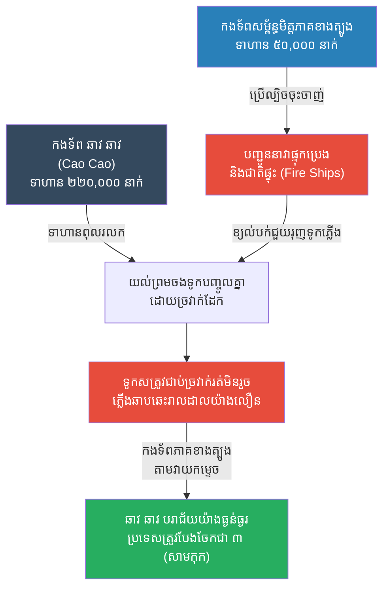

# The Battle of Red Cliffs: Fire & Deception (សមរភូមិក្រហមឆ្អៅ និងយុទ្ធសាស្ត្រនាវាភ្លើង)

**Author:** ichamrong
**Date:** 2026-05-23
**Tags:** #history #war #strategy #three-kingdoms #chibi
**Category:** Wars & Histories
**Read Time:** ~10 min

---

## 📌 Table of Contents
- [១. បរិបទនៃសង្គ្រាម (Context of the War)](#១-បរិបទនៃសង្គ្រាម-context-of-the-war)
- [២. យុទ្ធសាស្ត្រ៖ ចងទូក និងនាវាភ្លើង (The Strategy: Chained Ships & Fire)](#២-យុទ្ធសាស្ត្រ-ចងទូក-និងនាវាភ្លើង-the-strategy-chained-ships-fire)
- [៣. ការប្រើប្រាស់យុទ្ធសាស្ត្រនេះឡើងវិញក្នុងប្រវត្តិសាស្ត្រ (Reused in History)](#៣-ការប្រើប្រាស់យុទ្ធសាស្ត្រនេះឡើងវិញក្នុងប្រវត្តិសាស្ត្រ-reused-in-history)
- [References](#references)

---

## ១. បរិបទនៃសង្គ្រាម (Context of the War)

**សមរភូមិក្រហមឆ្អៅ (The Battle of Red Cliffs / Chibi)** គឺជាសមរភូមិផ្លូវទឹកដ៏ធំបំផុតនៅក្នុងប្រវត្តិសាស្ត្រចិន កើតឡើងនៅឆ្នាំ ២០៨ នៃគ្រឹស្តសករាជ (ចុងសម័យរាជវង្សហាន មុនឈានចូលសម័យសាមកុក ឬ Three Kingdoms)។

មេទ័ពដ៏មានអំណាច **ឆាវ ឆាវ (Cao Cao)** បានដឹកនាំកងទ័ពជាង ៨ សែននាក់ (អ្នកប្រវត្តិសាស្ត្រប៉ាន់ស្មានថាមានប្រហែល ២២ ម៉ឺននាក់) ធ្វើដំណើរតាមដងទន្លេយ៉ាងហ្សេ (Yangtze River) ដើម្បីកម្ចាត់កងទ័ពសម្ព័ន្ធមិត្តភាគខាងត្បូងរបស់ **ស៊ុន ឈាន (Sun Quan)** និង **លីវ ប៉ី (Liu Bei)** ដែលមានទាហានត្រឹមតែ ៥ ម៉ឺននាក់ប៉ុណ្ណោះ។ 
ទោះបីជាមានទាហានតិចតួច ប៉ុន្តែកងទ័ពសម្ព័ន្ធមិត្តមានមេទ័ព និងទីប្រឹក្សាដ៏ឆ្លាតវៃបំផុត គឺលោក **ជូវ យី (Zhou Yu)** និង **ជូកឺ លៀង ឬ ខុងម៉េង (Zhuge Liang)**។

---

## ២. យុទ្ធសាស្ត្រ៖ ចងទូក និងនាវាភ្លើង (The Strategy: Chained Ships & Fire)

បញ្ហារបស់កងទ័ព ឆាវ ឆាវ គឺពួកគេភាគច្រើនជាទាហានជើងគោកមកពីភាគខាងជើង មិនចេះច្បាំងលើទឹក និងតែងតែពុលរលកទូក។

**របៀបដែលយុទ្ធសាស្ត្រនេះដំណើរការ៖**
1. **ល្បិចចងទូកបញ្ចូលគ្នា (The Chain Link Tactic):** ខុងម៉េង និង ជូវយី បានបញ្ជូនចារកម្ម (Pang Tong) ទៅបញ្ចុះបញ្ចូល ឆាវ ឆាវ ឱ្យចងទូកចម្បាំងទាំងអស់បញ្ចូលគ្នាដោយច្រវាក់ដែកធំៗ ដើម្បីកុំឱ្យទូកឃ្លេងឃ្លោង ជួយឱ្យទាហានភាគខាងជើងអាចដើរនិងប្រយុទ្ធលើទូកបានដូចនៅលើដីគោក។ ឆាវ ឆាវ គិតថាវាជាគំនិតល្អ ក៏យល់ព្រម។
2. **ការចុះចាញ់ក្លែងក្លាយ (Feigned Defection):** មេទ័ពចាស់របស់ជូវយី ឈ្មោះ **ហ័ង កាយ (Huang Gai)** បានធ្វើពុតជាឈ្លោះប្រកែកជាមួយជូវយី ហើយសុំចុះចាញ់ ឆាវ ឆាវ។ ឆាវ ឆាវ ជឿជាក់ដោយឥតសង្ស័យ។
3. **នាវាភ្លើង (The Fire Ships):** នៅយប់មួយដែលមានខ្យល់បក់ពីទិសអាគ្នេយ៍ (ខ្យល់អំណោយផលដល់ភាគខាងត្បូង) ហ័ង កាយ បានបើកទូកដែលផ្ទុកពេញទៅដោយប្រេង សម្បកឈើស្ងួត និងជាតិផ្ទុះ ធ្វើពុតជាទៅសុំចុះចាញ់ឆាវឆាវ។ ពេលទៅដល់ជិត ពួកគេបានដុតទូកទាំងនោះ រួចលោតចុះទូកតូចរត់គេចខ្លួន។
4. **សមុទ្រភ្លើង (Sea of Fire):** ទូកភ្លើងបានរសាត់ទៅបុកទូកចម្បាំងរបស់ ឆាវ ឆាវ ដែលជាប់ច្រវាក់គ្នាមិនអាចផ្តាច់ចេញទាន់ពេល។ ភ្លើងបានឆាបឆេះយ៉ាងសន្ធោសន្ធៅរាលដាលពាសពេញទន្លេ។ ទាហាន ឆាវ ឆាវ រាប់សែននាក់ត្រូវស្លាប់ដោយសារភ្លើងឆេះ លង់ទឹក និងការវាយឆ្មក់។

---

## ៣. ការប្រើប្រាស់យុទ្ធសាស្ត្រនេះឡើងវិញក្នុងប្រវត្តិសាស្ត្រ (Reused in History)

យុទ្ធសាស្ត្រ "នាវាភ្លើង (Fire Ships / Hellburners)" គឺជាវិធីសាស្ត្រដ៏មានប្រសិទ្ធភាពបំផុតនៅក្នុងការច្បាំងលើទឹក ជាពិសេសនៅពេលសត្រូវមានកងទ័ពជើងទឹកធំជាងខ្លួន។ វាត្រូវបានយកមកប្រើប្រាស់ឡើងវិញយ៉ាងអស្ចារ្យនៅក្នុងប្រវត្តិសាស្ត្រអឺរ៉ុប៖

*   **ការបរាជ័យនៃកងទ័ពជើងទឹកអេស្ប៉ាញ (The Spanish Armada, ១៥៨៨):** ប្រទេសអេស្ប៉ាញដែលជាមហាអំណាច បានបញ្ជូនកងទ័ពជើងទឹកដ៏ធំបំផុតរបស់ខ្លួន (Spanish Armada) ទៅលុកលុយប្រទេសអង់គ្លេស។ កងទ័ពអង់គ្លេសមានទូកតូចជាងនិងខ្សោយជាង។ នៅពាក់កណ្តាលអធ្រាត្រ នៅពេលកងទ័ពអេស្ប៉ាញកំពុងបោះយុថ្កា អង់គ្លេសបានដុតកប៉ាល់ចាស់ៗចំនួន ៨ គ្រឿង រួចបណ្តែតវាឱ្យសំដៅទៅរកកងទ័ពអេស្ប៉ាញ។ ភាពភ័យស្លន់ស្លោដោយសារ "នាវាភ្លើង" បានធ្វើឱ្យទាហានអេស្ប៉ាញកាត់ខ្សែយុថ្ការបស់ខ្លួន រត់ប្រសេចប្រសាចបុកគ្នាឯង ហើយទីបំផុតត្រូវខ្យល់ព្យុះនិងអង់គ្លេសវាយកម្ទេច។
*   **សមរភូមិ Gravelines (Battle of Gravelines):** គឺជាបន្តបន្ទាប់ពីការប្រើនាវាភ្លើង ដែលកងទ័ពអេស្ប៉ាញបាត់បង់ទម្រង់ការពារ (Formation) អនុញ្ញាតឱ្យអង់គ្លេសប្រើកាំភ្លើងធំវាយប្រហារយ៉ាងងាយស្រួល។ នេះគឺជាព្រឹត្តិការណ៍ដែលធ្វើឱ្យចក្រភពអង់គ្លេសក្លាយជាមហាអំណាចជើងទឹកជំនួសអេស្ប៉ាញ។
*   **ការប្រើប្រាស់ Hellburners របស់ហូឡង់ (១៥៨៥):** ជនជាតិហូឡង់បានប្រើប្រាស់កប៉ាល់តូចៗដាក់ពេញដោយគ្រឿងផ្ទុះ (គ្រាប់បែកអណ្តែតទឹក) ដើម្បីបំផ្លាញស្ពាននិងរារាំងការឡោមព័ទ្ធរបស់អេស្ប៉ាញនៅទីក្រុង Antwerp។

---

## References

*   **Records of the Three Kingdoms (Sanguozhi) by Chen Shou** — The definitive historical text detailing the events and strategies of the period.
*   **Romance of the Three Kingdoms by Luo Guanzhong** — The famous historical novel that dramatized the role of Zhuge Liang and the changing of the wind.

---

*Last updated: 2026-05-23*
