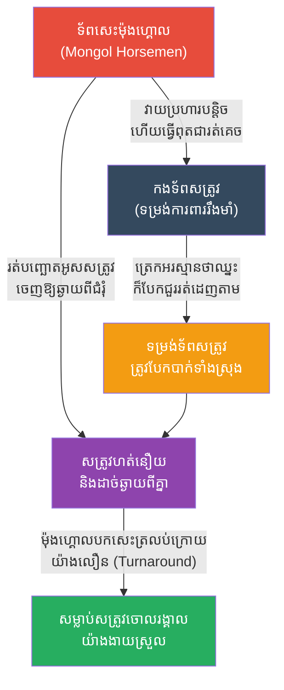

# The Mongol Conquests: The Feigned Retreat (សង្គ្រាមម៉ុងហ្គោល និងយុទ្ធសាស្ត្រដកថយបញ្ឆោត)

**Author:** ichamrong
**Date:** 2026-05-23
**Tags:** #history #war #strategy #mongol #genghis-khan
**Category:** Wars & Histories
**Read Time:** ~10 min

---

## 📌 Table of Contents
- [១. បរិបទនៃសង្គ្រាម (Context of the War)](#១-បរិបទនៃសង្គ្រាម-context-of-the-war)
- [២. យុទ្ធសាស្ត្រ៖ ការដកថយបញ្ឆោត (The Strategy: Feigned Retreat)](#២-យុទ្ធសាស្ត្រ-ការដកថយបញ្ឆោត-the-strategy-feigned-retreat)
- [៣. ការប្រើប្រាស់យុទ្ធសាស្ត្រនេះឡើងវិញក្នុងប្រវត្តិសាស្ត្រ (Reused in History)](#៣-ការប្រើប្រាស់យុទ្ធសាស្ត្រនេះឡើងវិញក្នុងប្រវត្តិសាស្ត្រ-reused-in-history)
- [References](#references)

---

## ១. បរិបទនៃសង្គ្រាម (Context of the War)

នៅសតវត្សទី១៣ ចក្រភពម៉ុងហ្គោល (Mongol Empire) ក្រោមការដឹកនាំរបស់ **ជិនហ្គីស ខាន់ (Genghis Khan)** បានវាយសញ្ជ័យបង្កើតចក្រភពដ៏ធំបំផុតនៅក្នុងប្រវត្តិសាស្ត្រមនុស្សជាតិ លាតសន្ធឹងពីមហាសមុទ្រប៉ាស៊ីហ្វិក រហូតដល់ទ្វីបអឺរ៉ុបខាងកើត។

កងទ័ពម៉ុងហ្គោលភាគច្រើនជា **ទ័ពសេះធ្នូ (Horse Archers)** ដែលមានចំនួនតិចជាងកងទ័ពសត្រូវជានិច្ច (ជាពិសេសពេលវាយប្រហារចិន ពែរ្ស និងអឺរ៉ុប)។ សត្រូវរបស់ម៉ុងហ្គោលច្រើនតែជាទាហានពាក់អាវក្រោះដែកធ្ងន់ៗ (Heavy Knights) និងទម្រង់ទ័ពថ្មើរជើងដ៏រឹងមាំ។ ដើម្បីយកឈ្នះសត្រូវដែលមានទម្រង់ការពាររឹងមាំនិងមានចំនួនច្រើន ម៉ុងហ្គោលបានប្រើប្រាស់ក្បាច់សង្គ្រាមចិត្តសាស្ត្រមួយដែលគេហៅថា "ការដកថយបញ្ឆោត"។

---

## ២. យុទ្ធសាស្ត្រ៖ ការដកថយបញ្ឆោត (The Strategy: Feigned Retreat)

**ការដកថយបញ្ឆោត (The Feigned Retreat)** គឺជាយុទ្ធសាស្ត្រដ៏មានប្រសិទ្ធភាពបំផុតរបស់ពួកម៉ុងហ្គោល ដែលទាមទារនូវវិន័យកងទ័ពកម្រិតខ្ពស់បំផុត ព្រោះបើធ្វេសប្រហែស ការដកថយក្លែងក្លាយ នឹងក្លាយទៅជាការរត់ចោលជួរពិតប្រាកដ។

**របៀបដែលយុទ្ធសាស្ត្រនេះដំណើរការ៖**
1. **ការវាយឆ្មក់ និងរត់ (Hit and Run):** ទ័ពសេះម៉ុងហ្គោលជិះចូលទៅក្បែរសត្រូវ បាញ់ព្រួញស្រោចដូចភ្លៀង រួចក៏ជិះរត់ចេញមកវិញយ៉ាងលឿន។
2. **ការធ្វើពុតជាភ័យខ្លាច (The Fake Panic):** បន្ទាប់ពីប្រយុទ្ធបានមួយសន្ទុះ កងទ័ពម៉ុងហ្គោលនឹងធ្វើពុតជាភ័យស្លន់ស្លោ បែកជួរ ហើយបំបោលសេះរត់គេចខ្លួន ដើម្បីទាក់ទាញសត្រូវឱ្យដេញតាម។
3. **ការបំបែកទម្រង់សត្រូវ (Breaking Enemy Formation):** ដោយសារឃើញម៉ុងហ្គោលរត់ សត្រូវ (ឧទាហរណ៍ កងទ័ពរុស្ស៊ី ឬអឺរ៉ុប) នឹងត្រេកអរ ដកទ័ពចេញពីទីតាំងការពាររបស់ខ្លួន ហើយបំបោលសេះដេញតាមដោយគ្មានសណ្តាប់ធ្នាប់ (អ្នកមានសេះលឿនរត់ទៅមុន អ្នកថ្មើរជើងរត់តាមក្រោយ)។
4. **ការបកក្រោយសម្លាប់ (The Turnaround/Parthian Shot):** ពេលសត្រូវរត់ដេញតាមហត់នឿយ ហើយទម្រង់ទ័ពបែកបាក់ខ្ទេចខ្ទីអស់ កងទ័ពម៉ុងហ្គោលដែលកំពុង "រត់គេច" នោះ នឹងបកសេះត្រលប់ក្រោយភ្លាមៗតែកមួយប៉ព្រិចភ្នែក (ដោយមានកងទ័ពបង្កប់ចាំជួយពីចំហៀងផង) ហើយបាញ់ព្រួញកម្ទេចសត្រូវដែលកំពុងរត់ដេញតាមនោះចោលទាំងអស់។

---

## ៣. ការប្រើប្រាស់យុទ្ធសាស្ត្រនេះឡើងវិញក្នុងប្រវត្តិសាស្ត្រ (Reused in History)

យុទ្ធសាស្ត្រដកថយបញ្ឆោតនេះ ត្រូវបានប្រើប្រាស់តាំងពីបុរាណកាលដោយពួកពែរ្ស (Parthian Shot) ប៉ុន្តែម៉ុងហ្គោលគឺជាអ្នកប្រើវាបានល្អឥតខ្ចោះបំផុត។ វាក៏ត្រូវបានមេទ័ពលោកខាងលិចលួចចម្លងយកទៅប្រើប្រាស់ និងផ្លាស់ប្តូរប្រវត្តិសាស្ត្រអឺរ៉ុបទាំងមូលផងដែរ៖

*   **សមរភូមិហេស្ទីង (Battle of Hastings, ១០៦៦):** នេះគឺជាសមរភូមិដែលផ្លាស់ប្តូរប្រវត្តិសាស្ត្រអង់គ្លេស។ ស្តេច William the Conqueror របស់បារាំង បានលើកទ័ពទៅវាយអង់គ្លេស។ កងទ័ពអង់គ្លេសមានប្រៀបជាងដោយឈរការពារនៅលើកូនភ្នំ (Shield Wall) ។ William វាយមិនឡើងសោះ ក៏បញ្ជាឱ្យទាហានខ្លួន "ធ្វើពុតជារត់ចុះពីលើភ្នំ"។ ទាហានអង់គ្លេសឃើញដូច្នេះ ក៏បំបែកទម្រង់រត់ដេញតាម។ ពេលចុះមកដល់ដីរាបស្មើ ទ័ពសេះរបស់បារាំងក៏បកក្រោយវាយកម្ទេចអង់គ្លេសទាល់តែឈ្នះសង្គ្រាម ហើយ William ក៏បានក្លាយជាស្តេចអង់គ្លេស។
*   **សង្គ្រាមឯករាជ្យរបស់ស្កុតឡែន (Battle of Bannockburn, ១៣១៤):** មេទ័ពស្កុតឡែន Robert the Bruce បានប្រើល្បិចប្រហាក់ប្រហែលគ្នានេះ ដើម្បីអូសទាញទ័ពសេះពាក់អាវក្រោះអង់គ្លេស ឱ្យធ្លាក់ចូលទៅក្នុងតំបន់ដីភក់ល្បាប់ មុនពេលវាយបកកម្ទេចអង់គ្លេស និងដណ្តើមបានឯករាជ្យជូនស្កុតឡែនវិញ។

---

## References

*   **The Secret History of the Mongols** — The oldest surviving Mongolian-language literary work, detailing the life, conquests, and strategies of Genghis Khan.
*   **Genghis Khan and the Making of the Modern World by Jack Weatherford** — A modern historical account of the Mongol tactics, emphasizing their disciplined use of the feigned retreat.

---

*Last updated: 2026-05-23*
