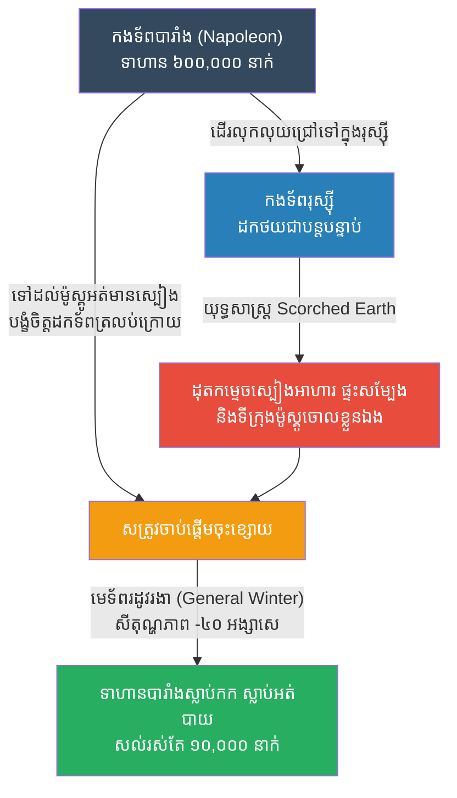

# The Russian Winter: Scorched Earth Strategy (រដូវរងានៅរុស្ស៊ី និងយុទ្ធសាស្ត្រដុតកម្ទេចចោល)

**Author:** ichamrong
**Date:** 2026-05-23
**Tags:** #history #war #strategy #napoleon #ww2 #scorched-earth
**Category:** Wars & Histories
**Read Time:** ~10 min

---

## 📌 Table of Contents
- [១. បរិបទនៃសង្គ្រាម (Context of the War)](#១-បរិបទនៃសង្គ្រាម-context-of-the-war)
- [២. យុទ្ធសាស្ត្រ៖ ដុតកម្ទេចចោល (The Strategy: Scorched Earth)](#២-យុទ្ធសាស្ត្រ-ដុតកម្ទេចចោល-the-strategy-scorched-earth)
- [៣. ការប្រើប្រាស់យុទ្ធសាស្ត្រនេះឡើងវិញក្នុងប្រវត្តិសាស្ត្រ (Reused in History)](#៣-ការប្រើប្រាស់យុទ្ធសាស្ត្រនេះឡើងវិញក្នុងប្រវត្តិសាស្ត្រ-reused-in-history)
- [References](#references)

---

## ១. បរិបទនៃសង្គ្រាម (Context of the War)

នៅឆ្នាំ ១៨១២ មេទ័ពដ៏ល្បីល្បាញបំផុតរបស់បារាំង គឺអធិរាជ **ណាប៉ូឡេអុង (Napoleon Bonaparte)** បានដឹកនាំកងទ័ពដ៏ធំបំផុតនៅក្នុងប្រវត្តិសាស្ត្រអឺរ៉ុបនាពេលនោះ (ហៅថា Grande Armée) ដែលមានទាហានជាង ៦០០,០០០ នាក់ ទៅលុកលុយចក្រភពរុស្ស៊ី។ ណាប៉ូឡេអុងមានជំនឿចិត្តយ៉ាងមុតមាំថា លោកនឹងអាចកម្ទេចកងទ័ពរុស្ស៊ីបានយ៉ាងងាយស្រួល ដូចដែលលោកធ្លាប់បានធ្វើកន្លងមកនៅទូទាំងទ្វីបអឺរ៉ុប។

ប៉ុន្តែរុស្ស៊ីដឹងខ្លួនថា បើប្រយុទ្ធគ្នាតាមក្បួនខ្នាតនៅលើទីវាល ខ្លួនច្បាស់ជាចាញ់ណាប៉ូឡេអុងមិនខាន។ ដូច្នេះ មេទ័ពរុស្ស៊ី បានសម្រេចចិត្តប្តូរយុទ្ធសាស្ត្រ ដោយពឹងផ្អែកលើទំហំផ្ទៃដីដ៏ធំល្វឹងល្វើយរបស់ខ្លួន និងអាកាសធាតុរដូវរងាដ៏ឃោរឃៅ។

---

## ២. យុទ្ធសាស្ត្រ៖ ដុតកម្ទេចចោល (The Strategy: Scorched Earth)

យុទ្ធសាស្ត្រនេះមានឈ្មោះថា **Scorched Earth (យុទ្ធសាស្ត្រដុតកម្ទេចចោល)** រួមបញ្ចូលជាមួយការពឹងផ្អែកលើ "មេទ័ពរដូវរងា (General Winter)"។

**របៀបដែលយុទ្ធសាស្ត្រនេះដំណើរការ៖**
1. **ការដកថយចូលក្នុង (Retreating Deep):** កងទ័ពរុស្ស៊ីបដិសេធមិនព្រមតទល់មុខទល់មុខជាមួយកងទ័ពបារាំងឡើយ។ ពួកគេចេះតែបន្តដកថយទៅកាន់ទិសខាងកើតកាន់តែជ្រៅទៅៗ។
2. **ដុតកម្ទេចធនធាន (Scorched Earth):** រាល់ពេលដែលរុស្ស៊ីដកថយ ពួកគេបានដុតកម្ទេចចោលនូវភូមិស្រុក ដំណាំកសិកម្ម សត្វពាហនៈ អណ្តូងទឹក និងស្ពានទាំងអស់ ដោយមិនបន្សល់ទុកអ្វីសូម្បីតែបន្តិចសម្រាប់កងទ័ពបារាំង។ កងទ័ពណាប៉ូឡេអុង ដែលពឹងផ្អែកលើការឆក់ប្លន់ស្បៀងតាមផ្លូវ ចាប់ផ្តើមដាច់ស្បៀងនិងអត់ឃ្លាន។
3. **ការដុតទីក្រុងម៉ូស្គូ (The Burning of Moscow):** នៅពេលណាប៉ូឡេអុងទៅដល់រដ្ឋធានីម៉ូស្គូ (Moscow) ដោយសង្ឃឹមថានឹងបានសម្រាកនិងរកស្បៀងអាហារ លោកបែរជាឃើញថាទីក្រុងទាំងមូលត្រូវបានរុស្ស៊ីជម្លៀសមនុស្សចេញអស់ ហើយដុតកម្ទេចចោលដោយខ្លួនឯងបាត់ទៅហើយ។ ណាប៉ូឡេអុងគ្មានជម្រើសអ្វីក្រៅពីបញ្ជាឱ្យកងទ័ពដកថយត្រលប់ទៅបារាំងវិញទាំងស្រេកឃ្លាន។
4. **ការវាយប្រហាររបស់មេទ័ពរដូវរងា (General Winter):** ពេលកំពុងដកថយ រដូវរងាដ៏អាក្រក់បំផុតរបស់រុស្ស៊ីបានមកដល់ (សីតុណ្ហភាពធ្លាក់ចុះដល់ -៣០ ឬ -៤០ អង្សាសេ)។ ទាហានបារាំងដែលគ្មានសម្លៀកបំពាក់រងាគ្រប់គ្រាន់ បានស្លាប់កក ស្លាប់ដោយសារជំងឺ និងការវាយឆ្មក់ពីកងទ័ពព្រៃរុស្ស៊ី។ ក្នុងចំណោមទាហាន ៦ សែននាក់ មានតែទាហានប្រមាណ ១ ម៉ឺននាក់ប៉ុណ្ណោះដែលបានរស់រានមានជីវិតត្រលប់ទៅដល់បារាំងវិញ។ នេះគឺជាការបរាជ័យដ៏ធំបំផុតរបស់ណាប៉ូឡេអុង។

---

## ៣. ការប្រើប្រាស់យុទ្ធសាស្ត្រនេះឡើងវិញក្នុងប្រវត្តិសាស្ត្រ (Reused in History)

ទោះបីជាមេដឹកនាំពិភពលោកទាំងអស់បានដឹងពីមេរៀនប្រវត្តិសាស្ត្រដ៏ជូរចត់របស់ណាប៉ូឡេអុងនៅឆ្នាំ ១៨១២ ក៏ដោយ ក៏នៅមានមេដឹកនាំម្នាក់ទៀត ដែលហ៊ានប្រព្រឹត្តកំហុសដ៏ធ្ងន់ធ្ងរដូចគ្នានេះម្តងទៀតនៅ ១៣០ ឆ្នាំក្រោយមក៖

*   **អាល្លឺម៉ង់លុកលុយសូវៀត (Operation Barbarossa, WW2 ឆ្នាំ១៩៤១):** អាដុលហ្វ ហ៊ីត្លែរ (Adolf Hitler) បានបញ្ជូនកងទ័ពជាង ៣ លាននាក់ ទៅលុកលុយសហភាពសូវៀត។ មេដឹកនាំសូវៀត ចូសេហ្វ ស្តាលីន (Joseph Stalin) បានប្រើប្រាស់ **យុទ្ធសាស្ត្រដុតកម្ទេចចោល (Scorched Earth)** ឡើងវិញទាំងស្រុង (ដូចអ្វីដែលរុស្ស៊ីធ្លាប់ធ្វើដាក់ណាប៉ូឡេអុងដែរ)។ ស្តាលីនបានបញ្ជាឱ្យបំផ្លាញរោងចក្រ ស្ពាន ផ្លូវដែក និងស្បៀងអាហារទាំងអស់ មុនពេលដកថយ។ 
*   នៅពេលដែលអាល្លឺម៉ង់ចូលជ្រៅទៅដល់ទីក្រុងមូស្គូ និងស្តាលីនក្រាត (Stalingrad) ពួកគេជួបនឹងអាកាសធាតុរដូវរងាដ៏ឃោរឃៅ។ រថក្រោះអាល្លឺម៉ង់កកម៉ាស៊ីន ទាហានអាល្លឺម៉ង់ខ្វះអាវរងា ខ្វះស្បៀងអាហារ និងទទួលបរាជ័យយ៉ាងធ្ងន់ធ្ងរបំផុត។ កំហុសក្នុងការមើលស្រាល "យុទ្ធសាស្ត្រដុតកម្ទេចចោល និងរដូវរងា" នេះ គឺជាមូលហេតុចម្បងដែលធ្វើឱ្យហ៊ីត្លែរចាញ់សង្គ្រាមលោកលើកទី២។

---

## References

*   **War and Peace by Leo Tolstoy** — A masterpiece of world literature that brilliantly chronicles the French invasion of Russia and the impact of the Napoleonic era.
*   **The Memoirs of General de Caulaincourt** — The firsthand account of Napoleon's Master of Horse, detailing the horrific retreat from Moscow.

---

*Last updated: 2026-05-23*
