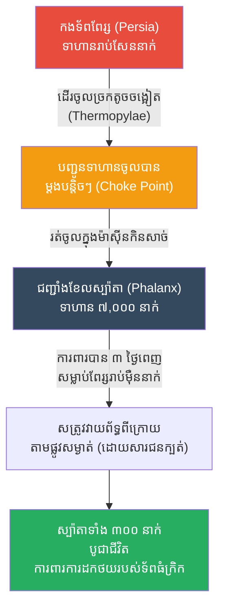

# The Battle of Thermopylae: The Choke Point (សមរភូមិថឺម៉ូពីឡៃ និងយុទ្ធសាស្ត្រច្រកទ្វារមរណៈ)

**Author:** ichamrong
**Date:** 2026-05-23
**Tags:** #history #war #strategy #thermopylae #sparta #choke-point
**Category:** Wars & Histories
**Read Time:** ~10 min

---

## 📌 Table of Contents
- [១. បរិបទនៃសង្គ្រាម (Context of the War)](#១-បរិបទនៃសង្គ្រាម-context-of-the-war)
- [២. យុទ្ធសាស្ត្រ៖ ច្រកទ្វារមរណៈ (The Strategy: The Choke Point)](#២-យុទ្ធសាស្ត្រ-ច្រកទ្វារមរណៈ-the-strategy-the-choke-point)
- [៣. ការប្រើប្រាស់យុទ្ធសាស្ត្រនេះឡើងវិញក្នុងប្រវត្តិសាស្ត្រ (Reused in History)](#៣-ការប្រើប្រាស់យុទ្ធសាស្ត្រនេះឡើងវិញក្នុងប្រវត្តិសាស្ត្រ-reused-in-history)
- [References](#references)

---

## ១. បរិបទនៃសង្គ្រាម (Context of the War)

**សមរភូមិថឺម៉ូពីឡៃ (The Battle of Thermopylae)** បានកើតឡើងនៅឆ្នាំ ៤៨០ មុនគ្រឹស្តសករាជ។ នេះគឺជាសង្គ្រាមដ៏ល្បីល្បាញបំផុតមួយរវាងចក្រភពពែរ្ស (Persian Empire) ដែលដឹកនាំដោយស្តេច សឺសេស (Xerxes) និងកងទ័ពសម្ព័ន្ធមិត្តក្រិក ដែលដឹកនាំដោយស្តេច លីអូណាដាស (Leonidas) នៃក្រុងស្ប៉ាតា (Sparta)។

ចក្រភពពែរ្សបានបញ្ជូនកងទ័ពប្រមាណ **១០០,០០០ ទៅ ៣០០,០០០ នាក់** ដើម្បីវាយលុកប្រទេសក្រិក។ ផ្ទុយទៅវិញ ស្តេចលីអូណាដាស មានទាហានស្ប៉ាតាដ៏ឆ្នើមតែ **៣០០ នាក់** និងទាហានសម្ព័ន្ធមិត្តក្រិកប្រហែល ៧,០០០ នាក់ប៉ុណ្ណោះ។ បើមើលតាមចំនួន ក្រិកច្បាស់ជារលាយមិនខាន។ ប៉ុន្តែ លីអូណាដាស បានជ្រើសរើសទីតាំងប្រយុទ្ធដ៏ឆ្លាតវៃបំផុតមួយ។

---

## ២. យុទ្ធសាស្ត្រ៖ ច្រកទ្វារមរណៈ (The Strategy: The Choke Point)

យុទ្ធសាស្ត្រនេះត្រូវបានគេហៅថា **The Choke Point (យុទ្ធសាស្ត្រច្រកតូច ឬ ច្រកទ្វារមរណៈ)**។ គោលការណ៍របស់វាគឺ៖ "នៅពេលសត្រូវមានចំនួនច្រើនជាងអ្នករាប់រយដង ចូរច្បាំងជាមួយពួកគេនៅកន្លែងដែលចង្អៀតបំផុត ដែលពួកគេមិនអាចប្រើប្រាស់ចំនួនទ័ពនោះបាន"។

**របៀបដែលយុទ្ធសាស្ត្រនេះដំណើរការ៖**
1. **ការជ្រើសរើសទីតាំង (Choosing the Ground):** លីអូណាដាស បានជ្រើសរើសតាំងទ័ពនៅច្រកថឺម៉ូពីឡៃ (Thermopylae) ដែលមានន័យថា "ច្រកទ្វារក្តៅ (Hot Gates)"។ វាគឺជាផ្លូវតូចចង្អៀតមួយ ដែលម្ខាងជាភ្នំខ្ពស់ចោត ហើយម្ខាងទៀតជាសមុទ្រ (មានទទឹងតែប្រហែល ១៥ ម៉ែត្រប៉ុណ្ណោះ)។
2. **ការបន្សាបចំនួនសត្រូវ (Negating Numbers):** ដោយសារច្រកនេះតូចពេក កងទ័ពពែរ្សរាប់សែននាក់ មិនអាចវាយសម្រុកព្រមគ្នា ឬឡោមព័ទ្ធក្រិកបានឡើយ។ ពួកគេបង្ខំចិត្តវាយប្រហារចូលម្តងមួយក្រុមតូចៗ ដែលធ្វើឱ្យចំនួនរាប់សែននាក់របស់ពួកគេ លែងមានន័យ។
3. **ជញ្ជាំងខែល (The Phalanx/Shield Wall):** ទាហានស្ប៉ាតា ដែលពាក់អាវក្រោះក្រាស់ៗ និងកាន់ខែលធំៗ បានរៀបចំជាទម្រង់ជញ្ជាំងខែលបិទជិតច្រកទ្វារនោះ។ រាល់ទាហានពែរ្សដែលរត់ចូលមក គឺប្រៀបដូចជារត់ចូលក្នុងម៉ាស៊ីនកិនសាច់។ ទាហានក្រិក ៧,០០០ នាក់ អាចទប់ទល់ទាហានពែរ្សរាប់សែននាក់ បានរយៈពេល ៣ ថ្ងៃពេញ ដោយសម្លាប់សត្រូវរាប់ម៉ឺននាក់ មុនពេលមានជនក្បត់ជាតិក្រិកម្នាក់ បង្ហាញផ្លូវសម្ងាត់ឱ្យពែរ្សវាយព័ទ្ធពីក្រោយ។ ទីបំផុត ស្ប៉ាតាទាំង ៣០០ នាក់ បានបូជាជីវិតទាំងអស់នៅទីនោះ ដើម្បីពន្យារពេលឱ្យកងទ័ពក្រិកដទៃដកថយរៀបចំទ័ពឡើងវិញ។

---

## ៣. ការប្រើប្រាស់យុទ្ធសាស្ត្រនេះឡើងវិញក្នុងប្រវត្តិសាស្ត្រ (Reused in History)

យុទ្ធសាស្ត្រ **Choke Point** គឺជាយុទ្ធសាស្ត្រសកល ដែលត្រូវបានប្រើប្រាស់ដោយអ្នកការពារដែលមានកម្លាំងទន់ខ្សោយជាងសត្រូវ ដើម្បីកែប្រែស្ថានការណ៍។

*   **សមរភូមិស្ពានស្ទែមហ្វត (Battle of Stamford Bridge, ១០៦៦):** ជនជាតិអង់គ្លេស (Saxons) បានវាយប្រហារទ័ព វីគីង (Vikings)។ មានរឿងព្រេងមួយបានកត់ត្រាថា ទាហានវីគីងដ៏ធំសម្បើមតែម្នាក់ឯង បានឈរនៅលើស្ពានតូចមួយ ហើយកាប់សម្លាប់ទាហានអង់គ្លេសអស់ ៤០ នាក់ ព្រោះស្ពាននោះតូចពេក ទាហានអង់គ្លេសអាចឡើងទៅវាយប្រហារបានម្តងម្នាក់ប៉ុណ្ណោះ។ គាត់ការពារស្ពានរហូតដល់អង់គ្លេសត្រូវលួចចាក់គាត់ពីក្រោមស្ពាន។
*   **សមរភូមិរុករកអវកាសនិងភូមិសាស្ត្រនយោបាយ (Modern Geopolitics):** សព្វថ្ងៃនេះ យុទ្ធសាស្ត្រ Choke Point លែងសំដៅលើការយកមនុស្សទៅឈរាំងផ្លូវទៀតហើយ ប៉ុន្តែវាសំដៅលើ "ច្រកសមុទ្រសំខាន់ៗ" ដូចជា ព្រែកជីកស៊ុយអេ (Suez Canal), ច្រកសមុទ្រម៉ាឡាកា (Strait of Malacca), ឬច្រកសមុទ្រតៃវ៉ាន់។ ប្រទេសណាកាន់កាប់ច្រកទាំងនេះ (Choke Points) គឺមានអំណាចអាចកាត់ផ្តាច់សេដ្ឋកិច្ចពិភពលោក ឬកម្ទេចកងទ័ពជើងទឹករបស់សត្រូវដែលចង់ឆ្លងកាត់ទីនោះ។
*   **សមរភូមិអាជីនខត (Agincourt, ១៤១៥):** អង់គ្លេសបានជ្រើសរើសតាំងទ័ពនៅចន្លោះព្រៃក្រាស់ពីរ ដែលបង្ខំឱ្យទ័ពសេះបារាំងរាប់ម៉ឺននាក់ ត្រូវរត់តម្រង់ជួរចូលក្នុងផ្លូវភក់តូចចង្អៀត ដែលធ្វើឱ្យពួកគេក្លាយជាផ្ទាំងស៊ីបដ៏ងាយស្រួលសម្រាប់អ្នកបាញ់ធ្នូអង់គ្លេស។

---

## References

*   **The Histories by Herodotus** — The primary ancient Greek source that dramatically recounts the heroic stand of the 300 Spartans.
*   **Gates of Fire by Steven Pressfield** — A highly acclaimed historical fiction novel that accurately details the tactical genius of the Spartan phalanx at the choke point.

---

*Last updated: 2026-05-23*
