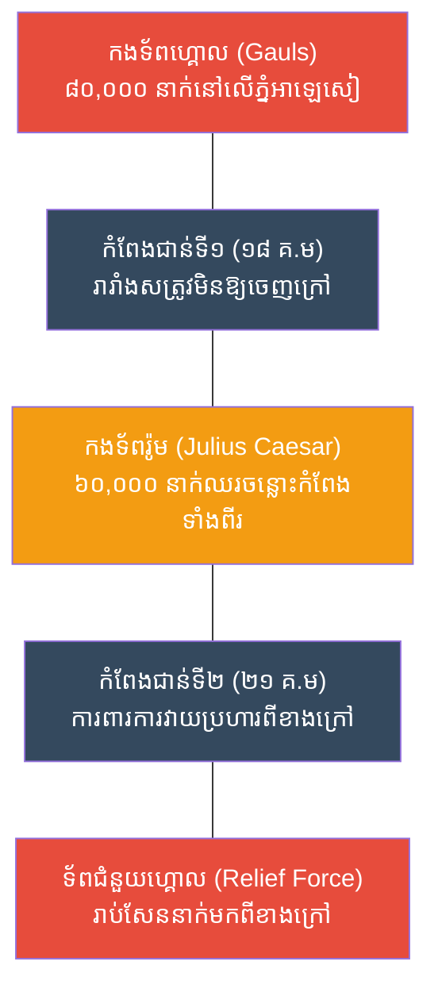

# The Battle of Alesia: Circumvallation (សមរភូមិអាឡេសៀ និងយុទ្ធសាស្ត្រកំពែងពីរជាន់)

**Author:** ichamrong
**Date:** 2026-05-23
**Tags:** #history #war #strategy #julius-caesar #alesia #roman-empire
**Category:** Wars & Histories
**Read Time:** ~10 min

---

## 📌 Table of Contents
- [១. បរិបទនៃសង្គ្រាម (Context of the War)](#១-បរិបទនៃសង្គ្រាម-context-of-the-war)
- [២. យុទ្ធសាស្ត្រ៖ កំពែងពីរជាន់ (The Strategy: Circumvallation)](#២-យុទ្ធសាស្ត្រ-កំពែងពីរជាន់-the-strategy-circumvallation)
- [៣. ការប្រើប្រាស់យុទ្ធសាស្ត្រនេះឡើងវិញក្នុងប្រវត្តិសាស្ត្រ (Reused in History)](#៣-ការប្រើប្រាស់យុទ្ធសាស្ត្រនេះឡើងវិញក្នុងប្រវត្តិសាស្ត្រ-reused-in-history)
- [References](#references)

---

## ១. បរិបទនៃសង្គ្រាម (Context of the War)

**សមរភូមិអាឡេសៀ (The Battle of Alesia)** កើតឡើងនៅឆ្នាំ ៥២ មុនគ្រឹស្តសករាជ ដែលជាសមរភូមិចុងក្រោយនិងធំបំផុត នៅក្នុងយុទ្ធនាការលុកលុយតំបន់ហ្គោល (Gaul - បារាំងបច្ចុប្បន្ន) ដោយមេទ័ពរ៉ូម៉ាំងដ៏ឆ្នើម **ជូលៀស ស៊ីសារ (Julius Caesar)**។

កុលសម្ព័ន្ធហ្គោលទាំងអស់ បានរួបរួមគ្នាជាលើកដំបូងក្រោមការដឹកនាំរបស់មេទ័ព **Vercingetorix**។ ដើម្បីគេចពីការវាយលុករបស់រ៉ូម Vercingetorix បាននាំកងទ័ពប្រហែល ៨ ម៉ឺននាក់ ទៅលាក់ខ្លួននិងបោះជំរុំនៅលើភ្នំកំផែងដ៏រឹងមាំមួយឈ្មោះថា អាឡេសៀ (Alesia)។ ស៊ីសារ ដែលមានទាហានតែ ៦ ម៉ឺននាក់ ដឹងថាបើវាយលុកឡើងភ្នំ ច្បាស់ជាបរាជ័យ ដូច្នេះគាត់បានសម្រេចចិត្តប្រើប្រាស់យុទ្ធសាស្ត្រឡោមព័ទ្ធដ៏ឆ្កួតលីលាបំផុតមួយក្នុងប្រវត្តិសាស្ត្រ។

---

## ២. យុទ្ធសាស្ត្រ៖ កំពែងពីរជាន់ (The Strategy: Circumvallation)

យុទ្ធសាស្ត្រនេះហៅថា **Circumvallation & Contravallation (ការសាងសង់កំពែងឡោមព័ទ្ធពីរជាន់)**។ 

**របៀបដែលយុទ្ធសាស្ត្រនេះដំណើរការ៖**
1. **កំពែងជាន់ទី១ (Circumvallation - បិទខ្ទប់ខាងក្នុង):** ស៊ីសារមិនវាយលុកឡើងភ្នំទេ តែគាត់បញ្ជាឱ្យទាហានរ៉ូមជីកប្រឡាយនិងសាងសង់កំពែងឈើប្រវែង **១៨ គីឡូម៉ែត្រ** ព័ទ្ធជុំវិញភ្នំអាឡេសៀ ព្រមទាំងបង្កប់អន្ទាក់ចម្រូងឬស្សីយ៉ាងច្រើន។ គោលដៅគឺដើម្បីបង្អត់អាហារទាហានហ្គោលទាំង ៨ ម៉ឺននាក់នៅខាងក្នុង មិនឱ្យចេញមករកស្បៀងបាន។
2. **ការហៅទ័ពជំនួយ (The Relief Force):** មុនពេលកំពែងទី១សង់រួច Vercingetorix បានបញ្ជូនទ័ពសេះចេញទៅក្រៅ ដើម្បីហៅកងទ័ពជំនួយពីកុលសម្ព័ន្ធហ្គោលផ្សេងៗឱ្យមកជួយ។ ទ័ពជំនួយរាប់សែននាក់កំពុងធ្វើដំណើរមកវាយប្រហាររ៉ូមពីខាងក្រៅវិញ។
3. **កំពែងជាន់ទី២ (Contravallation - ការពារខាងក្រៅ):** ដោយដឹងថាទ័ពជំនួយសត្រូវកំពុងមកដល់ ស៊ីសារកំពុងស្ថិតនៅចន្លោះសត្រូវ (ត្រូវហ្គោលព័ទ្ធមុខព័ទ្ធក្រោយ)។ ជំនួសឱ្យការរត់គេច ស៊ីសារបែរជាបញ្ជាឱ្យទាហានសាងសង់ **កំពែងទី២** ដែលមានប្រវែង **២១ គីឡូម៉ែត្រ** ព័ទ្ធជុំវិញខ្លួនឯង (បែរមុខចេញទៅក្រៅ) ដើម្បីការពារពីការវាយប្រហាររបស់ទ័ពជំនួយហ្គោល។
4. **អព្ភូតហេតុនៃវិន័យរ៉ូម (The Ultimate Siege):** កងទ័ពរ៉ូម ៦ ម៉ឺននាក់ ឈរនៅចន្លោះកំពែងទាំងពីរ។ ពួកគេបានវាយទប់ទល់កងទ័ពហ្គោល ៨ ម៉ឺននាក់ពីខាងក្នុងភ្នំផង និងវាយទប់ទល់កងទ័ពហ្គោលរាប់សែននាក់ដែលមកជួយពីខាងក្រៅផង។ ដោយសារវិន័យដ៏តឹងរ៉ឹងនិងប្រព័ន្ធការពារដ៏រឹងមាំ ស៊ីសារទទួលបានជ័យជម្នះទាំងស្រុង ហើយ Vercingetorix ត្រូវបង្ខំចិត្តចុះចាញ់។

---

## ៣. ការប្រើប្រាស់យុទ្ធសាស្ត្រនេះឡើងវិញក្នុងប្រវត្តិសាស្ត្រ (Reused in History)

យុទ្ធសាស្ត្រសាងសង់កំពែងឡោមព័ទ្ធពីរជាន់ (Circumvallation / Contravallation) គឺជាកំពូលនៃ "សិល្បៈនៃការឡោមព័ទ្ធ (Siege Warfare)"។ វាត្រូវបានប្រើប្រាស់ដោយមេទ័ពដែលដឹងថាខ្លួនឯងត្រូវកៀបចន្លោះកណ្តាល ប៉ុន្តែប្រើប្រាស់វិស្វកម្មដើម្បីយកឈ្នះ។

*   **សមរភូមិ Dien Bien Phu (សង្គ្រាមឥណ្ឌូចិន, ១៩៥៤):** ទោះបីជាមិនមែនជាការសង់កំពែងពីរជាន់យ៉ាងជាក់លាក់ ប៉ុន្តែកងទ័ពវៀតមិញ (Viet Minh) ក្រោមការដឹកនាំរបស់ឧត្តមសេនីយ៍ វ៉ូ ង្វៀនយ៉ាប (Vo Nguyen Giap) បានប្រើប្រាស់ប្រព័ន្ធលេណដ្ឋាន (Trench warfare) ជីកឡោមព័ទ្ធមូលដ្ឋានកងទ័ពបារាំងទាំងស្រុង។ វៀតមិញជីកលេណដ្ឋានរំកិលចូលទៅជិតសត្រូវជារៀងរាល់យប់ ធ្វើឱ្យបារាំងជាប់អន្ទាក់ និងគ្មានផ្លូវរត់ ដែលស្រដៀងនឹងការឡោមព័ទ្ធរបស់ស៊ីសារដែរ។
*   **សមរភូមិស្តាលីនក្រាត (Stalingrad, ១៩៤២):** កងទ័ពអាល្លឺម៉ង់បានវាយឡោមព័ទ្ធទីក្រុងស្តាលីនក្រាតរបស់សូវៀត។ ប៉ុន្តែក្រោយមក កងទ័ពសូវៀតបានបើកប្រតិបត្តិការអ៊ុយរ៉ានុស (Operation Uranus) វាយកៀបឡោមព័ទ្ធកងទ័ពអាល្លឺម៉ង់ពីខាងក្រៅវិញម្តង (Encirclement of the Encircle)។ អាល្លឺម៉ង់ដែលនៅកណ្តាល មិនមានសមត្ថភាពសង់កំពែង "ពីរជាន់" ដូចស៊ីសារទេ ទីបំផុតក៏ត្រូវសូវៀតកម្ទេចទាំងស្រុង។

---

## References

*   **Commentarii de Bello Gallico (Gallic Wars) by Julius Caesar** — Caesar’s own first-hand account of the campaign and the incredible engineering feat at Alesia.
*   **The Roman Army: The Greatest War Machine of the Ancient World by Chris McNab** — Details the incredible logistics and engineering capabilities of the Roman legions.

---

*Last updated: 2026-05-23*
