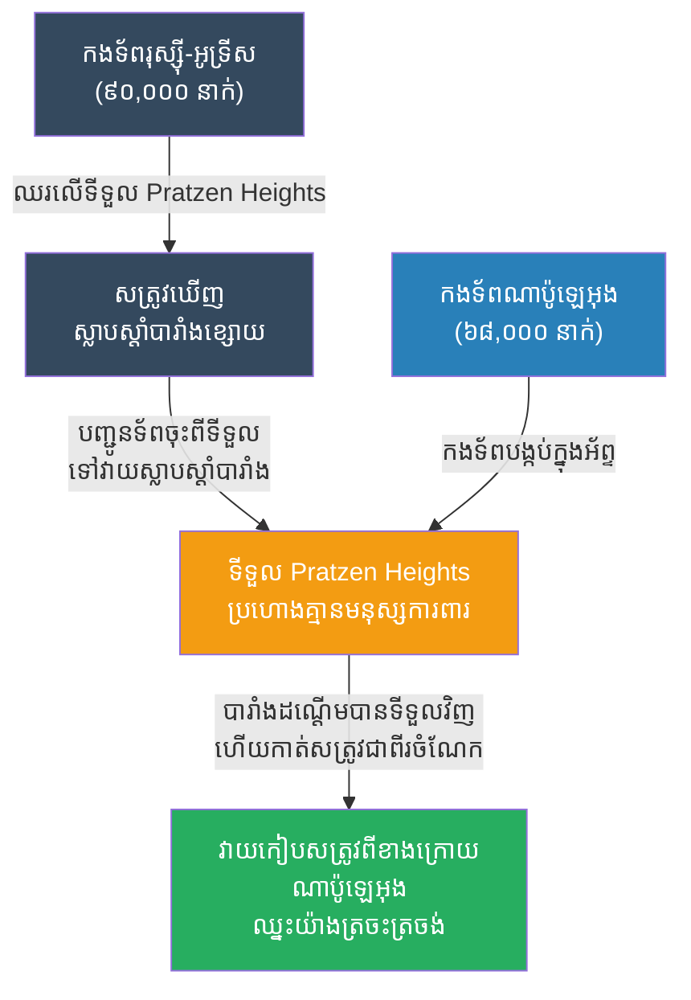

# The Battle of Austerlitz: Feigning Weakness (សមរភូមិអូស្ទើលីត និងយុទ្ធសាស្ត្រធ្វើពុតជាខ្សោយ)

**Author:** ichamrong
**Date:** 2026-05-23
**Tags:** #history #war #strategy #napoleon #austerlitz #deception
**Category:** Wars & Histories
**Read Time:** ~10 min

---

## 📌 Table of Contents
- [១. បរិបទនៃសង្គ្រាម (Context of the War)](#១-បរិបទនៃសង្គ្រាម-context-of-the-war)
- [២. យុទ្ធសាស្ត្រ៖ ធ្វើពុតជាខ្សោយ (The Strategy: Feigning Weakness)](#២-យុទ្ធសាស្ត្រ-ធ្វើពុតជាខ្សោយ-the-strategy-feigning-weakness)
- [៣. ការប្រើប្រាស់យុទ្ធសាស្ត្រនេះឡើងវិញក្នុងប្រវត្តិសាស្ត្រ (Reused in History)](#៣-ការប្រើប្រាស់យុទ្ធសាស្ត្រនេះឡើងវិញក្នុងប្រវត្តិសាស្ត្រ-reused-in-history)
- [References](#references)

---

## ១. បរិបទនៃសង្គ្រាម (Context of the War)

**សមរភូមិអូស្ទើលីត (The Battle of Austerlitz)** ឬហៅម្យ៉ាងទៀតថា "សមរភូមិនៃអធិរាជទាំងបី (Battle of the Three Emperors)" កើតឡើងនៅឆ្នាំ ១៨០៥។ នេះត្រូវបានចាត់ទុកថាជា **ស្នាដៃឯក (Masterpiece)** និងជាជ័យជម្នះដ៏អស្ចារ្យបំផុតរបស់ **ណាប៉ូឡេអុង (Napoleon Bonaparte)**។

ណាប៉ូឡេអុង (អធិរាជបារាំង) ដែលមានកងទ័ពប្រហែល ៦៨,០០០ នាក់ ត្រូវប្រឈមមុខនឹងកងទ័ពចម្រុះរបស់រុស្ស៊ីនិងអូទ្រីស ដែលមានចំនួនរហូតដល់ ៩០,០០០ នាក់ (ដឹកនាំដោយអធិរាជ អាឡិចសាន់ឌឺទី១ នៃរុស្ស៊ី និងអធិរាជ ហ្វ្រង់ស៊ីសទី២ នៃអូទ្រីស)។ ក្រៅពីមានទាហានតិចជាង កងទ័ពរបស់ណាប៉ូឡេអុងក៏កំពុងហត់នឿយនិងនៅឆ្ងាយពីទឹកដីខ្លួនឯងផងដែរ។ គាត់ត្រូវការកម្ទេចសត្រូវឱ្យលឿនបំផុត មុនពេលដែលសត្រូវដឹងខ្លួន។

---

## ២. យុទ្ធសាស្ត្រ៖ ធ្វើពុតជាខ្សោយ (The Strategy: Feigning Weakness)

ណាប៉ូឡេអុងបានប្រើប្រាស់ក្បួនចិត្តសាស្ត្រ ដោយលេងល្បែង **"ធ្វើពុតជាខ្សោយដើម្បីអូសទាញសត្រូវឱ្យដើរចូលអន្ទាក់ (Feigning Weakness)"**។

**របៀបដែលយុទ្ធសាស្ត្រនេះដំណើរការ៖**
1. **ការលះបង់ទីតាំងខ្ពស់ (Giving up the High Ground):** ក្បួនសង្គ្រាមទូទៅ អ្នកណាឈរនៅទីខ្ពស់ អ្នកនោះមានប្រៀប។ ណាប៉ូឡេអុងបានបញ្ជាឱ្យកងទ័ពរបស់ខ្លួនដកថយចុះពីទីទួលខ្ពស់ឈ្មោះ Pratzen Heights ហើយបោះជំរុំនៅតំបន់ទំនាប ដែលធ្វើឱ្យសត្រូវគិតថាបារាំងកំពុងភ័យខ្លាច។ សត្រូវក៏បានឡើងទៅឈរលើទីទួលនោះជំនួសវិញ។
2. **ការធ្វើពុតជាខ្សោយនៅស្លាបស្តាំ (Weakening the Right Flank):** ណាប៉ូឡេអុងចេតនាដាក់ទាហានតិចតួចបំផុតនៅខាងស្លាបស្តាំរបស់ខ្លួន ដើម្បីបញ្ឆោតសត្រូវ។ លោកដឹងច្បាស់ថាសត្រូវនឹងមើលឃើញ "ចំណុចខ្សោយ" នេះ ហើយនឹងប្រមូលកម្លាំងវាយសម្រុកមកស្លាបស្តាំនេះជាមិនខាន។
3. **សត្រូវដើរចូលអន្ទាក់ (Falling for the Trap):** ដូចការគិតទុក កងទ័ពចម្រុះរុស្ស៊ី-អូទ្រីស បានលោភលន់ចង់ឈ្នះ ក៏បានបញ្ជាកងទ័ពភាគច្រើនរបស់ខ្លួនឱ្យចុះពីទីទួលខ្ពស់ Pratzen Heights ដើម្បីទៅវាយកម្ទេចស្លាបស្តាំរបស់បារាំង។
4. **ការវាយលុកបំបែកកណ្តាល (The Decisive Strike):** នៅពេលកងទ័ពសត្រូវចុះពីទីទួលខ្ពស់អស់ ណាប៉ូឡេអុងបានបញ្ចេញកងទ័ពបង្កប់ដ៏ខ្លាំងបំផុតរបស់លោក (ដែលលាក់ខ្លួននៅក្នុងអ័ព្ទនាពេលព្រឹក) ឱ្យវាយសម្រុកឡើងទៅដណ្តើមយកទីទួល Pratzen Heights វិញ។ ដោយសារសត្រូវបាត់បង់ទាហាននៅទីនោះអស់ហើយ បារាំងវាយកម្ទេចកណ្តាលរបស់សត្រូវដាច់ជាពីរចំណែក (Cutting the center) ហើយឡោមព័ទ្ធកងទ័ពសត្រូវដែលចុះទៅវាយស្លាបស្តាំនោះ។ សត្រូវបែកបាក់រត់ប្រសេចប្រសាច និងត្រូវកាប់សម្លាប់យ៉ាងរង្គាល។

---

## ៣. ការប្រើប្រាស់យុទ្ធសាស្ត្រនេះឡើងវិញក្នុងប្រវត្តិសាស្ត្រ (Reused in History)

យុទ្ធសាស្ត្រ **"ធ្វើពុតជាខ្សោយ ដើម្បីបញ្ឆោតសត្រូវឱ្យចាកចេញពីទីតាំងការពារដ៏រឹងមាំ (Baiting/Feigned Weakness)"** គឺជាសិល្បៈសង្គ្រាមបុរាណ ដែលត្រូវបានប្រើប្រាស់ដោយមេទ័ពដែលចេះអានចិត្តសត្រូវ៖

*   **ក្បួនសឹកស៊ុនអ៊ូ (The Art of War by Sun Tzu):** ស៊ុនអ៊ូ បានសរសេរក្បួននេះតាំងពីជាង ២ ពាន់ឆ្នាំមុនថា៖ *"សង្គ្រាមគឺផ្អែកលើការបោកប្រាស់។ នៅពេលអ្នកខ្លាំង ត្រូវធ្វើពុតជាខ្សោយ។ នៅពេលអ្នកជិត ត្រូវធ្វើពុតជានៅឆ្ងាយ។"* ណាប៉ូឡេអុងបានអនុវត្តក្បួននេះយ៉ាងល្អឥតខ្ចោះ។
*   **សង្គ្រាមលោកលើកទី២ (ប្រតិបត្តិការ Operation Fortitude):** មុនការវាយលុកនៅ D-Day អាមេរិកនិងអង់គ្លេសបានធ្វើពុតជាប្រមូលផ្តុំ "កងទ័ពខ្សោយនិងក្លែងក្លាយ" នៅទីក្រុង Dover ដើម្បីបញ្ឆោតហ៊ីត្លែរឱ្យជឿថាពួកគេនឹងវាយលុកនៅ Calais។ ដោយសារឃើញ "ចំណុចខ្សោយនិងចលនា" នេះ ហ៊ីត្លែរបានទុកទាហានខ្លាំងៗនៅ Calais ខណៈដែលកងទ័ពសម្ព័ន្ធមិត្តពិតប្រាកដទៅវាយលុកនៅឆ្នេរ Normandy។
*   **យុទ្ធសាស្ត្រនយោបាយនិងជំនួញ (Business & Politics):** ការធ្វើពុតជាខ្សោយ ត្រូវបានប្រើប្រាស់រហូតដល់សព្វថ្ងៃក្នុងការចរចាជំនួញ។ ការធ្វើឱ្យគូប្រជែងមើលស្រាលសមត្ថភាពរបស់យើង គឺជួយឱ្យយើងអាចរៀបចំផែនការវាយលុកនៅ "ចំណុចកណ្តាល" ដែលគូប្រជែងមិនបានការពារបានយ៉ាងងាយស្រួល។

---

## References

*   **The Campaigns of Napoleon by David G. Chandler** — A masterful and detailed analysis of Napoleon's tactical genius at Austerlitz.
*   **On War by Carl von Clausewitz** — Analyzes the psychological components of war and the brilliance of decisive strikes at the center of gravity.

---

*Last updated: 2026-05-23*
