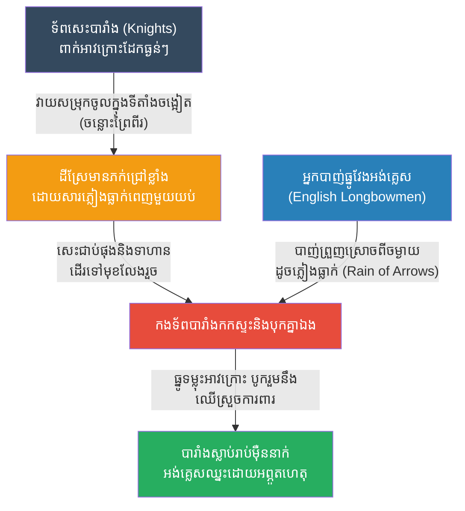

# The Battle of Agincourt: Terrain & Technology (សមរភូមិអាជីនខត ភក់ និងធ្នូវែង)

**Author:** ichamrong
**Date:** 2026-05-23
**Tags:** #history #war #strategy #agincourt #longbow #england #france
**Category:** Wars & Histories
**Read Time:** ~10 min

---

## 📌 Table of Contents
- [១. បរិបទនៃសង្គ្រាម (Context of the War)](#១-បរិបទនៃសង្គ្រាម-context-of-the-war)
- [២. យុទ្ធសាស្ត្រ៖ ភក់ និងបច្ចេកវិទ្យា (The Strategy: Terrain & The Longbow)](#២-យុទ្ធសាស្ត្រ-ភក់-និងបច្ចេកវិទ្យា-the-strategy-terrain-the-longbow)
- [៣. ការប្រើប្រាស់យុទ្ធសាស្ត្រនេះឡើងវិញក្នុងប្រវត្តិសាស្ត្រ (Reused in History)](#៣-ការប្រើប្រាស់យុទ្ធសាស្ត្រនេះឡើងវិញក្នុងប្រវត្តិសាស្ត្រ-reused-in-history)
- [References](#references)

---

## ១. បរិបទនៃសង្គ្រាម (Context of the War)

**សមរភូមិអាជីនខត (The Battle of Agincourt)** កើតឡើងនៅថ្ងៃទី ២៥ ខែតុលា ឆ្នាំ ១៤១៥ ជាផ្នែកមួយនៃ "សង្គ្រាមមួយរយឆ្នាំ (The Hundred Years' War)" រវាងអង់គ្លេស និងបារាំង។

ស្តេច **ហង់រីទី៥ (Henry V)** នៃប្រទេសអង់គ្លេស បានដឹកនាំកងទ័ពតូចមួយទៅលុកលុយប្រទេសបារាំង។ ប៉ុន្តែក្រោយពីយុទ្ធនាការដ៏យូរ កងទ័ពអង់គ្លេសបានធ្លាក់ខ្លួនឈឺ អត់ឃ្លាន និងហត់នឿយយ៉ាងខ្លាំង។ ពេលកំពុងដកថយទៅអង់គ្លេសវិញ ពួកគេត្រូវបានស្ទាក់ផ្លូវដោយកងទ័ពបារាំងដ៏ធំសម្បើម។
*   **អង់គ្លេស៖** មានទាហានប្រមាណ ៦,០០០ ទៅ ៩,០០០ នាក់ (ភាគច្រើនជាអ្នកបាញ់ធ្នូ) រាងកាយទន់ខ្សោយ។
*   **បារាំង៖** មានទាហានប្រមាណ ១២,០០០ ទៅ ៣៦,០០០ នាក់ ដែលសុទ្ធសឹងជាអភិជនជិះសេះពាក់អាវក្រោះដែកយ៉ាងក្រាស់ (Heavy Cavalry & Knights) និងមានស្មារតីប្រយុទ្ធខ្ពស់។

បារាំងជឿជាក់ ១០០% ថានឹងយកឈ្នះអង់គ្លេស ព្រោះកងទ័ពសេះដែក គឺជាកងទ័ពដែលខ្លាំងបំផុតនៅលើលោកនៅសម័យនោះ។

---

## ២. យុទ្ធសាស្ត្រ៖ ភក់ និងបច្ចេកវិទ្យា (The Strategy: Terrain & The Longbow)

ហង់រីទី៥ ដឹងថាគាត់មិនអាចបញ្ជូនទាហានថ្មើរជើងទៅទប់ទល់នឹងទ័ពសេះបារាំងបានទេ។ ដូច្នេះ គាត់បានពឹងផ្អែកលើ **"លក្ខខណ្ឌភូមិសាស្ត្រ (Terrain)"** និង **"បច្ចេកវិទ្យាធ្នូវែង (The English Longbow)"**។

**របៀបដែលយុទ្ធសាស្ត្រនេះដំណើរការ៖**
1. **ការជ្រើសរើសទីតាំង (The Narrow Field):** ហង់រីទី៥ បានរៀបចំកងទ័ពនៅចន្លោះព្រៃក្រាស់ពីរ។ ការធ្វើបែបនេះគឺដើម្បីបង្ខំឱ្យទ័ពសេះបារាំងរាប់ម៉ឺននាក់ មិនអាចវាយឡោមព័ទ្ធពីចំហៀងបាន និងត្រូវរត់តម្រង់ចូលមកចំកណ្តាលតូចចង្អៀត។
2. **អន្ទាក់បង្គោលឈើ (Wooden Stakes):** អ្នកបាញ់ធ្នូអង់គ្លេស បានកាប់បង្គោលឈើស្រួចៗ ដាំបញ្ឆិតទៅមុខនៅពីមុខជួររបស់ខ្លួន ដើម្បីការពារកុំឱ្យសេះសត្រូវអាចរត់ចូលមកជាន់ពួកគេបាន។
3. **សត្រូវនៃទ័ពសេះគឺ "ភក់" (The Mud):** យប់មុនពេលប្រយុទ្ធមានភ្លៀងធ្លាក់យ៉ាងខ្លាំង ដែលធ្វើឱ្យដីស្រែដែលទើបនឹងភ្ជួររួច ក្លាយជាភក់ជ្រៅ។ នៅពេលទ័ពសេះបារាំងពាក់អាវក្រោះដែកធ្ងន់ៗ (ទម្ងន់ជាង ៣០ គីឡូក្រាម) សម្រុកចូលមក ពួកគេបានផុងសេះ និងដើរយឺតៗដូចអណ្តើកនៅក្នុងភក់។
4. **ព្យុះព្រួញ (The Longbow Storm):** ខណៈពេលដែលបារាំងកំពុងជាប់គាំងក្នុងភក់និងចង្អៀតបុកគ្នា អ្នកបាញ់ធ្នូអង់គ្លេស (Longbowmen) ដែលអាចបាញ់ព្រួញបានរហូតដល់ ១០ គ្រាប់ក្នុងមួយនាទី និងមានកម្លាំងទម្លុះអាវក្រោះ បានបាញ់ស្រោចព្រួញដូចភ្លៀងធ្លាក់ (រាប់សែនគ្រាប់) ទៅលើកងទ័ពបារាំង។ ទាហានបារាំងមិនអាចដើរទៅមុខក៏មិនបាន ថយក្រោយក៏មិនរួច ត្រូវស្លាប់រង្គាលក្នុងភក់នោះឯង។

---

## ៣. ការប្រើប្រាស់យុទ្ធសាស្ត្រនេះឡើងវិញក្នុងប្រវត្តិសាស្ត្រ (Reused in History)

យុទ្ធសាស្ត្ររបស់ហង់រីទី៥ បានផ្តល់មេរៀនដ៏សំខាន់មួយគឺ៖ **"អាវុធទំនើប ឬទ័ពខ្លាំងប៉ុណ្ណាក៏ដោយ ក៏អាចត្រូវបំផ្លាញបានដែរ ប្រសិនបើជាប់អន្ទាក់ភូមិសាស្ត្រ (Terrain) និងអាកាសធាតុ"**។

*   **សង្គ្រាមវៀតណាម (The Vietnam War):** អាមេរិកមានបច្ចេកវិទ្យាយោធាទំនើបបំផុត (ឧទ្ធម្ភាគចក្រ រថក្រោះ យន្តហោះទម្លាក់គ្រាប់បែក)។ ប៉ុន្តែវៀតកុង (Viet Cong) បានទាញយកប្រយោជន៍ពី "ភូមិសាស្ត្រព្រៃក្រាស់ និងរដូវវស្សា" ដើម្បីធ្វើឱ្យបច្ចេកវិទ្យាអាមេរិកអស់ប្រសិទ្ធភាព។ ព្រៃក្រាស់ធ្វើឱ្យអាមេរិកមើលមិនឃើញពីលើអាកាស ហើយដីភក់ធ្វើឱ្យរថក្រោះរអាក់រអួល រីឯវៀតកុងប្រើប្រាស់យុទ្ធសាស្ត្រទ័ពព្រៃបាញ់ឆ្មក់ ដែលស្រដៀងនឹងការជាប់អន្ទាក់នៅ Agincourt។
*   **សមរភូមិ Crecy (១៣៤៦):** មុនសមរភូមិ Agincourt, អង់គ្លេសក៏ធ្លាប់បានប្រើប្រាស់ធ្នូវែង (Longbow) និងភូមិសាស្ត្រការពារ វាយកម្ទេចទ័ពសេះបារាំងនៅសមរភូមិ Crecy ម្តងរួចមកហើយ។ ប៉ុន្តែបារាំងហាក់ដូចជាមិនបានរៀនសូត្រពីកំហុសនេះសោះ និងបានធ្វើខុសដដែលនៅ Agincourt។
*   **ការប្រើប្រាស់ IED ក្នុងសង្គ្រាមនៅអ៊ីរ៉ាក់ និងអាហ្វហ្គានីស្ថាន:** ក្រុមឧទ្ទាមមិនអាចយកឈ្នះរថពាសដែកទំនើបៗរបស់សហរដ្ឋអាមេរិកដោយការប្រយុទ្ធផ្ទាល់បានទេ។ ជំនួសមកវិញ ពួកគេប្រើប្រាស់គ្រាប់បែកបង្កប់តាមដងផ្លូវ (IEDs) នៅតាមទីតាំងចង្អៀត ដែលបង្ខំឱ្យរថពាសដែកត្រូវកកស្ទះ និងងាយរងការវាយប្រហារ ដូចទៅនឹងការប្រើបង្គោលឈើស្រួច (Stakes) និងភក់របស់អង់គ្លេសដែរ។

---

## References

*   **The Face of Battle by John Keegan** — A classic military history book that vividly details the physical realities of Agincourt, including the devastating effect of the mud and the longbow.
*   **Henry V by William Shakespeare** — The famous historical play that immortalized the battle and the St. Crispin's Day speech.

---

*Last updated: 2026-05-23*
