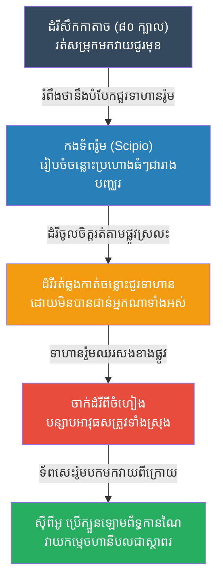

# The Battle of Zama: Neutralizing the Unstoppable (សមរភូមិហ្សាម៉ា និងវិធីកម្ចាត់ដំរីសឹក)

**Author:** ichamrong
**Date:** 2026-05-23
**Tags:** #history #war #strategy #scipio #hannibal #zama
**Category:** Wars & Histories
**Read Time:** ~10 min

---

## 📌 Table of Contents
- [១. បរិបទនៃសង្គ្រាម (Context of the War)](#១-បរិបទនៃសង្គ្រាម-context-of-the-war)
- [២. យុទ្ធសាស្ត្រ៖ ច្រករបៀងបើកចំហ (The Strategy: Open Lanes)](#២-យុទ្ធសាស្ត្រ-ច្រករបៀងបើកចំហ-the-strategy-open-lanes)
- [៣. ការប្រើប្រាស់យុទ្ធសាស្ត្រនេះឡើងវិញក្នុងប្រវត្តិសាស្ត្រ (Reused in History)](#៣-ការប្រើប្រាស់យុទ្ធសាស្ត្រនេះឡើងវិញក្នុងប្រវត្តិសាស្ត្រ-reused-in-history)
- [References](#references)

---

## ១. បរិបទនៃសង្គ្រាម (Context of the War)

**សមរភូមិហ្សាម៉ា (The Battle of Zama)** កើតឡើងនៅឆ្នាំ ២០២ មុនគ្រឹស្តសករាជ ដែលជាសមរភូមិចុងក្រោយបង្អស់នៃសង្គ្រាម Punic លើកទី២ និងជាការប្រកួតរវាងកំពូលមេទ័ពទាំងពីរនៃពិភពលោកបុរាណ៖ **ហានីបល (Hannibal)** របស់កាតាច និង **ស៊ីពីអូ (Scipio Africanus)** របស់រ៉ូម។

បន្ទាប់ពីហានីបលបានវាយកម្ទេចរ៉ូមយ៉ាងចាស់ដៃនៅសមរភូមិ Cannae (ដោយប្រើទ័ពឡោមព័ទ្ធ) រ៉ូមបានចំណាយពេល ១៤ ឆ្នាំដើម្បីរៀនសូត្រពីកំហុស។ ស៊ីពីអូ បានសម្រេចចិត្តមិនតាមវាយហានីបលនៅអ៊ីតាលីទេ ប៉ុន្តែបែរជាលើកទ័ពវាយប្រហារទៅលើបេះដូងនៃប្រទេសកាតាច (នៅអាហ្វ្រិក) វិញ។ ហានីបលត្រូវបង្ខំចិត្តដកទ័ពត្រលប់ទៅស្រុកកំណើតដើម្បីការពារ។ 
នៅ Zama ហានីបលមានអាវុធសម្ងាត់ដ៏គួរឱ្យខ្លាចបំផុត គឺ **"ដំរីសឹក ៨០ ក្បាល (War Elephants)"** ដែលជាគ្រឿងចក្រវាយប្រហារ (Tanks) សម័យបុរាណ។ កងទ័ពដែលប្រឈមមុខនឹងការរត់ជាន់របស់ដំរីសឹក តែងតែបែកជួរនិងរត់ចោលស្រុក។ 

---

## ២. យុទ្ធសាស្ត្រ៖ ច្រករបៀងបើកចំហ (The Strategy: Open Lanes)

ស៊ីពីអូ ដឹងច្បាស់ថាគាត់មិនអាចបញ្ឈប់កម្លាំងបុកទម្លុះរបស់ដំរី ៨០ ក្បាល ដោយប្រើខែលនិងលំពែងបានទេ។ ដូច្នេះគាត់បានប្រើប្រាស់ **"យុទ្ធសាស្ត្របង្វែរទិសដៅ ឬ ច្រករបៀងបើកចំហ (Open Lanes / Redirection)"**។

**របៀបដែលយុទ្ធសាស្ត្រនេះដំណើរការ៖**
1. **ការផ្លាស់ប្តូរទម្រង់ (Changing the Formation):** ជាធម្មតា ទាហានរ៉ូមរៀបចំទម្រង់ជួរឈរឆ្លាស់គ្នាដូចក្តារអុក (Checkerboard formation) ដើម្បីឱ្យមានភាពហាប់ណែន។ ប៉ុន្តែនៅ Zama ស៊ីពីអូបានរៀបទាហានជារាងបញ្ឈរ ដោយទុកចន្លោះប្រហោងធំៗ (Lanes) នៅចន្លោះជួរនីមួយៗរហូតដល់ខាងក្រោយ។ គាត់បានយកទាហានស្រាលៗ (អ្នកគប់លំពែង) ទៅឈរបិទប្រហោងនោះនៅខាងមុខ ដើម្បីបញ្ឆោតភ្នែកសត្រូវ។
2. **បើកផ្លូវឱ្យដំរី (Letting the Elephants Pass):** នៅពេលហានីបលបញ្ជាឱ្យដំរីទាំង ៨០ ក្បាលរត់សម្រុកមក ទាហានស្រាលរបស់រ៉ូមបានគប់លំពែង រួចរត់គេចចូលទៅតាមចន្លោះជួរ។ ដោយសារសត្វដំរីមានសភាវគតិរត់ទៅរកផ្លូវដែលមានស្រាប់ (Path of least resistance) ជាងការរត់បុកជញ្ជាំងមនុស្ស ដំរីភាគច្រើនបានរត់ត្រង់តាម "ចន្លោះប្រហោង" ដែលរ៉ូមបានរៀបចំទុក។
3. **ការបន្សាបអាវុធសត្រូវ (Neutralization):** ពេលដំរីរត់ចូលទៅតាមចន្លោះជួរ ទាហានរ៉ូមនៅសងខាងបានយកលំពែងចាក់ដំរីពីចំហៀងដោយងាយស្រួល។ ដំរីខ្លះភិតភ័យនឹងសម្លេងត្រែរ៉ូម ក៏រត់ត្រលប់ក្រោយទៅជាន់កងទ័ពកាតាចខ្លួនឯង។ អាវុធដ៏ខ្លាំងបំផុតរបស់ហានីបល ត្រូវបានបំផ្លាញដោយមិនបាច់ប្រើកម្លាំងបាយទប់ទល់។
4. **ការយកក្បួនហានីបល វាយហានីបល:** បន្ទាប់ពីកម្ចាត់ដំរីអស់ ស៊ីពីអូបានបញ្ជាទ័ពសេះរបស់ខ្លួនដែលរុញច្រានទ័ពសេះសត្រូវចេញរួចហើយ ឱ្យបកត្រលប់មកវាយកៀបហានីបលពីក្រោយ (ដូចយុទ្ធសាស្ត្រដែលហានីបលធ្លាប់ប្រើនៅ Cannae ដែរ)។ ហានីបលបរាជ័យជាស្ថាពរ។

---

## ៣. ការប្រើប្រាស់យុទ្ធសាស្ត្រនេះឡើងវិញក្នុងប្រវត្តិសាស្ត្រ (Reused in History)

យុទ្ធសាស្ត្ររបស់ស៊ីពីអូ គឺជាមេរៀនសៀវភៅគោលនៃគោលការណ៍៖ **"កុំទប់ទល់នឹងកម្លាំងដែលធំជាងខ្លួនដោយកម្លាំងបាយ ប៉ុន្តែត្រូវស្រូបយកវា ឬបង្វែរទិសដៅវាឱ្យក្លាយជាចំណុចខ្សោយរបស់សត្រូវវិញ (Judo Strategy)"**។

*   **សិល្បៈក្បាច់គុនយូដូ និងអាយគីដូ (Judo & Aikido):** ទោះបីមិនមែនជាសង្គ្រាមធំ ប៉ុន្តែគោលការណ៍នៃក្បាច់គុនទាំងនេះ គឺពឹងផ្អែកទាំងស្រុងលើការមិនប្រឆាំងកម្លាំងសត្រូវ។ បើសត្រូវស្ទុះមកបុក អ្នកមិនត្រូវឈរទប់ទេ តែត្រូវគេចចេញហើយប្រើកម្លាំងរបស់សត្រូវនោះឯង ដើម្បីទាញផ្តួលគេ។
*   **ការទប់ទល់យុទ្ធសាស្ត្រ Blitzkrieg (WW2):** នៅដើមសង្គ្រាមលោកលើកទី២ រថក្រោះអាល្លឺម៉ង់ (Blitzkrieg) ប្រៀបដូចជាដំរីសឹករបស់ហានីបលអញ្ចឹង ដែលវាយបំបែកជួរការពារសត្រូវដោយស្រួល។ ក្រោយមក កងទ័ពសូវៀតបានរៀនសូត្រ ដោយបង្កើត **"ការការពារស៊ីជម្រៅ (Defense in Depth)"** នៅសមរភូមិ Kursk។ ជំនួសឱ្យការឈរទប់រថក្រោះអាល្លឺម៉ង់នៅជួរមុខ សូវៀតបានបើកផ្លូវឱ្យរថក្រោះចូលមកជ្រៅ រួចវាយកម្ទេចពីចំហៀងនិងពីក្រោយ (ដូចគ្នាបេះបិទទៅនឹងការបើកចន្លោះជួររបស់រ៉ូម)។
*   **បច្ចេកវិទ្យាការពាររថក្រោះទំនើប (ERA Armor):** ពាសដែកការពាររថក្រោះទំនើប (Explosive Reactive Armor) មិនមែនគ្រាន់តែជាដែកក្រាស់ដើម្បីទប់គ្រាប់នោះទេ តែវាផ្ទុះបញ្ច្រាសត្រលប់ទៅវិញ ដើម្បីបំបែកកម្លាំងបុកទម្លុះរបស់គ្រាប់បែកសត្រូវ ឱ្យខ្ចាត់ខ្ចាយ។ នេះគឺជាការប្រើប្រាស់គំនិត "ការបន្សាបកម្លាំង" ជាជាងការរារាំងកម្លាំងដោយត្រង់។

---

## References

*   **Scipio Africanus: Greater Than Napoleon by B.H. Liddell Hart** — A brilliant analysis comparing Scipio's tactical innovations to later modern warfare.
*   **The Fall of Carthage by Adrian Goldsworthy** — A modern historical text chronicling the Punic Wars and the profound changes in Roman military tactics.

---

*Last updated: 2026-05-23*
