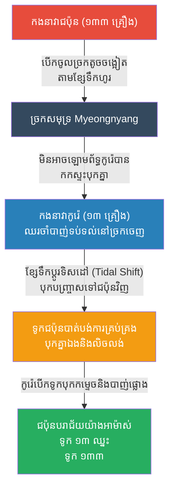

# The Battle of Myeongnyang: Exploiting the Tides (សមរភូមិម្យុងនយ៉ាង និងយុទ្ធសាស្ត្រខ្សែទឹកកួច)

**Author:** ichamrong
**Date:** 2026-05-23
**Tags:** #history #war #strategy #myeongnyang #yi-sun-sin #korea #japan
**Category:** Wars & Histories
**Read Time:** ~10 min

---

## 📌 Table of Contents
- [១. បរិបទនៃសង្គ្រាម (Context of the War)](#១-បរិបទនៃសង្គ្រាម-context-of-the-war)
- [២. យុទ្ធសាស្ត្រ៖ ខ្សែទឹកកួច (The Strategy: Tidal Currents)](#២-យុទ្ធសាស្ត្រ-ខ្សែទឹកកួច-the-strategy-tidal-currents)
- [៣. ការប្រើប្រាស់យុទ្ធសាស្ត្រនេះឡើងវិញក្នុងប្រវត្តិសាស្ត្រ (Reused in History)](#៣-ការប្រើប្រាស់យុទ្ធសាស្ត្រនេះឡើងវិញក្នុងប្រវត្តិសាស្ត្រ-reused-in-history)
- [References](#references)

---

## ១. បរិបទនៃសង្គ្រាម (Context of the War)

**សមរភូមិម្យុងនយ៉ាង (The Battle of Myeongnyang)** គឺជាជ័យជម្នះកងទ័ពជើងទឹកដ៏អស្ចារ្យបំផុតមួយនៅក្នុងប្រវត្តិសាស្ត្រពិភពលោក ដែលបានកើតឡើងនៅឆ្នាំ ១៥៩៧ ក្នុងអំឡុងពេលដែលជប៉ុនលុកលុយកូរ៉េ (Joseon)។

បន្ទាប់ពីកងទ័ពជើងទឹកកូរ៉េស្ទើរតែត្រូវបំផ្លាញទាំងស្រុងដោយសារមេទ័ពអសមត្ថភាព ស្តេចកូរ៉េបានតែងតាំងឧត្តមនាវីឯក **យី ស៊ុនស៊ីន (Yi Sun-sin)** ឱ្យមកកាន់តំណែងវិញ។ ប៉ុន្តែស្ថានការណ៍ហាក់ដូចជាអស់សង្ឃឹមទៅហើយ ព្រោះលោក យី ស៊ុនស៊ីន មានទូកចម្បាំង (Panokseon) សល់តែ **១៣ គ្រឿង** ប៉ុណ្ណោះ ខណៈដែលកងទ័ពជើងទឹកជប៉ុនមានទូកចម្បាំងជាង **១៣៣ គ្រឿង** (និងទូកតូចៗរាប់រយទៀត) ធ្វើដំណើរមកវាយប្រហារ។ ស្តេចបានបញ្ជាឱ្យលោកបោះបង់សមុទ្រ ហើយរត់ទៅតាំងទីលើគោក ប៉ុន្តែលោក យី បានតបវិញថា៖ *"ទូលព្រះបង្គំនៅមានទូក ១៣ គ្រឿងទៀត... ដរាបណាទូលព្រះបង្គំនៅមានជីវិត សត្រូវមិនអាចឆ្លងកាត់សមុទ្រនេះបានឡើយ។"*

---

## ២. យុទ្ធសាស្ត្រ៖ ខ្សែទឹកកួច (The Strategy: Tidal Currents)

យី ស៊ុនស៊ីន ដឹងថាបើវាយគ្នានៅសមុទ្រធំ លោកច្បាស់ជារលាយមិនខាន។ ដូច្នេះលោកបានពឹងផ្អែកលើ **"អព្ភូតហេតុនៃភូមិសាស្ត្រ និងខ្សែទឹក (Topography & Tides)"**។

**របៀបដែលយុទ្ធសាស្ត្រនេះដំណើរការ៖**
1. **ច្រកសមុទ្រមរណៈ (The Roaring Strait):** លោកបានបោះយុថ្កាទូកទាំង ១៣ គ្រឿងនៅច្រកសមុទ្រម្យុងនយ៉ាង (Myeongnyang Strait) ដែលជាច្រកតូចចង្អៀត និងមានចរន្តទឹកហូរខ្លាំងបំផុតនិងកួចគួរឱ្យខ្លាចបំផុតនៅកូរ៉េ។ 
2. **ការបង្ខំឱ្យសត្រូវចូលក្នុងអន្ទាក់:** កងទ័ពជើងទឹកជប៉ុនមិនអាចវាយឡោមព័ទ្ធលោកបានទេ ដោយសារច្រកនេះតូចពេក ពួកគេត្រូវតែបើកតម្រង់ជួរចូលមក។ ដោយសារជប៉ុនមានចំនួនច្រើន ពួកគេមានទំនុកចិត្ត ហើយបានបើកចូលមកតាមខ្សែទឹកដែលកំពុងហូររុញពួកគេទៅមុខ។
3. **ការផ្លាស់ប្តូរចរន្តទឹក (The Tide Turns):** លោក យី ស៊ុនស៊ីន បានឈរទប់ទល់យ៉ាងស្វិតស្វាញ។ អ្វីដែលលោកកំពុងរង់ចាំ គឺការផ្លាស់ប្តូរទិសដៅនៃខ្សែទឹកនាពេលថ្ងៃត្រង់ (Tidal shift)។ នៅពេលដែលខ្សែទឹកប្តូរទិស ចរន្តទឹកដ៏ខ្លាំងក្លាបានកួចបុកបញ្ច្រាសទៅលើកងនាវាជប៉ុនវិញ។
4. **ការបំផ្លិចបំផ្លាញ (The Devastation):** ទូកជប៉ុនដែលស្រាលនិងគ្មានបាតរាបស្មើ បានបាត់បង់ការគ្រប់គ្រង បុកគ្នាឯង និងត្រូវចរន្តទឹកកួចបង្វិល។ ឆ្លៀតឱកាសនោះ ទូកកូរ៉េ (Panokseon) ដែលមានបាតរាបស្មើនិងធ្ងន់ បានបើកបុកកម្ទេចទូកជប៉ុន និងបាញ់កាំភ្លើងធំស្រោចពីលើ។ ទូកជប៉ុន ៣១ គ្រឿងត្រូវលិច និងរាប់សិបគ្រឿងទៀតខូចខាតធ្ងន់ធ្ងរ ខណៈកូរ៉េមិនបាត់បង់ទូកសូម្បីតែមួយគ្រឿង។

---

## ៣. ការប្រើប្រាស់យុទ្ធសាស្ត្រនេះឡើងវិញក្នុងប្រវត្តិសាស្ត្រ (Reused in History)

យុទ្ធសាស្ត្រនៃការប្រើប្រាស់ **"ចរន្តទឹក អាកាសធាតុ ឬភូមិសាស្ត្រ (Force of Nature)"** ជាអាវុធ ដើម្បីទូទាត់សងនឹងការខ្វះខាតកងទ័ព គឺជារឿងដែលតែងតែកើតមាននៅក្នុងប្រវត្តិសាស្ត្រ៖

*   **សមរភូមិសាឡាមីស (Battle of Salamis, ៤៨០ មុនគ.ស):** រាប់ពាន់ឆ្នាំមុនលោក យី ស៊ុនស៊ីន... មេទ័ពក្រិកឈ្មោះ Themistocles ក៏បានប្រើប្រាស់ច្រកសមុទ្រតូចចង្អៀត (Salamis) ដើម្បីទាក់ទាញកងទ័ពជើងទឹកពែរ្សដ៏ធំសម្បើមឱ្យចូលមកកកស្ទះ រួចប្រើទូកក្រិកវាយបុកកម្ទេច ជួយសង្គ្រោះប្រទេសក្រិកទាំងមូលពីការឈ្លានពានរបស់ពែរ្ស។
*   **ការបរាជ័យរបស់ម៉ុងហ្គោលនៅជប៉ុន (Kamikaze/Divine Wind, ១២៧៤ & ១២៨១):** ម៉ុងហ្គោលបានបញ្ជូនកងទ័ពជើងទឹកដ៏ធំបំផុតទៅវាយជប៉ុន។ ជនជាតិជប៉ុនមិនអាចតទល់បានទេ ប៉ុន្តែខ្យល់ព្យុះទីហ្វុង (Typhoon) ដ៏ខ្លាំងក្លាបានបោកបក់កម្ទេចកងនាវាម៉ុងហ្គោលទាំងស្រុងពីរដងផ្ទួនៗ ដែលជប៉ុនហៅថា "ខ្យល់ទេវតា (Kamikaze)"។ នេះមិនមែនជាការរៀបចំយុទ្ធសាស្ត្ររបស់មនុស្សទេ ប៉ុន្តែវាជាការបញ្ជាក់ថា អំណាចនៃធម្មជាតិគឺខ្លាំងជាងអាវុធទាំងអស់។

---

## References

*   **Nanjung Ilgi (The War Diary of Yi Sun-sin)** — Admiral Yi's personal diary, providing a direct, day-by-day account of his incredible naval campaigns.
*   **The Imjin War by Samuel Hawley** — A comprehensive modern history of the 16th-century Japanese invasion of Korea and Yi Sun-sin's genius.

---

*Last updated: 2026-05-23*
