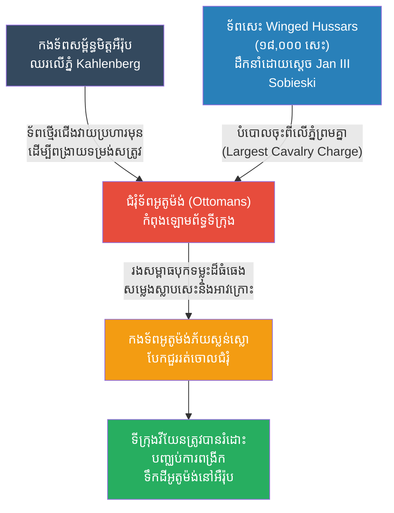

# The Siege of Vienna: The Winged Hussars (ការឡោមព័ទ្ធក្រុងវីយែន និងយុទ្ធសាស្ត្រទ័ពសេះស្លាប)

**Author:** ichamrong
**Date:** 2026-05-23
**Tags:** #history #war #strategy #vienna #ottoman #winged-hussars #cavalry
**Category:** Wars & Histories
**Read Time:** ~10 min

---

## 📌 Table of Contents
- [១. បរិបទនៃសង្គ្រាម (Context of the War)](#១-បរិបទនៃសង្គ្រាម-context-of-the-war)
- [២. យុទ្ធសាស្ត្រ៖ ការវាយសម្រុកដោយទ័ពសេះ (The Strategy: Massive Cavalry Charge)](#២-យុទ្ធសាស្ត្រ-ការវាយសម្រុកដោយទ័ពសេះ-the-strategy-massive-cavalry-charge)
- [៣. ការប្រើប្រាស់យុទ្ធសាស្ត្រនេះឡើងវិញក្នុងប្រវត្តិសាស្ត្រ (Reused in History)](#៣-ការប្រើប្រាស់យុទ្ធសាស្ត្រនេះឡើងវិញក្នុងប្រវត្តិសាស្ត្រ-reused-in-history)
- [References](#references)

---

## ១. បរិបទនៃសង្គ្រាម (Context of the War)

**ការឡោមព័ទ្ធទីក្រុងវីយែន (The Battle of Vienna)** កើតឡើងនៅថ្ងៃទី ១១-១២ ខែកញ្ញា ឆ្នាំ ១៦៨៣ ដែលជាការប្រយុទ្ធដ៏សំខាន់បំផុតមួយដើម្បីការពារទ្វីបអឺរ៉ុបពីការវាយលុករបស់ ចក្រភពអូតូម៉ង់ (Ottoman Empire)។

ចក្រភពអូតូម៉ង់ (តួកគី) បានបញ្ជូនកងទ័ពដ៏ធំសម្បើមរហូតដល់ **១៥០,០០០ នាក់** ទៅឡោមព័ទ្ធទីក្រុងវីយែន (ប្រទេសអូទ្រីសបច្ចុប្បន្ន) ដែលមានកងទ័ពការពារត្រឹមតែ ១៥,០០០ នាក់ប៉ុណ្ណោះ។ អស់រយៈពេលពីរខែ អូតូម៉ង់បានជីករូងក្រោមដីដាក់ថ្នាំផ្ទុះ ដើម្បីវាយបំបែកកំពែងក្រុង។ វីយែនជិតនឹងដួលរលំទៅហើយ ប្រជាជនអត់ឃ្លាន និងកំពែងជិតរលំ។ ប៉ុន្តែនៅវិនាទីចុងក្រោយ កងទ័ពសម្ព័ន្ធមិត្តអឺរ៉ុប (Holy League) និងកងទ័ពប៉ូឡូញ-លីទុយអានី (Polish-Lithuanian Commonwealth) បានមកដល់ដើម្បីជួយសង្គ្រោះ។

---

## ២. យុទ្ធសាស្ត្រ៖ ការវាយសម្រុកដោយទ័ពសេះ (The Strategy: Massive Cavalry Charge)

យុទ្ធសាស្ត្រនេះមិនមែនជារឿងស្មុគស្មាញដូចការឡោមព័ទ្ធនោះទេ ប៉ុន្តែវាគឺជាការប្រើប្រាស់ **"កម្លាំងទ័ពសេះដ៏ធំបំផុតនៅក្នុងប្រវត្តិសាស្ត្រ (The Largest Cavalry Charge in History)"** ដើម្បីវាយបំបែកស្មារតីនិងទម្រង់របស់សត្រូវតែម្តង។

**របៀបដែលយុទ្ធសាស្ត្រនេះដំណើរការ៖**
1. **ការវាយឆ្មក់ពីលើភ្នំ (The High Ground Advantage):** ស្តេចប៉ូឡូញ លោក **Jan III Sobieski** បានដឹកនាំទ័ពសម្ព័ន្ធមិត្តឡើងទៅលើភ្នំ Kahlenberg ដែលមើលចុះមកឃើញជំរុំរបស់ពួកអូតូម៉ង់ទាំងមូលនៅតំបន់ទំនាប។
2. **ទ័ពថ្មើរជើងបើកផ្លូវ (Infantry Clears the Way):** នៅពេលព្រឹក ទាហានថ្មើរជើងអាល្លឺម៉ង់និងអូទ្រីស បានចុះពីលើភ្នំវាយប្រហារជំរុំអូតូម៉ង់ជាមុន ដើម្បីទាក់ទាញកម្លាំងសត្រូវឱ្យផ្តោតលើពួកគេ និងធ្វើឱ្យទម្រង់សត្រូវរអាក់រអួល។
3. **ការមកដល់នៃទ័ពសេះស្លាប (The Winged Hussars):** នៅពេលរសៀល ម៉ោងប្រហែល ៥ ល្ងាច ស្តេច Sobieski បានបញ្ជាឱ្យបញ្ចេញកងទ័ពដែលគួរឱ្យខ្លាចបំផុតនៅអឺរ៉ុប គឺ **ទ័ពសេះ "Winged Hussars"** របស់ប៉ូឡូញ ដែលពាក់អាវក្រោះភ្លឺចាំង និងមានពាក់ស្លាបសត្វឥន្ទ្រីដ៏ធំនៅពីក្រោយខ្នង (បង្កើតសំឡេងលាន់ឮគួរឱ្យខ្លាចពេលជិះលឿន)។ 
4. **កម្លាំងបុកទម្លុះ (The Shock Charge):** ទ័ពសេះជាង **១៨,០០០ សេះ** បានបំបោលចុះពីលើភ្នំស្របពេលគ្នាតែមួយ (ជាការសម្រុកទ័ពសេះធំបំផុតក្នុងប្រវត្តិសាស្ត្រ)។ ទាហានអូតូម៉ង់ដែលកំពុងហត់នឿយនិងភ័យខ្លាច មិនអាចទប់ទល់នឹងកម្លាំងបុកទម្លុះដ៏មហិមានេះបានឡើយ។ ពួកគេបែកជួរ រត់ចោលជំរុំ និងរត់ចោលអាវុធទាំងស្រុង។ ទីក្រុងវីយែនត្រូវបានរំដោះ។

---

## ៣. ការប្រើប្រាស់យុទ្ធសាស្ត្រនេះឡើងវិញក្នុងប្រវត្តិសាស្ត្រ (Reused in History)

យុទ្ធសាស្ត្រ **Shock Cavalry Charge (ការវាយសម្រុកបំបែកជួរដោយទ័ពសេះធ្ងន់)** គឺជាក្បាច់វាយប្រហារដ៏ពេញនិយមបំផុតរហូតដល់ការបង្កើតកាំភ្លើងយន្ត។

*   **សមរភូមិអេឡូ (Battle of Eylau, ១៨០៧):** មេទ័ពទ័ពសេះបារាំង Joachim Murat របស់ណាប៉ូឡេអុង បានដឹកនាំទ័ពសេះជាង ១១,០០០ នាក់ វាយសម្រុកចូលចំកណ្តាលកងទ័ពរុស្ស៊ីដែលកំពុងមានប្រៀប ដើម្បីជួយសង្គ្រោះកងទ័ពថ្មើរជើងបារាំងដែលជិតដួលរលំ។ នេះគឺជា Cavalry Charge ដ៏ធំមួយទៀតក្នុងប្រវត្តិសាស្ត្រ។
*   **សង្គ្រាមលោកលើកទី១ (សមរភូមិ Beersheba, ១៩១៧):** ទោះបីជានៅក្នុងយុគសម័យកាំភ្លើងយន្តក៏ដោយ ក៏កងទ័ពសេះអូស្ត្រាលី (Australian Light Horse) បានប្រថុយជីវិត បំបោលសេះវាយសម្រុកយ៉ាងលឿនចូលទៅក្នុងលេណដ្ឋានរបស់ទាហានអូតូម៉ង់។ ដោយសារពួកគេជិះលឿនពេក ទាហានអូតូម៉ង់បង្វិលកាំភ្លើងបាញ់មិនទាន់ ដែលជួយឱ្យអូស្ត្រាលីទទួលបានជ័យជម្នះ។
*   **The Charge of the Light Brigade (សង្គ្រាមគ្រីមៀ, ១៨៥៤):** ជាឧទាហរណ៍នៃ **ការបរាជ័យ** នៃយុទ្ធសាស្ត្រនេះ នៅពេលដែលមេបញ្ជាការបញ្ជាខុស ឱ្យទ័ពសេះអង់គ្លេសរត់តម្រង់ទៅរកមាត់កាំភ្លើងធំរបស់រុស្ស៊ី ដែលបណ្តាលឱ្យទ័ពសេះត្រូវស្លាប់រង្គាលដោយគ្មានប្រយោជន៍ (បង្ហាញថា ការសម្រុកដោយទ័ពសេះលែងមានប្រសិទ្ធភាពទៀតហើយនៅពេលប៉ះជាមួយអាវុធទំនើប)។

---

## References

*   **The Enemy at the Gate by Andrew Wheatcroft** — A masterful narrative of the 1683 siege and the clash of empires.
*   **God's Playground: A History of Poland by Norman Davies** — Provides great context on the Polish-Lithuanian Commonwealth and the elite Winged Hussars.

---

*Last updated: 2026-05-23*
