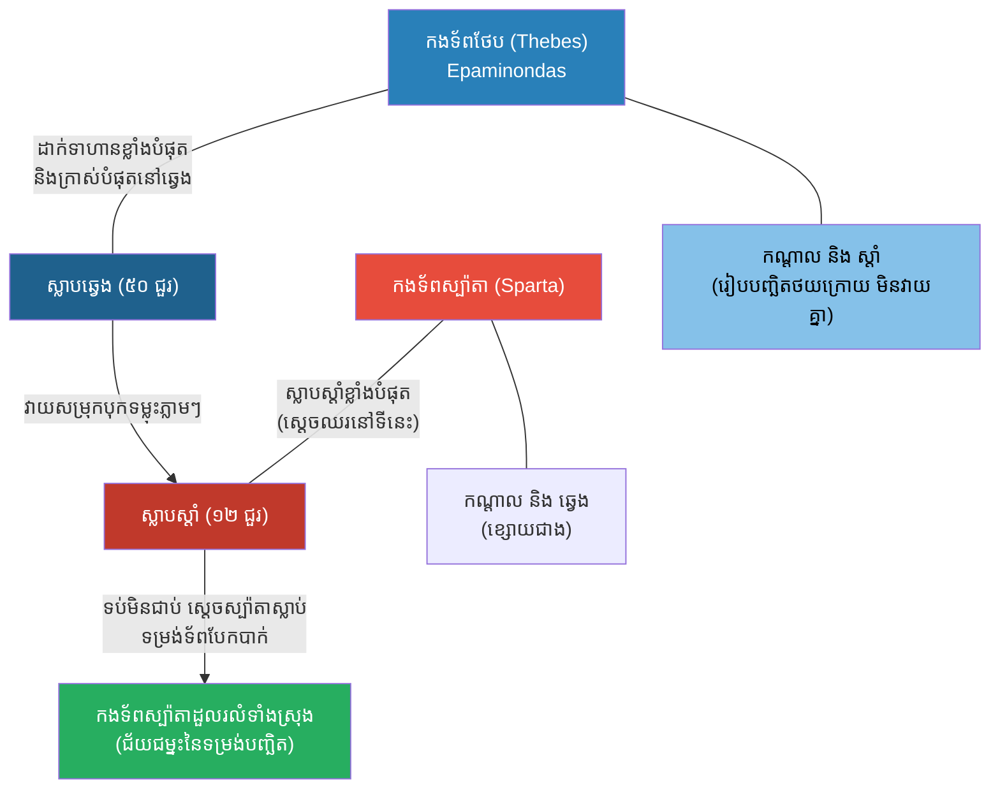

# The Battle of Leuctra: The Oblique Order (សមរភូមិលូត្រា និងយុទ្ធសាស្ត្រទម្រង់បញ្ឆិត)

**Author:** ichamrong
**Date:** 2026-05-23
**Tags:** #history #war #strategy #sparta #thebes #oblique-order #leuctra
**Category:** Wars & Histories
**Read Time:** ~10 min

---

## 📌 Table of Contents
- [១. បរិបទនៃសង្គ្រាម (Context of the War)](#១-បរិបទនៃសង្គ្រាម-context-of-the-war)
- [២. យុទ្ធសាស្ត្រ៖ ទម្រង់បញ្ឆិត (The Strategy: Oblique Order)](#២-យុទ្ធសាស្ត្រ-ទម្រង់បញ្ឆិត-the-strategy-oblique-order)
- [៣. ការប្រើប្រាស់យុទ្ធសាស្ត្រនេះឡើងវិញក្នុងប្រវត្តិសាស្ត្រ (Reused in History)](#៣-ការប្រើប្រាស់យុទ្ធសាស្ត្រនេះឡើងវិញក្នុងប្រវត្តិសាស្ត្រ-reused-in-history)
- [References](#references)

---

## ១. បរិបទនៃសង្គ្រាម (Context of the War)

**សមរភូមិលូត្រា (The Battle of Leuctra)** កើតឡើងនៅឆ្នាំ ៣៧១ មុនគ្រឹស្តសករាជ។ វាគឺជាសង្គ្រាមរវាងមហាអំណាចយោធា **ស្ប៉ាតា (Sparta)** និងរដ្ឋទីក្រុង **ថែប (Thebes)** របស់ក្រិក។

នៅសម័យនោះ កងទ័ពស្ប៉ាតាត្រូវបានគេចាត់ទុកថា "មិនអាចយកឈ្នះបាន (Invincible)" នៅក្នុងការប្រយុទ្ធលើដីគោក។ ក្បួនសឹកបុរាណរបស់ក្រិក តែងតែតម្រៀបទាហានពូកែៗបំផុតរបស់ខ្លួននៅ "ស្លាបខាងស្តាំ (Right Wing)" ហើយទាហានខ្សោយៗនៅ "ស្លាបខាងឆ្វេង"។ ដូច្នេះ ពេលវាយគ្នា ស្តាំវាយឆ្វេង ឆ្វេងវាយស្តាំ ជាទម្រង់ស្របគ្នា (Parallel Lines)។ ស្ប៉ាតាមានទាហានប្រមាណ ១១,០០០ នាក់ ខណៈថែបមានតែ ៧,០០០ នាក់ប៉ុណ្ណោះ។

---

## ២. យុទ្ធសាស្ត្រ៖ ទម្រង់បញ្ឆិត (The Strategy: Oblique Order)

មេទ័ពរបស់ថែប លោក **អេប៉ាមីណុងដាស (Epaminondas)** ដឹងថា បើតម្រៀបទ័ពតាមក្បួនបុរាណ ថែបច្បាស់ជារលាយក្រោមថ្វីដៃស្ប៉ាតាមិនខាន។ ដូច្នេះលោកបានបង្កើតយុទ្ធសាស្ត្របដិវត្តន៍មួយហៅថា **The Oblique Order (ទម្រង់បញ្ឆិត ឬ ត្រេត)**។

**របៀបដែលយុទ្ធសាស្ត្រនេះដំណើរការ៖**
1. **ការពង្រឹងស្លាបឆ្វេង (Loading the Left Flank):** ជាជាងដាក់ទាហានពូកែនៅខាងស្តាំ លោកបែរជាប្រមូលផ្តុំកងទ័ពដ៏ខ្លាំងបំផុតរបស់លោក (The Sacred Band of Thebes) រួមជាមួយទាហានជួរមុខយ៉ាងក្រាស់រហូតដល់ **៥០ ជួរ** យកទៅដាក់នៅ "ស្លាបខាងឆ្វេង" វិញ។ (ខណៈដែលស្ប៉ាតាដាក់កម្រាស់តែ ១២ ជួរប៉ុណ្ណោះនៅខាងស្តាំរបស់ពួកគេ)។
2. **ការបដិសេធមិនប្រយុទ្ធនៅខាងស្តាំ (Refusing the Right Flank):** ចំណែកឯស្លាបស្តាំនិងកណ្តាលរបស់ថែប ដែលសុទ្ធតែជាទាហានខ្សោយៗ លោកបានបញ្ជាឱ្យតម្រៀបទ័ព "រាងបញ្ឆិតថយក្រោយ" (មិនឱ្យដើរទៅជិតសត្រូវទេ ដើម្បីពន្យារពេលប្រយុទ្ធ)។
3. **កម្ទេចក្បាលម៉ាស៊ីនមុនគេ (Crushing the Head):** នៅពេលសង្គ្រាមចាប់ផ្តើម ស្លាបឆ្វេងដ៏ក្រាស់និងខ្លាំងបំផុតរបស់ថែប (៥០ ជួរ) បានបុកទម្លុះ "ស្លាបស្តាំ" របស់ស្ប៉ាតាដែលជាកន្លែងស្តេចស្ប៉ាតានិងទាហានឥស្សរជនឈរ។ ដោយសារកម្លាំងបុកខ្លាំងពេក ស្លាបស្តាំរបស់ស្ប៉ាតាត្រូវបែកបាក់ទាំងស្រុងត្រឹមតែប៉ុន្មាននាទី ស្តេចស្ប៉ាតាត្រូវសម្លាប់។
4. **ការដួលរលំនៃស្ប៉ាតា:** ពេលឃើញស្តេចខ្លួនឯងនិងទាហានខ្លាំងបំផុតត្រូវសម្លាប់ ទាហានស្ប៉ាតាផ្សេងទៀតនៅកណ្តាលនិងខាងឆ្វេង (ដែលមិនទាន់ទាំងបានវាយគ្នាស្រួលបួលផង) ក៏បាត់បង់ស្មារតីនិងដកថយ។ ការវាយកម្ទេចភាពមិនចាញ់របស់ស្ប៉ាតា គឺចាប់ផ្តើមចេញពីទម្រង់បញ្ឆិតនេះឯង។

---

## ៣. ការប្រើប្រាស់យុទ្ធសាស្ត្រនេះឡើងវិញក្នុងប្រវត្តិសាស្ត្រ (Reused in History)

ការប្រមូលផ្តុំកម្លាំងដ៏ខ្លាំងបំផុតរបស់អ្នក ទៅវាយប្រហារនៅចំណុចតែមួយរបស់សត្រូវ (Concentration of Force) ខណៈពេលដែលប្រើទាហានខ្សោយៗរបស់អ្នកដើម្បីគ្រាន់តែពន្យារពេលសត្រូវនោះ គឺជាគន្លឹះនៃជ័យជម្នះក្នុងសង្គ្រាមទំនើប៖

*   **ស្តេច Frederick the Great នៃព្រុស (Prussia):** នៅសតវត្សទី ១៨ ស្តេចហ្វ្រេឌឺរិច បានប្រើប្រាស់យុទ្ធសាស្ត្រ **Oblique Order** នេះស្ទើរតែទាំងស្រុងនៅក្នុងសមរភូមិ Leuthen (១៧៥៧)។ លោកបានវាយបំបែរសត្រូវ ហើយប្រមូលកម្លាំងទ័ពព្រុសយ៉ាងច្រើន ទៅវាយសម្រុកកម្ទេចស្លាបឆ្វេងរបស់អូទ្រីសតែមួយមុខគត់។ ហ្វ្រេឌឺរិច យកទាហាន ៣ ម៉ឺននាក់ ឈ្នះទាហាន ៨ ម៉ឺននាក់ ដោយប្រើក្បួនរបស់ថែបនេះឯង។
*   **សង្គ្រាមលោកលើកទី១ (Schlieffen Plan):** ផែនការរបស់អាល្លឺម៉ង់ក្នុងការវាយបារាំង ក៏ផ្អែកលើគំនិតនេះដែរ។ អាល្លឺម៉ង់បានដាក់កម្លាំងទ័ពភាគច្រើនបំផុតរបស់ខ្លួន (ជាង ៨០%) នៅស្លាបស្តាំ (Right Wing) ដើម្បីវាយកោងកាត់ប្រទេសបែលហ្ស៊ិក ចូលទៅកម្ទេចទីក្រុងប៉ារីស ខណៈដែលទុកទាហានតែបន្តិចបន្តួចប៉ុណ្ណោះនៅព្រំដែនអាល្លឺម៉ង់-បារាំងដើម្បីពន្យារពេលបារាំង។
*   **យុទ្ធសាស្ត្រកីឡា និងជំនួញ (Sports & Business):** នៅក្នុងកីឡាដូចជាបាល់ទាត់ ឬបាល់បោះ ការប្រមូលផ្តុំកីឡាករឆ្នើមៗទៅលេងវាយសម្រុកនៅតំបន់មួយដែលខ្សែការពារគូប្រជែងខ្សោយ (Overloading one side) គឺជាការអនុវត្តផ្ទាល់នៃទម្រង់ Oblique Order នេះឯង។

---

## References

*   **Hellenica by Xenophon** — A major source for the events in Greece, detailing the shock of the Spartan defeat.
*   **The Campaigns of Frederick the Great** — Details how this ancient tactical formation was resurrected to dominate 18th-century Europe.

---

*Last updated: 2026-05-23*
