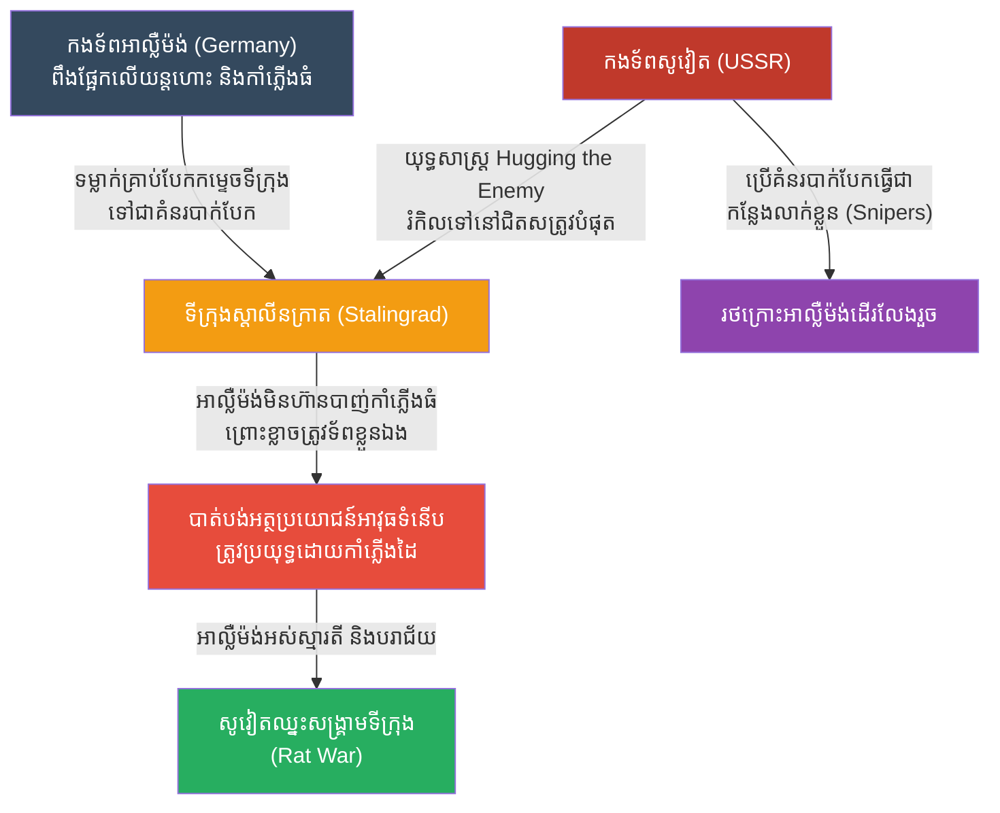

# The Battle of Stalingrad: The Rat War (សមរភូមិស្តាលីនក្រាត និងយុទ្ធសាស្ត្រសង្គ្រាមកណ្តុរ)

**Author:** ichamrong
**Date:** 2026-05-23
**Tags:** #history #war #strategy #stalingrad #ww2 #urban-warfare
**Category:** Wars & Histories
**Read Time:** ~10 min

---

## 📌 Table of Contents
- [១. បរិបទនៃសង្គ្រាម (Context of the War)](#១-បរិបទនៃសង្គ្រាម-context-of-the-war)
- [២. យុទ្ធសាស្ត្រ៖ ឱបសត្រូវឱ្យជាប់ (The Strategy: Hugging the Enemy)](#២-យុទ្ធសាស្ត្រ-ឱបសត្រូវឱ្យជាប់-the-strategy-hugging-the-enemy)
- [៣. ការប្រើប្រាស់យុទ្ធសាស្ត្រនេះឡើងវិញក្នុងប្រវត្តិសាស្ត្រ (Reused in History)](#៣-ការប្រើប្រាស់យុទ្ធសាស្ត្រនេះឡើងវិញក្នុងប្រវត្តិសាស្ត្រ-reused-in-history)
- [References](#references)

---

## ១. បរិបទនៃសង្គ្រាម (Context of the War)

**សមរភូមិស្តាលីនក្រាត (The Battle of Stalingrad, ១៩៤២-១៩៤៣)** គឺជាសមរភូមិដ៏បង្ហូរឈាមបំផុតនៅក្នុងប្រវត្តិសាស្ត្រមនុស្សជាតិ (មានមនុស្សស្លាប់ជាង ២ លាននាក់) និងជាចំណុចរបត់នៃសង្គ្រាមលោកលើកទី២។ 

កងទ័ពអាល្លឺម៉ង់របស់ហ៊ីត្លែរ (ដែលពូកែខាងរថក្រោះ កាំភ្លើងធំ និងយន្តហោះទម្លាក់គ្រាប់បែក - Blitzkrieg) បានវាយសម្រុកចូលទីក្រុងស្តាលីនក្រាតរបស់សហភាពសូវៀត។ យន្តហោះអាល្លឺម៉ង់ (Luftwaffe) បានទម្លាក់គ្រាប់បែកកម្ទេចទីក្រុងទាំងមូលទៅជាគំនរបាក់បែក។ កងទ័ពសូវៀត ដែលមានសព្វាវុធខ្សោយជាង ដឹងថាបើវាយគ្នានៅទីវាល ពួកគេច្បាស់ជាត្រូវកាំភ្លើងធំនិងយន្តហោះអាល្លឺម៉ង់កម្ទេចចោលមិនខាន។

---

## ២. យុទ្ធសាស្ត្រ៖ ឱបសត្រូវឱ្យជាប់ (The Strategy: Hugging the Enemy)

មេបញ្ជាការសូវៀត **វ៉ាស៊ីលី ជូយកូវ (Vasily Chuikov)** បានបង្កើតយុទ្ធសាស្ត្រមួយសម្រាប់ប្រយុទ្ធក្នុងទីក្រុង ដែលអាល្លឺម៉ង់ដាក់រហស្សនាមឱ្យថា **"សង្គ្រាមកណ្តុរ (Rattenkrieg / Rat War)"** ។

**របៀបដែលយុទ្ធសាស្ត្រនេះដំណើរការ៖**
1. **កុំនៅឆ្ងាយពីសត្រូវ (Hugging the Enemy):** Chuikov បានបញ្ជាឱ្យទាហានសូវៀតទាំងអស់ រក្សាគម្លាតពីទាហានអាល្លឺម៉ង់ឱ្យនៅជិតបំផុត (ប្រហែល ៥០ ម៉ែត្រ ឬតិចជាងនេះ គឺជិតដល់ថ្នាក់អាចគប់គ្រាប់បែកដៃដល់)។ 
2. **បន្សាបអាវុធធុនធ្ងន់ (Neutralizing Artillery & Air Power):** ការ "ឱប" សត្រូវឱ្យនៅជិតបែបនេះ ធ្វើឱ្យមេបញ្ជាការអាល្លឺម៉ង់មិនហ៊ានហៅយន្តហោះទម្លាក់គ្រាប់បែក ឬបាញ់កាំភ្លើងធំទេ ព្រោះខ្លាចបាញ់ខុស ត្រូវទាហានអាល្លឺម៉ង់ខ្លួនឯង។ យុទ្ធសាស្ត្រនេះបានលុបចោលអត្ថប្រយោជន៍ដ៏ធំបំផុតរបស់កងទ័ពអាល្លឺម៉ង់ទាំងស្រុង។
3. **សង្គ្រាមគំនរបាក់បែក (Rubble Warfare):** ទីក្រុងដែលអាល្លឺម៉ង់ទម្លាក់គ្រាប់បែកកម្ទេចនោះ បែរជាក្លាយជាប្រព័ន្ធការពារដ៏ល្អសម្រាប់សូវៀតទៅវិញ។ រថក្រោះអាល្លឺម៉ង់មិនអាចបើកកាត់គំនរបាក់បែកបានទេ។ ទាហានសូវៀត និងអ្នកបាញ់ស៊ីប (Snipers) ដ៏ល្បីល្បាញដូចជា វ៉ាស៊ីលី ហ្សៃសេវ (Vasily Zaitsev) បានលាក់ខ្លួនតាមរន្ធ លូក្រោមដី និងគំនរបាក់បែក ដើម្បីបាញ់ឆ្មក់ទាហានអាល្លឺម៉ង់ម្តងម្នាក់ៗជារៀងរាល់ថ្ងៃ។
4. **ការបាក់ស្មារតី:** ទាហានអាល្លឺម៉ង់ដែលធ្លាប់តែវាយយកប្រទេសផ្សេងៗក្នុងពេលប៉ុន្មានសប្តាហ៍ ត្រូវមកជាប់គាំង ប្រយុទ្ធដណ្តើមបន្ទប់ទឹក ឬជណ្តើរផ្ទះនីមួយៗ អស់ជាច្រើនខែ។ ទីបំផុត ពួកគេហត់នឿយ អត់ឃ្លាន និងត្រូវសូវៀតវាយឡោមព័ទ្ធកម្ទេចចោល។

---

## ៣. ការប្រើប្រាស់យុទ្ធសាស្ត្រនេះឡើងវិញក្នុងប្រវត្តិសាស្ត្រ (Reused in History)

យុទ្ធសាស្ត្រ **"Hugging the Enemy" ឬ "សង្គ្រាមទីក្រុង (Urban Warfare)"** គឺជាសុបិនអាក្រក់បំផុតសម្រាប់កងទ័ពទំនើបៗដែលមានសព្វាវុធខ្លាំងក្លា ប៉ុន្តែវាគឺជាក្តីសង្ឃឹមតែមួយគត់សម្រាប់កងទ័ពដែលខ្សោយជាង។

*   **សង្គ្រាមវៀតណាម (សមរភូមិ Hue កំឡុងពេល Tet Offensive, ១៩៦៨):** កងទ័ពវៀតកុងនិងវៀតណាមខាងជើង បានប្រើប្រាស់យុទ្ធសាស្ត្រ "ឱបសត្រូវឱ្យជាប់" នេះ ដើម្បីទប់ទល់នឹងកងទ័ពអាមេរិកក្នុងទីក្រុង Hue។ ដោយសារវៀតកុងនៅជិតពេក កងម៉ារីនអាមេរិកមានការលំបាកយ៉ាងខ្លាំងក្នុងការហៅយន្តហោះមកទម្លាក់គ្រាប់បែក ដែលធ្វើឱ្យការប្រយុទ្ធត្រូវអូសបន្លាយនិងបង្ហូរឈាមរាប់សប្តាហ៍។
*   **សង្គ្រាមនៅអ៊ីរ៉ាក់ (សមរភូមិ Fallujah, ២០០៤):** ក្រុមឧទ្ទាមអ៊ីរ៉ាក់បានប្រែក្លាយទីក្រុង Fallujah ទៅជាបន្ទាយប្រយុទ្ធ ដោយប្រើប្រាស់គំនរបាក់បែក រូងក្រោមដី និងការវាយឆ្មក់ពីចម្ងាយជិត។ ទោះបីជាអាមេរិកមានបច្ចេកវិទ្យាទំនើបយ៉ាងណាក៏ដោយ ក៏ពួកគេត្រូវចុះដើរថ្មើរជើង ដើម្បីឆែកឆេរផ្ទះម្តងមួយៗ (House-to-house clearing) ដែលជារបៀបវាយប្រយុទ្ធកាលពីសម័យស្តាលីនក្រាតដដែល។
*   **សង្គ្រាមនៅហ្គាហ្សា (Gaza, បច្ចុប្បន្ន):** ការប្រយុទ្ធនៅក្នុងតំបន់ទីក្រុងដ៏ហាប់ណែន និងការប្រើប្រាស់រូងក្រោមដី គឺជាឧទាហរណ៍ច្បាស់លាស់នៃការលុបបំបាត់អត្ថប្រយោជន៍ដែនអាកាសរបស់សត្រូវ ដោយបង្ខំឱ្យពួកគេប្រយុទ្ធក្នុង "សង្គ្រាមកណ្តុរ" ។

---

## References

*   **Stalingrad: The Fateful Siege by Antony Beevor** — The definitive and horrifyingly detailed account of the brutal urban warfare.
*   **Enemy at the Gates by William Craig** — Focuses on the sniper duels and the psychological aspects of the Rattenkrieg.

---

*Last updated: 2026-05-23*
