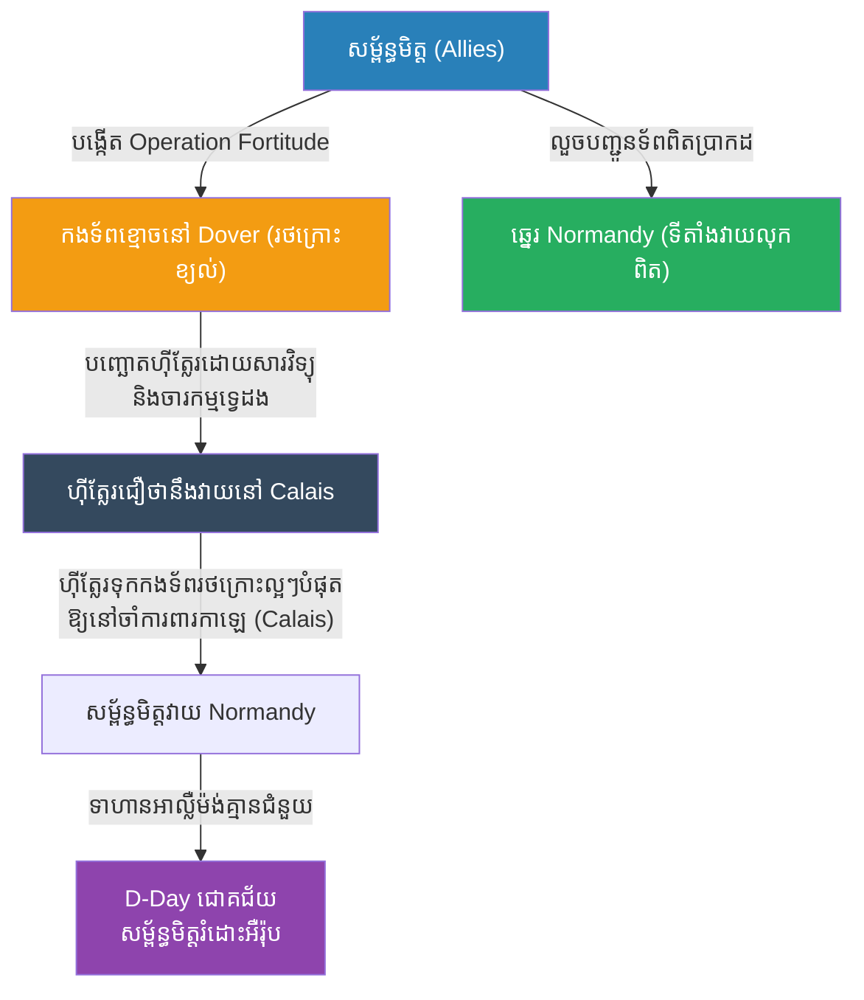

# Operation Overlord: The Ghost Army (សមរភូមិ D-Day និងយុទ្ធសាស្ត្រកងទ័ពខ្មោច)

**Author:** ichamrong
**Date:** 2026-05-23
**Tags:** #history #war #strategy #ww2 #d-day #deception #ghost-army
**Category:** Wars & Histories
**Read Time:** ~10 min

---

## 📌 Table of Contents
- [១. បរិបទនៃសង្គ្រាម (Context of the War)](#១-បរិបទនៃសង្គ្រាម-context-of-the-war)
- [២. យុទ្ធសាស្ត្រ៖ ប្រតិបត្តិការបោកប្រាស់ (The Strategy: Operation Fortitude)](#២-យុទ្ធសាស្ត្រ-ប្រតិបត្តិការបោកប្រាស់-the-strategy-operation-fortitude)
- [៣. ការប្រើប្រាស់យុទ្ធសាស្ត្រនេះឡើងវិញក្នុងប្រវត្តិសាស្ត្រ (Reused in History)](#៣-ការប្រើប្រាស់យុទ្ធសាស្ត្រនេះឡើងវិញក្នុងប្រវត្តិសាស្ត្រ-reused-in-history)
- [References](#references)

---

## ១. បរិបទនៃសង្គ្រាម (Context of the War)

**Operation Overlord (ប្រតិបត្តិការ D-Day)** កើតឡើងនៅថ្ងៃទី ៦ ខែមិថុនា ឆ្នាំ ១៩៤៤។ វាគឺជាប្រតិបត្តិការលើកទ័ពឡើងគោក (Amphibious Invasion) ដ៏ធំបំផុតនៅក្នុងប្រវត្តិសាស្ត្រ ដោយកងទ័ពសម្ព័ន្ធមិត្ត (អាមេរិក អង់គ្លេស កាណាដា) ត្រូវឆ្លងកាត់សមុទ្រ ដើម្បីទៅវាយរំដោះប្រទេសបារាំងពីការកាន់កាប់របស់កងទ័ពអាល្លឺម៉ង់ (ណាស៊ី)។

បញ្ហាដ៏ធំបំផុតគឺ ហ៊ីត្លែរ (Hitler) ដឹងច្បាស់ថាសម្ព័ន្ធមិត្តនឹងវាយលុក ប៉ុន្តែគាត់មិនដឹងថា **"នៅទីណា" និង "នៅពេលណា"** នោះទេ។ ហ៊ីត្លែរបានសាងសង់ "ជញ្ជាំងអាត្លង់ទិក (Atlantic Wall)" ដែលជាបណ្តាញកាំភ្លើងធំនិងបន្ទាយរឹងមាំតាមបណ្តោយឆ្នេរសមុទ្រ។ ប្រសិនបើអាល្លឺម៉ង់ដឹងមុនពីទីតាំងពិតប្រាកដ កងទ័ពសម្ព័ន្ធមិត្តច្បាស់ជាត្រូវបាញ់កម្ទេចស្លាប់ក្នុងសមុទ្រមិនខាន។

---

## ២. យុទ្ធសាស្ត្រ៖ ប្រតិបត្តិការបោកប្រាស់ (The Strategy: Operation Fortitude)

ដើម្បីការពារជីវិតទាហានរបស់ខ្លួន សម្ព័ន្ធមិត្តបានបង្កើតប្រតិបត្តិការបោកប្រាស់ដ៏ធំបំផុតក្នុងប្រវត្តិសាស្ត្រសង្គ្រាម ដែលមានឈ្មោះថា **Operation Fortitude (កងទ័ពខ្មោច - The Ghost Army)**។ គោលដៅគឺធ្វើឱ្យហ៊ីត្លែរជឿថា សម្ព័ន្ធមិត្តនឹងវាយលុកនៅទីក្រុងកាឡេ (Pas de Calais) ជាជាងទីតាំងពិតប្រាកដនៅ ណរម៉ង់ឌី (Normandy)។

**របៀបដែលយុទ្ធសាស្ត្រនេះដំណើរការ៖**
1. **កងទ័ពខ្មោច (The Ghost Army / FUSAG):** សម្ព័ន្ធមិត្តបានបង្កើតកងទ័ពក្លែងក្លាយមួយនៅប្រទេសអង់គ្លេស ដោយតាំងឈ្មោះមេទ័ពដ៏ល្បីល្បាញ George S. Patton ជាមេបញ្ជាការ។ ពួកគេបានយក **រថក្រោះផ្លុំខ្យល់ (Inflatable Tanks) យន្តហោះធ្វើពីឈើ និងកាំភ្លើងធំធ្វើពីកៅស៊ូ** ទៅដាក់តម្រៀបគ្នានៅទីវាល ដើម្បីឱ្យយន្តហោះស៊ើបការណ៍អាល្លឺម៉ង់ថតរូបបាន។
2. **សារវិទ្យុក្លែងក្លាយ (Fake Radio Traffic):** ពួកគេបានប្រើប្រាស់វិទ្យុទាក់ទង បញ្ជូនសារចុះឡើងរវាងកងទ័ពខ្មោចទាំងនោះ (ធ្វើពុតជាជេរគ្នា ហៅឈ្មោះគ្នា និងនិយាយពីការខ្វះខាតស្បៀង) ដើម្បីឱ្យចារកម្មអាល្លឺម៉ង់លួចស្តាប់បាន និងជឿជាក់ថាមានកងទ័ពរាប់សែននាក់នៅទីនោះមែន។
3. **ចារកម្មទ្វេដង (Double Agents):** សម្ព័ន្ធមិត្តបានចាប់ខ្លួនចារកម្មអាល្លឺម៉ង់ទាំងអស់នៅអង់គ្លេស ហើយបង្ខំឱ្យពួកគេបញ្ជូនសារក្លែងក្លាយទៅឱ្យហ៊ីត្លែរប្រាប់ថា កងទ័ពធំកំពុងត្រៀមវាយនៅ Calais។ ចារកម្មដ៏ល្បីល្បាញបំផុតគឺភ្នាក់ងារ Garbo។
4. **ភាពរឹងរូសរបស់ហ៊ីត្លែរ (The Decisive Deception):** នៅពេល D-Day ចាប់ផ្តើមនៅឆ្នេរ Normandy ហ៊ីត្លែរនៅតែជឿថា នោះគ្រាន់តែជាការវាយបញ្ឆោត (Diversion) ប៉ុណ្ណោះ។ គាត់ជឿជាក់លើ "កងទ័ពខ្មោច" របស់ Patton ខ្លាំងពេក រហូតបដិសេធមិនព្រមបញ្ជូនរថក្រោះធុនធ្ងន់ទៅជួយសង្គ្រោះទាហានខ្លួននៅ Normandy ឡើយ ដែលធ្វើឱ្យសម្ព័ន្ធមិត្តអាចវាយដណ្តើមបានឆ្នេរខ្សាច់ និងឈានទៅយកឈ្នះសង្គ្រាមលោកលើកទី២។

---

## ៣. ការប្រើប្រាស់យុទ្ធសាស្ត្រនេះឡើងវិញក្នុងប្រវត្តិសាស្ត្រ (Reused in History)

យុទ្ធសាស្ត្រនៃការបោកប្រាស់ (Deception/Maskirovka) គឺជាក្បួនសឹកដែលតែងតែមានប្រសិទ្ធភាពជានិច្ច ព្រោះ "សង្គ្រាមទាំងអស់គឺផ្អែកលើការបោកប្រាស់" ដូចដែល ស៊ុនអ៊ូ (Sun Tzu) បានពោលទុក។

*   **កងទ័ពសូវៀត និង Maskirovka:** ជនជាតិរុស្ស៊ីគឺជាអ្នកជំនាញខាងយុទ្ធសាស្ត្របោកប្រាស់ (ហៅថា Maskirovka)។ នៅក្នុងប្រតិបត្តិការ Bagration (១៩៤៤) សូវៀតបានប្រើប្រាស់វិទ្យុក្លែងក្លាយ និងចលនាទ័ពបញ្ឆោត ដើម្បីធ្វើឱ្យអាល្លឺម៉ង់ជឿថាការវាយប្រហារនឹងកើតឡើងនៅតំបន់ភាគខាងត្បូង ប៉ុន្តែការពិតពួកគេវាយប្រហារនៅភាគកណ្តាល និងបានកម្ទេចកងទ័ពអាល្លឺម៉ង់ Group Center ទាំងស្រុង។
*   **សង្គ្រាមនៅកូសូវ៉ូ (Kosovo War, ១៩៩៩):** កងទ័ពស៊ែប (Serbian Army) បានរៀនសូត្រពីកងទ័ពខ្មោច។ ពួកគេបានសាងសង់រថក្រោះ និងប្រព័ន្ធការពារអាកាសក្លែងក្លាយ ធ្វើពីឈើ និងប្លាស្ទិក ដើម្បីទាក់ទាញយន្តហោះណាតូ (NATO) ឱ្យទម្លាក់គ្រាប់បែករាប់ពាន់លានដុល្លារ ទៅលើរបស់ក្លែងក្លាយទាំងនោះ ខណៈដែលសព្វាវុធពិតប្រាកដត្រូវបានលាក់យ៉ាងមានសុវត្ថិភាព។
*   **សមរភូមិទំនើប (Decoys in Modern Warfare):** នៅក្នុងសង្គ្រាមបច្ចុប្បន្ន (ដូចជាសង្គ្រាមនៅអ៊ុយក្រែន) កងទ័ពទាំងសងខាងប្រើប្រាស់ប្រព័ន្ធកាំភ្លើងធំក្លែងក្លាយ (Wooden HIMARS) ដើម្បីបញ្ឆោតដ្រូន (Drones) និងមីស៊ីលសត្រូវឱ្យបាញ់ខាតគ្រាប់ចោល។ យុទ្ធសាស្ត្រ "កងទ័ពខ្មោច" នៅតែរស់រានមានជីវិតជានិច្ច។

---

## References

*   **The Ghost Army of World War II by Rick Beyer and Elizabeth Sayles** — The fascinating true story of the artists and engineers who built the inflatable army.
*   **Double Cross by Ben Macintyre** — An incredible narrative of the double agents who fooled Hitler and ensured the success of D-Day.

---

*Last updated: 2026-05-23*
