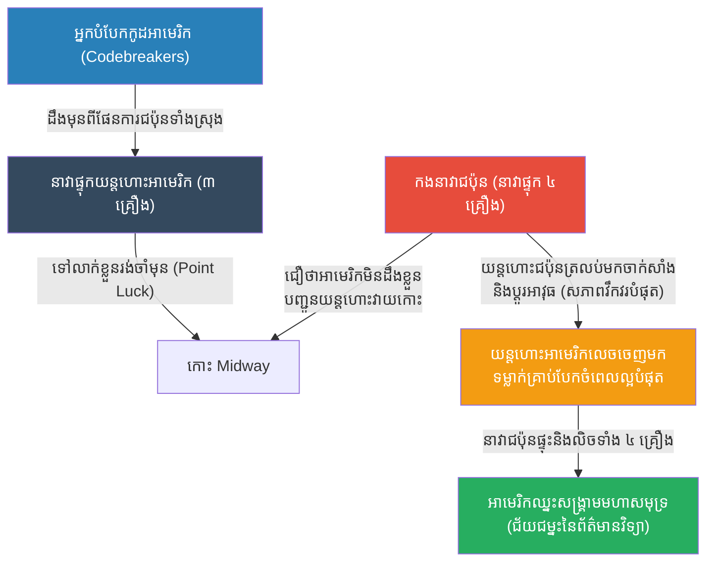

# The Battle of Midway: Intelligence & Ambush (សមរភូមិមីតវ៉េ និងយុទ្ធសាស្ត្រវាយឆ្មក់)

**Author:** ichamrong
**Date:** 2026-05-23
**Tags:** #history #war #strategy #ww2 #midway #intelligence #ambush
**Category:** Wars & Histories
**Read Time:** ~10 min

---

## 📌 Table of Contents
- [១. បរិបទនៃសង្គ្រាម (Context of the War)](#១-បរិបទនៃសង្គ្រាម-context-of-the-war)
- [២. យុទ្ធសាស្ត្រ៖ ចារកម្ម និងការវាយឆ្មក់ (The Strategy: Intelligence & Ambush)](#២-យុទ្ធសាស្ត្រ-ចារកម្ម-និងការវាយឆ្មក់-the-strategy-intelligence-ambush)
- [៣. ការប្រើប្រាស់យុទ្ធសាស្ត្រនេះឡើងវិញក្នុងប្រវត្តិសាស្ត្រ (Reused in History)](#៣-ការប្រើប្រាស់យុទ្ធសាស្ត្រនេះឡើងវិញក្នុងប្រវត្តិសាស្ត្រ-reused-in-history)
- [References](#references)

---

## ១. បរិបទនៃសង្គ្រាម (Context of the War)

**សមរភូមិមីតវ៉េ (The Battle of Midway)** កើតឡើងនៅខែមិថុនា ឆ្នាំ ១៩៤២ ត្រឹមតែ ៦ ខែប៉ុណ្ណោះបន្ទាប់ពីជប៉ុនបានវាយប្រហារកំពង់ផែ Pearl Harbor។ នេះគឺជាសមរភូមិផ្លូវទឹកដ៏សំខាន់បំផុតនៅមហាសមុទ្រប៉ាស៊ីហ្វិកកំឡុងសង្គ្រាមលោកលើកទី២។

កងទ័ពជើងទឹកជប៉ុនដែលកំពុងមានប្រៀបខ្លាំង បានរៀបចំផែនការវាយប្រហារកោះ Midway (កោះតូចមួយរបស់អាមេរិក) ដើម្បីទាក់ទាញនាវាផ្ទុកយន្តហោះ (Aircraft Carriers) អាមេរិកដែលនៅសេសសល់ ឱ្យចេញមកក្រៅហើយវាយកម្ទេចចោលតែម្តង។ ជប៉ុនមាននាវាផ្ទុកយន្តហោះធំៗចំនួន ៤ គ្រឿង ខណៈអាមេរិកមានតែ ៣ គ្រឿងប៉ុណ្ណោះ។ បើមើលតាមកម្លាំង ជប៉ុនច្បាស់ជាឈ្នះមិនខាន។ ប៉ុន្តែអាមេរិកមានអាវុធសម្ងាត់មួយ គឺ **"អ្នកបំបែកកូដ (Codebreakers)"**។

---

## ២. យុទ្ធសាស្ត្រ៖ ចារកម្ម និងការវាយឆ្មក់ (The Strategy: Intelligence & Ambush)

នៅសមរភូមិ Midway ជ័យជម្នះមិនមែនបានមកពីអ្នកមានកាំភ្លើងធំជាងទេ តែបានមកពីអ្នកមាន **"ព័ត៌មាន (Information)"** លឿនជាង។

**របៀបដែលយុទ្ធសាស្ត្រនេះដំណើរការ៖**
1. **ការបំបែកកូដសម្ងាត់ (Cracking the Code):** ក្រុមអ្នកបំបែកកូដរបស់អាមេរិក (Station HYPO) បានលួចស្តាប់និងបំបែកកូដសម្ងាត់របស់កងទ័ពជើងទឹកជប៉ុន (JN-25) បានសម្រេច។ ពួកគេដឹងថាជប៉ុនកំពុងរៀបចំវាយប្រហារគោលដៅឈ្មោះ "AF"។
2. **ការបញ្ឆោតដើម្បីបញ្ជាក់ (The Water Trap):** ដើម្បីបញ្ជាក់ថា AF គឺជាកោះ Midway មែនឬអត់ អាមេរិកបានបញ្ជូនសារវិទ្យុក្លែងក្លាយមួយដែលមិនបានបំប្លែងកូដ ដោយនិយាយថា "កោះ Midway ខូចម៉ាស៊ីនចម្រោះទឹកសាបហើយ"។ ជប៉ុនបានលួចស្តាប់ឮសារនេះ រួចបញ្ជូនសារកូដសម្ងាត់រវាងគ្នានឹងគ្នាថា "គោលដៅ AF កំពុងខ្វះទឹកសាប"។ ពេលនោះអាមេរិកដឹង ១០០% ថាជប៉ុននឹងវាយកោះ Midway។
3. **ការរៀបចំអន្ទាក់វាយឆ្មក់ (The Ambush):** ដោយដឹងមុនពីកាលបរិច្ឆេទនិងទីតាំងច្បាស់លាស់ ឧត្តមនាវីឯកអាមេរិក Chester Nimitz បានបញ្ជូននាវាផ្ទុកយន្តហោះរបស់ខ្លួនទៅលាក់ខ្លួនរង់ចាំ (Point Luck) នៅក្បែរកោះ Midway មុនពេលជប៉ុនមកដល់ទៅទៀត។
4. **ការវាយលុកពេលសត្រូវធ្វេសប្រហែស (The Fatal Five Minutes):** នៅពេលកងនាវាជប៉ុនមកដល់ ហើយបញ្ជូនយន្តហោះទៅវាយកោះ Midway ពួកគេមិនដឹងថានាវាអាមេរិកកំពុងលាក់ខ្លួនក្បែរនោះទេ។ នៅពេលយន្តហោះជប៉ុនត្រលប់មកវិញដើម្បីចាក់សាំងនិងប្តូរគ្រាប់បែក (ដែលជប៉ុនកំពុងមានភាពវឹកវរបំផុត) យន្តហោះទម្លាក់គ្រាប់បែក (Dive Bombers) របស់អាមេរិក បានលេចចេញមកហើយទម្លាក់គ្រាប់បែក ចំពេលដែលនាវាជប៉ុនពោរពេញដោយគ្រាប់បែកនិងសាំងនៅលើដំបូល។ ត្រឹមតែ ៥ នាទី នាវាផ្ទុកយន្តហោះជប៉ុន ៣ គ្រឿងត្រូវបានឆេះនិងលិច (គ្រឿងទី៤លិចនៅពេលក្រោយ)។ កងទ័ពជើងទឹកជប៉ុនមិនអាចងើបមុខរួចទៀតឡើយ។

---

## ៣. ការប្រើប្រាស់យុទ្ធសាស្ត្រនេះឡើងវិញក្នុងប្រវត្តិសាស្ត្រ (Reused in History)

សមរភូមិ Midway បានបង្កើតក្បួនច្បាប់មាសថ្មីមួយនៅក្នុងសង្គ្រាមទំនើប៖ **"ព័ត៌មាន (Information) គឺសំខាន់ជាងចំនួនកងទ័ព"**។

*   **ប្រតិបត្តិការបំបែកកូដ Enigma (WW2 អឺរ៉ុប):** ស្របពេលជាមួយគ្នានោះ នៅអឺរ៉ុប អ្នកវិទ្យាសាស្ត្រអង់គ្លេស Alan Turing បានបង្កើតម៉ាស៊ីនកុំព្យូទ័រដំបូងបង្អស់ដើម្បីបំបែកកូដសម្ងាត់ Enigma របស់អាល្លឺម៉ង់។ ដោយសារដឹងមុនពីទីតាំងនាវាមុជទឹកអាល្លឺម៉ង់ (U-boats) សម្ព័ន្ធមិត្តអាចបញ្ចៀសការវាយប្រហារ និងកាត់បន្ថយរយៈពេលសង្គ្រាមលោកលើកទី២ បានយ៉ាងហោចណាស់ ២ ឆ្នាំ។
*   **សង្គ្រាមព័ត៌មានវិទ្យាទំនើប (Cyber Warfare & SIGINT):** សព្វថ្ងៃនេះ ការប្រមូលព័ត៌មានចារកម្ម (Signals Intelligence - SIGINT) គឺជាជួរមុខនៃសង្គ្រាម។ យន្តហោះគ្មានមនុស្សបើក (Drones) ផ្កាយរណប និងការលួចស្តាប់ទូរស័ព្ទ (Hacking) ត្រូវបានប្រើប្រាស់ដើម្បីដឹងមុនពីទីតាំងសត្រូវ ហើយវាយប្រហារចំចំណុចខ្សោយដោយប្រើមីស៊ីល (ដូចដែលយើងឃើញញឹកញាប់ក្នុងសង្គ្រាមនៅអ៊ុយក្រែន)។ "ការវាយឆ្មក់ដោយពឹងផ្អែកលើទិន្នន័យ (Data-driven Ambush)" គឺផ្តើមចេញពីគំរូនៃសមរភូមិ Midway នេះឯង។

---

## References

*   **Shattered Sword by Jonathan Parshall and Anthony Tully** — The definitive book on Midway, told largely from the Japanese perspective.
*   **Incredible Victory by Walter Lord** — A gripping narrative of how the underdog American forces achieved an impossible win.

---

*Last updated: 2026-05-23*
