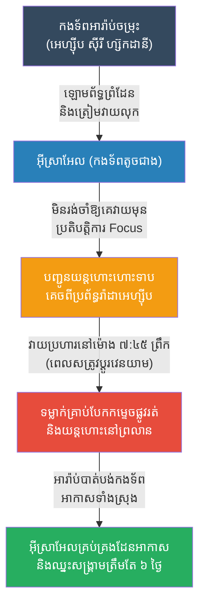

# The Six-Day War: The Preemptive Strike (សង្គ្រាម៦ថ្ងៃ និងយុទ្ធសាស្ត្រវាយប្រហារមុន)

**Author:** ichamrong
**Date:** 2026-05-23
**Tags:** #history #war #strategy #israel #six-day-war #preemptive-strike
**Category:** Wars & Histories
**Read Time:** ~10 min

---

## 📌 Table of Contents
- [១. បរិបទនៃសង្គ្រាម (Context of the War)](#១-បរិបទនៃសង្គ្រាម-context-of-the-war)
- [២. យុទ្ធសាស្ត្រ៖ ការវាយប្រហារមុន (The Strategy: Preemptive Strike)](#២-យុទ្ធសាស្ត្រ-ការវាយប្រហារមុន-the-strategy-preemptive-strike)
- [៣. ការប្រើប្រាស់យុទ្ធសាស្ត្រនេះឡើងវិញក្នុងប្រវត្តិសាស្ត្រ (Reused in History)](#៣-ការប្រើប្រាស់យុទ្ធសាស្ត្រនេះឡើងវិញក្នុងប្រវត្តិសាស្ត្រ-reused-in-history)
- [References](#references)

---

## ១. បរិបទនៃសង្គ្រាម (Context of the War)

**សង្គ្រាម ៦ ថ្ងៃ (The Six-Day War)** កើតឡើងនៅខែមិថុនា ឆ្នាំ ១៩៦៧ រវាងប្រទេសអ៊ីស្រាអែល និងសម្ព័ន្ធភាពអារ៉ាប់ (អេហ្ស៊ីប ស៊ីរី និងហ្ស៊កដានី)។

ភាពតានតឹងបានកើនឡើងដល់កម្រិតកំពូល នៅពេលដែលប្រទេសអេហ្ស៊ីបបានបណ្តេញកងកម្លាំងរក្សាសន្តិភាពអង្គការសហប្រជាជាតិចេញ បិទច្រកសមុទ្រមិនឱ្យកប៉ាល់អ៊ីស្រាអែលឆ្លងកាត់ និងប្រមូលផ្តុំកងទ័ពរាប់សែននាក់នៅតាមព្រំដែន។ អ៊ីស្រាអែល ស្ថិតក្នុងស្ថានភាព "ត្រូវគេឡោមព័ទ្ធគ្រប់ទិសទី" និងមានទំហំកងទ័ពតូចជាងប្រទេសអារ៉ាប់រួមបញ្ចូលគ្នាជាច្រើនដង។ ប្រសិនបើអ៊ីស្រាអែលរង់ចាំឱ្យអារ៉ាប់វាយប្រហារមុន អ៊ីស្រាអែលច្បាស់ជាត្រូវលុបឈ្មោះចេញពីផែនទីពិភពលោកមិនខាន។

---

## ២. យុទ្ធសាស្ត្រ៖ ការវាយប្រហារមុន (The Strategy: Preemptive Strike)

ជំនួសឱ្យការរង់ចាំ អ៊ីស្រាអែលបានសម្រេចចិត្តប្រើប្រាស់យុទ្ធសាស្ត្រ **"ការវាយប្រហារមុន (Preemptive Strike)"** ដែលមានឈ្មោះកូដថា **ប្រតិបត្តិការ Focus (Operation Focus)**។

**របៀបដែលយុទ្ធសាស្ត្រនេះដំណើរការ៖**
1. **កត្តាភ្ញាក់ផ្អើល (Total Surprise):** នៅព្រឹកព្រលឹមថ្ងៃទី ៥ ខែមិថុនា អ៊ីស្រាអែលបានបញ្ជូនយន្តហោះចម្បាំងរបស់ខ្លួនស្ទើរតែទាំងអស់ (ទុកតែ ១២ គ្រឿងសម្រាប់ការពារប្រទេស) ហោះហើរក្នុងកម្ពស់ទាបបំផុត ដើម្បីគេចពីប្រព័ន្ធរ៉ាដា ចូលទៅក្នុងប្រទេសអេហ្ស៊ីប។ ពួកគេវាយប្រហារនៅម៉ោង ៧:៤៥ ព្រឹក ដែលជាម៉ោងទាហានអេហ្ស៊ីបកំពុងប្តូរវេនយាម និងកំពុងញ៉ាំអាហារព្រឹក។
2. **កម្ទេចពេលកំពុងដេក (Destroying the Air Force on the Ground):** យន្តហោះអេហ្ស៊ីបជាង ៣០០ គ្រឿង កំពុងចតរៀបជួរគ្នាយ៉ាងស្អាតនៅព្រលានយន្តហោះ។ យន្តហោះអ៊ីស្រាអែលបានទម្លាក់គ្រាប់បែកបំផ្លាញផ្លូវរត់ (Runways) ជាមុន ដើម្បីកុំឱ្យយន្តហោះអេហ្ស៊ីបហោះឡើងរួច បន្ទាប់មកក៏បាញ់កម្ទេចយន្តហោះទាំងនោះចោលនៅនឹងដីតែម្តង។ 
3. **ការគ្រប់គ្រងដែនអាកាសទាំងស្រុង (Air Superiority):** ត្រឹមតែប៉ុន្មានម៉ោងប៉ុណ្ណោះ អ៊ីស្រាអែលបានកម្ទេចកងទ័ពអាកាសរបស់អេហ្ស៊ីប ស៊ីរី និងហ្ស៊កដានី ស្ទើរតែទាំងស្រុង។ 
4. **ជ័យជម្នះផ្លូវគោក (Ground Victory):** ដោយគ្មានយន្តហោះជួយការពារពីលើអាកាស កងទ័ពជើងគោកអារ៉ាប់រាប់សែននាក់ បានក្លាយជាផ្ទាំងស៊ីបដ៏ងាយស្រួលសម្រាប់កងទ័ពអ៊ីស្រាអែល។ ត្រឹមតែ ៦ ថ្ងៃប៉ុណ្ណោះ អ៊ីស្រាអែលបានឈ្នះសង្គ្រាមទាំងស្រុង និងពង្រីកទឹកដីរបស់ខ្លួនបានធំជាងមុនទៅទៀត។

---

## ៣. ការប្រើប្រាស់យុទ្ធសាស្ត្រនេះឡើងវិញក្នុងប្រវត្តិសាស្ត្រ (Reused in History)

យុទ្ធសាស្ត្រ **Preemptive Strike (វាយប្រហារមុនពេលសត្រូវមានឱកាសវាយខ្លួន)** គឺជាក្បួនសឹកដែលតែងតែមានភាពចម្រូងចម្រាសខាងច្បាប់អន្តរជាតិ ប៉ុន្តែវាមានប្រសិទ្ធភាពបំផុតខាងយោធា៖

*   **Pearl Harbor (១៩៤១):** ជប៉ុនបានវាយប្រហារមុន (Preemptive strike) ទៅលើមូលដ្ឋានទ័ពជើងទឹកអាមេរិកនៅ Pearl Harbor ដោយមិនបានប្រកាសសង្គ្រាមជាមុន។ គោលដៅគឺដើម្បីកម្ទេចកងនាវាអាមេរិកក្នុងប៉ាស៊ីហ្វិក ដើម្បីកុំឱ្យអាមេរិកអាចរារាំងជប៉ុនក្នុងការវាយយកអាស៊ីអាគ្នេយ៍បាន។ (ទោះបីជាជោគជ័យខាងយុទ្ធសាស្ត្រភ្លាមៗ ប៉ុន្តែវាបានធ្វើឱ្យអាមេរិកខឹងសម្បារ និងចូលរួមសង្គ្រាមរហូតកម្ទេចជប៉ុនវិញ)។
*   **សង្គ្រាមអ៊ឺរ៉ាក់ (Iraq War, ២០០៣):** សហរដ្ឋអាមេរិកបានប្រើប្រាស់ទ្រឹស្តី "Preemptive War (សង្គ្រាមការពារទុកជាមុន)" ដោយអះអាងថា អ៊ីរ៉ាក់មានអាវុធប្រល័យលោក ហើយអាមេរិកត្រូវតែវាយប្រហារមុន មុនពេលអ៊ីរ៉ាក់យកអាវុធនោះមកប្រើ។ ទោះបីជាក្រោយមកមិនរកឃើញអាវុធក៏ដោយ តែវាបង្ហាញពីការយកទ្រឹស្តី "វាយមុន" មកប្រើប្រាស់ជានយោបាយ។
*   **ប្រតិបត្តិការរំដោះចំណាប់ខ្មាំងនៅ Entebbe (១៩៧៦):** កងកម្លាំងពិសេសអ៊ីស្រាអែលបានហោះហើរជាង ៤០០០ គីឡូម៉ែត្រ ទៅកាន់ប្រទេសអ៊ូហ្គង់ដា ដើម្បីវាយឆ្មក់រំដោះចំណាប់ខ្មាំង ដោយពឹងផ្អែកលើភាពភ្ញាក់ផ្អើល និងការវាយប្រហារដោយមិនឱ្យសត្រូវដឹងខ្លួនមុន ស្រដៀងទៅនឹងការវាយប្រហារក្នុងសង្គ្រាម ៦ ថ្ងៃដែរ។

---

## References

*   **Six Days of War by Michael B. Oren** — The most comprehensive and objective account of the 1967 Arab-Israeli War.
*   **The Art of War by Sun Tzu** — Reflects the principle: "Let your plans be dark and impenetrable as night, and when you move, fall like a thunderbolt."

---

*Last updated: 2026-05-23*
