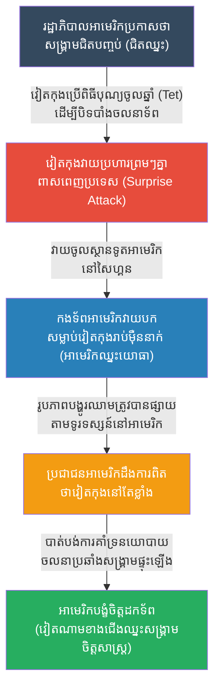

# The Tet Offensive: Psychological Shock (យុទ្ធនាការតេត និងការវាយប្រហារផ្លូវចិត្ត)

**Author:** ichamrong
**Date:** 2026-05-23
**Tags:** #history #war #strategy #tet-offensive #vietnam-war #psychology
**Category:** Wars & Histories
**Read Time:** ~10 min

---

## 📌 Table of Contents
- [១. បរិបទនៃសង្គ្រាម (Context of the War)](#១-បរិបទនៃសង្គ្រាម-context-of-the-war)
- [២. យុទ្ធសាស្ត្រ៖ ចាញ់សមរភូមិ តែឈ្នះសង្គ្រាម (The Strategy: Losing the Battle, Winning the War)](#២-យុទ្ធសាស្ត្រ-ចាញ់សមរភូមិ-តែឈ្នះសង្គ្រាម-the-strategy-losing-the-battle-winning-the-war)
- [៣. ការប្រើប្រាស់យុទ្ធសាស្ត្រនេះឡើងវិញក្នុងប្រវត្តិសាស្ត្រ (Reused in History)](#៣-ការប្រើប្រាស់យុទ្ធសាស្ត្រនេះឡើងវិញក្នុងប្រវត្តិសាស្ត្រ-reused-in-history)
- [References](#references)

---

## ១. បរិបទនៃសង្គ្រាម (Context of the War)

**យុទ្ធនាការតេត (The Tet Offensive)** កើតឡើងនៅខែមករា ឆ្នាំ ១៩៦៨ កំឡុងពេល **សង្គ្រាមវៀតណាម (Vietnam War)**។ 

នៅពេលនោះ រដ្ឋាភិបាលសហរដ្ឋអាមេរិក និងមេបញ្ជាការយោធា លោក General Westmoreland បានប្រាប់ប្រជាជនអាមេរិកាំងថា "សង្គ្រាមជិតបញ្ចប់ហើយ អាមេរិកកំពុងឈ្នះ ហើយវៀតកុង (Viet Cong) គ្មានកម្លាំងវាយលុកទៀតទេ"។
"បុណ្យតេត (Tet)" គឺជាពិធីបុណ្យចូលឆ្នាំថ្មីប្រពៃណីរបស់វៀតណាម ដែលជាធម្មតាកងទ័ពទាំងសងខាងតែងតែឈប់បាញ់គ្នា (Ceasefire) ដើម្បីអបអរសាទរ។ កងទ័ពអាមេរិកនិងវៀតណាមខាងត្បូងមានការសម្រាកលំហែរយ៉ាងស្ងប់ស្ងាត់។

---

## ២. យុទ្ធសាស្ត្រ៖ ចាញ់សមរភូមិ តែឈ្នះសង្គ្រាម (The Strategy: Losing the Battle, Winning the War)

កងទ័ពវៀតណាមខាងជើង និងវៀតកុង បានប្រើប្រាស់យុទ្ធសាស្ត្រ **"ការវាយប្រហារផ្លូវចិត្ត និងភាពភ្ញាក់ផ្អើល (Psychological Shock & Awe)"**។

**របៀបដែលយុទ្ធសាស្ត្រនេះដំណើរការ៖**
1. **ភាពភ្ញាក់ផ្អើលទូទាំងប្រទេស (Nationwide Surprise):** ដោយបំពានកិច្ចព្រមព្រៀងឈប់បាញ់ កងទ័ពវៀតកុងជាង ៨០,០០០ នាក់ បានបើកការវាយប្រហារដ៏ធំ និងព្រមៗគ្នានៅពាសពេញប្រទេសវៀតណាមខាងត្បូង (ជាង ១០០ ទីក្រុង និងមូលដ្ឋានយោធា រួមទាំងរដ្ឋធានីសៃហ្គន)។ 
2. **វាយប្រហារស្ថានទូត (The Embassy Attack):** គោលដៅដ៏រន្ធត់បំផុតគឺ ក្រុមវៀតកុងមួយក្តាប់តូចបានវាយទម្លុះចូលទៅក្នុងបរិវេណស្ថានទូតអាមេរិកនៅទីក្រុងសៃហ្គន ដែលជាកន្លែងការពារតឹងរ៉ឹងបំផុត។ 
3. **ការបរាជ័យផ្នែកយោធា (Tactical Defeat):** បើនិយាយពីលទ្ធផលនៃការប្រយុទ្ធ វៀតកុងគឺជាអ្នក **បរាជ័យយ៉ាងធ្ងន់ធ្ងរ**។ អាមេរិកនិងវៀតណាមខាងត្បូងបានវាយបកវិញយ៉ាងលឿន សម្លាប់ទាហានវៀតកុងរាប់ម៉ឺននាក់ និងដណ្តើមបានទីក្រុងទាំងអស់មកវិញ។ វៀតកុងស្ទើរតែរលាយកម្លាំងទាំងស្រុង។
4. **ជ័យជម្នះផ្នែកនយោបាយ និងចិត្តសាស្ត្រ (Strategic/Political Victory):** ទោះបីជាអាមេរិកឈ្នះក្នុងការប្រយុទ្ធ ប៉ុន្តែរូបភាពនៃការវាយប្រហារលើស្ថានទូតអាមេរិក និងការប្រយុទ្ធបង្ហូរឈាមក្នុងទីក្រុង ត្រូវបានចាក់ផ្សាយលើកញ្ចក់ទូរទស្សន៍អាមេរិកជារៀងរាល់ថ្ងៃ។ ប្រជាជនអាមេរិកដែលរដ្ឋាភិបាលប្រាប់ថា "ជិតឈ្នះសង្គ្រាមហើយ" បែរជាឃើញរូបភាពដ៏រន្ធត់នេះ ក៏បាត់បង់ទំនុកចិត្តលើរដ្ឋាភិបាលទាំងស្រុង។ ចលនាប្រឆាំងសង្គ្រាមនៅអាមេរិកបានផ្ទុះឡើងយ៉ាងខ្លាំង បង្ខំឱ្យប្រធានាធិបតីអាមេរិកត្រូវដកទ័ពត្រលប់ទៅវិញ។ ទីបំផុត វៀតណាមខាងជើងឈ្នះសង្គ្រាម។

---

## ៣. ការប្រើប្រាស់យុទ្ធសាស្ត្រនេះឡើងវិញក្នុងប្រវត្តិសាស្ត្រ (Reused in History)

យុទ្ធនាការតេត គឺជាឧទាហរណ៍ដ៏ល្អឥតខ្ចោះនៃគោលការណ៍ក្បួនសឹករបស់លោក Carl von Clausewitz ដែលថា **"សង្គ្រាមគឺជាការបន្តនៃនយោបាយ (War is the continuation of politics)"**។ បើអ្នកឈ្នះនយោបាយ ទោះបីចាញ់យោធាក៏អ្នកនៅតែឈ្នះសង្គ្រាមដែរ។

*   **សង្គ្រាមទប់ទល់អំពើភេរវកម្ម (War on Terror):** ក្រុមភេរវករដូចជា អាល់កៃដា (Al-Qaeda) និងការវាយប្រហារ 9/11 (២០០១) គឺផ្តោតលើផលប៉ះពាល់ផ្នែកចិត្តសាស្ត្រជាងផលប៉ះពាល់ផ្នែកយោធា។ ការបំផ្លាញអគារពាណិជ្ជកម្មពិភពលោក មិនមែនធ្វើឱ្យកងទ័ពអាមេរិកចុះខ្សោយទេ ប៉ុន្តែវាបង្កើតភាពភ័យខ្លាច (Psychological shock) និងអូសទាញអាមេរិកឱ្យចូលទៅក្នុងសង្គ្រាមដ៏រ៉ាំរ៉ៃនៅមជ្ឈិមបូព៌ា ដែលបំផ្លាញធនធាននិងឥទ្ធិពលនយោបាយរបស់អាមេរិកយ៉ាងច្រើន។
*   **សង្គ្រាមទ័ពព្រៃ (Guerrilla Warfare):** ក្រុមឧទ្ទាមភាគច្រើនតែងតែប្រើប្រាស់ការវាយប្រហារក្នុងទីក្រុង ដើម្បីទាក់ទាញចំណាប់អារម្មណ៍ពីសារព័ត៌មានអន្តរជាតិ (Media Coverage)។ ទោះបីជាពួកគេត្រូវសត្រូវកម្ទេចចោលក៏ដោយ តែរូបភាពនៃ "ជនទន់ខ្សោយតស៊ូប្រឆាំងនឹងមហាអំណាច" តែងតែទទួលបានការគាំទ្រនិងជួយឱ្យពួកគេឈ្នះនៅលើឆាកនយោបាយអន្តរជាតិជានិច្ច។

---

## References

*   **The Tet Offensive by Don Oberdorfer** — A classic journalistic account of how the offensive unfolded and completely changed American public opinion.
*   **On War by Carl von Clausewitz** — Analyzes the fundamental relationship between military action, psychological impact, and political objectives.

---

*Last updated: 2026-05-23*
