# The Battle of Gettysburg: The Fishhook Defense (សមរភូមិហ្គេតធីស្បឺគ និងកំហុសនៃការវាយសម្រុក)

**Author:** ichamrong
**Date:** 2026-05-23
**Tags:** #history #war #strategy #gettysburg #civil-war #robert-e-lee
**Category:** Wars & Histories
**Read Time:** ~10 min

---

## 📌 Table of Contents
- [១. បរិបទនៃសង្គ្រាម (Context of the War)](#១-បរិបទនៃសង្គ្រាម-context-of-the-war)
- [២. យុទ្ធសាស្ត្រ៖ ទម្រង់ទំពក់ត្រី និងកំហុស Picket (Fishhook Defense & Pickett's Charge)](#២-យុទ្ធសាស្ត្រ-ទម្រង់ទំពក់ត្រី-និងកំហុស-picket-fishhook-defense-picketts-charge)
- [៣. ការប្រើប្រាស់យុទ្ធសាស្ត្រនេះឡើងវិញក្នុងប្រវត្តិសាស្ត្រ (Reused in History)](#៣-ការប្រើប្រាស់យុទ្ធសាស្ត្រនេះឡើងវិញក្នុងប្រវត្តិសាស្ត្រ-reused-in-history)
- [References](#references)

---

## ១. បរិបទនៃសង្គ្រាម (Context of the War)

**សមរភូមិហ្គេតធីស្បឺគ (The Battle of Gettysburg)** កើតឡើងនៅខែកក្កដា ឆ្នាំ ១៨៦៣ ដែលជាសមរភូមិដ៏បង្ហូរឈាមបំផុត និងជាចំណុចរបត់នៃ **សង្គ្រាមស៊ីវិលអាមេរិក (American Civil War)**។

មេបញ្ជាការដ៏អស្ចារ្យនៃកងទ័ពភាគខាងត្បូង (Confederacy) លោកឧត្តមសេនីយ៍ **Robert E. Lee** បានដឹកនាំទ័ពលុកលុយចូលទឹកដីភាគខាងជើង (Union) ដោយសង្ឃឹមថានឹងឈ្នះសមរភូមិដ៏ធំមួយ ដើម្បីបង្ខំឱ្យភាគខាងជើងសុំចុះចាញ់។ ភាគខាងជើង (ដឹកនាំដោយឧត្តមសេនីយ៍ George Meade) បានទៅដល់មុន និងកាន់កាប់ទីតាំងភ្នំខ្ពស់ៗជុំវិញទីក្រុងហ្គេតធីស្បឺគ។

---

## ២. យុទ្ធសាស្ត្រ៖ ទម្រង់ទំពក់ត្រី និងកំហុស Picket (Fishhook Defense & Pickett's Charge)

សមរភូមិនេះគឺបង្ហាញពីភាពខ្លាំងនៃ "ការការពារពីទីខ្ពស់" និងភាពមហន្តរាយនៃ "ការវាយសម្រុកចំកណ្តាល (Frontal Assault)"។

**របៀបដែលយុទ្ធសាស្ត្រនេះដំណើរការ៖**
1. **ទម្រង់ការពារទំពក់ត្រី (The Fishhook Formation):** កងទ័ពភាគខាងជើង (Union) បានតម្រៀបទ័ពនៅតាមបណ្តោយជួរភ្នំ ដែលមានរាងកោងដូច "ផ្លែទំពក់ត្រី"។ អត្ថប្រយោជន៍នៃទម្រង់កោងនេះ (Interior Lines) គឺអាចឱ្យពួកគេផ្លាស់ទីកងទ័ពជំនួយពីកន្លែងមួយទៅកន្លែងមួយទៀត (ពីឆ្វេងទៅស្តាំ) បានយ៉ាងលឿននិងខ្លី ខណៈដែលភាគខាងត្បូង (ដែលនៅខាងក្រៅរង្វង់) ត្រូវដើរផ្លូវឆ្ងាយណាស់ទើបអាចបញ្ជូនទ័ពជំនួយបាន។
2. **ការវាយប្រហារសងខាងបរាជ័យ (Failed Flank Attacks):** ក្នុងរយៈពេលពីរថ្ងៃដំបូង ឧត្តមសេនីយ៍ Lee បានបញ្ជាឱ្យទ័ពភាគខាងត្បូងវាយប្រហារទៅលើចុងសងខាង (Flanks) នៃទំពក់ត្រីនោះ ប៉ុន្តែត្រូវភាគខាងជើងវាយបកនិងទប់ជាប់ជានិច្ច។
3. **កំហុសដ៏ធំបំផុត (Pickett's Charge):** ដោយជឿជាក់ថាភាគខាងជើងបានបញ្ជូនទ័ពទៅការពារសងខាងអស់ លោក Lee បានធ្វើការសម្រេចចិត្តដ៏ខុសឆ្គងបំផុតមួយក្នុងប្រវត្តិសាស្ត្រ។ នៅថ្ងៃទី ៣ លោកបានបញ្ជាឱ្យកងទ័ពប្រមាណ ១២,៥០០ នាក់ (ដឹកនាំដោយឧត្តមសេនីយ៍ George Pickett) **ដើរជាជួរត្រង់កាត់ទីវាលចម្ងាយជិត ១ គីឡូម៉ែត្រ** ដើម្បីទៅវាយសម្រុកចំកណ្តាលទម្រង់របស់ភាគខាងជើង។
4. **ការសម្លាប់រង្គាល (The Massacre):** នៅពេលទាហានរបស់ Pickett ដើរតម្រង់ទៅមុខ កាំភ្លើងធំនិងកាំភ្លើងដៃរបស់ភាគខាងជើង (ដែលតម្រៀបជាទម្រង់កោង និងបាញ់ប្រមូលផ្តុំមកកណ្តាល - Enfilade Fire) បានបាញ់ស្រោចទៅលើពួកគេយ៉ាងសាហាវ។ ទាហានភាគខាងត្បូងជាងពាក់កណ្តាល (ប្រហែល ៦០០០ នាក់) ត្រូវបានសម្លាប់និងរបួសក្នុងពេលតែប៉ុន្មាននាទី។ លោក Lee បរាជ័យ និងត្រូវដកទ័ពទាំងរងា។

```mermaid
graph TD
    A["កងទ័ពភាគខាងត្បូង (Confederate)<br/>វាយពីខាងក្រៅរង្វង់"] -->|"ព្យាយាមវាយឆ្វេង និងស្តាំ<br>(ថ្ងៃទី ១ និង ទី ២)"| B["កងទ័ពភាគខាងជើង (Union)<br/>រៀបចំទម្រង់ 'ទំពក់ត្រី' លើទីខ្ពស់"]
    
    B -->|"ងាយស្រួលបញ្ជូនទ័ពជំនួយ<br>តាមខ្សែក្នុង (Interior Lines)"| B
    
    A -->|"លោក Lee បញ្ជាឱ្យ Pickett<br>ដើរកាត់ទីវាលវាយចំកណ្តាល (ថ្ងៃទី ៣)"| C["កងទ័ពខាងជើងប្រើកាំភ្លើងធំ<br/>បាញ់កៀបពីសងខាងនិងកណ្តាល"]
    
    C -->|"ទាហានខាងត្បូងគ្មានកន្លែងពួន"| D["Pickett's Charge ទទួលបរាជ័យ<br/>ស្លាប់ជាង ៦០០០ នាក់"]
    
    D --> E["ចំណុចរបត់សង្គ្រាមស៊ីវិលអាមេរិក<br/>ខាងត្បូងមិនអាចវាយលុកបានទៀតទេ"]
    
    style A fill:#34495e,color:#fff
    style B fill:#2980b9,color:#fff
    style C fill:#f39c12,color:#fff
    style D fill:#e74c3c,color:#fff
    style E fill:#27ae60,color:#fff
```

---

## ៣. ការប្រើប្រាស់យុទ្ធសាស្ត្រនេះឡើងវិញក្នុងប្រវត្តិសាស្ត្រ (Reused in History)

សមរភូមិហ្គេតធីស្បឺគ បានបង្ហាញពីចំណុចបញ្ចប់នៃ "យុគសម័យទាហានដើរតម្រៀបជួរ" (Napoleonic Tactics) ព្រោះបច្ចេកវិទ្យាកាំភ្លើង (Rifles) អាចបាញ់បានឆ្ងាយនិងច្បាស់ជាងមុន៖

*   **សង្គ្រាមលោកលើកទី១ (WW1 Trench Warfare):** កំហុសនៃការវាយសម្រុកចំកណ្តាល (Frontal Assault) ត្រូវបានមេបញ្ជាការជាច្រើនធ្វើខុសច្រំដែលៗនៅក្នុងសង្គ្រាមលោកលើកទី១។ មេទ័ពតែងតែបញ្ជាឱ្យទាហានរាប់ម៉ឺននាក់ ដើរចេញពីលេណដ្ឋានកាត់ទីវាលទៅវាយលេណដ្ឋានសត្រូវ ដោយត្រូវសត្រូវបាញ់សម្លាប់ដោយកាំភ្លើងយន្តយ៉ាងរង្គាល (ឧទាហរណ៍៖ សមរភូមិ Somme ដែលអង់គ្លេសស្លាប់ជិត ៦ ម៉ឺននាក់ក្នុងមួយថ្ងៃ)។ នេះគឺជា Pickett's Charge ក្នុងទំហំធំជាង។
*   **គោលការណ៍ Interior Lines:** ការការពារដោយរក្សាទម្រង់កោង ឬជារង្វង់ ដើម្បីអាចបញ្ជូនទ័ពជំនួយឱ្យគ្នាយ៉ាងលឿនតាម "ខ្សែក្នុង" ត្រូវបានប្រើប្រាស់ដោយជោគជ័យដោយ ណាប៉ូឡេអុង (អូទ្រីសតែងតែនៅខ្សែក្រៅ) និងត្រូវបានបង្រៀននៅក្នុងសាលាយោធាជុំវិញពិភពលោករហូតដល់សព្វថ្ងៃ។

---

## References

*   **The Killer Angels by Michael Shaara** — A Pulitzer Prize-winning historical novel that brilliantly captures the decisions and tragedies of Gettysburg.
*   **Gettysburg by Stephen W. Sears** — One of the most authoritative and detailed historical accounts of the battle and its strategic blunders.

---

*Last updated: 2026-05-23*
