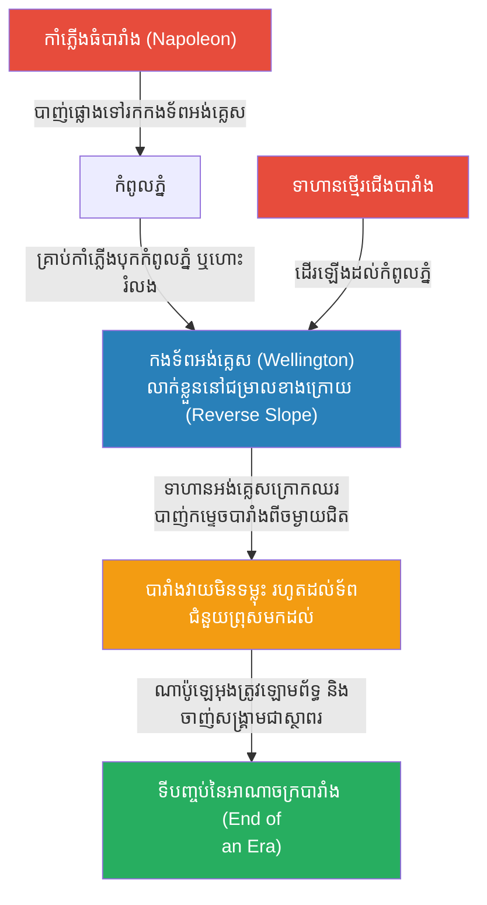

# The Battle of Waterloo: The Reverse Slope (សមរភូមិវ៉តធើលូ និងយុទ្ធសាស្ត្រជម្រាលភ្នំ)

**Author:** ichamrong
**Date:** 2026-05-23
**Tags:** #history #war #strategy #waterloo #napoleon #wellington #reverse-slope
**Category:** Wars & Histories
**Read Time:** ~10 min

---

## 📌 Table of Contents
- [១. បរិបទនៃសង្គ្រាម (Context of the War)](#១-បរិបទនៃសង្គ្រាម-context-of-the-war)
- [២. យុទ្ធសាស្ត្រ៖ ការការពារនៅជម្រាលក្រោយ (The Strategy: Reverse Slope Defense)](#២-យុទ្ធសាស្ត្រ-ការការពារនៅជម្រាលក្រោយ-the-strategy-reverse-slope-defense)
- [៣. ការប្រើប្រាស់យុទ្ធសាស្ត្រនេះឡើងវិញក្នុងប្រវត្តិសាស្ត្រ (Reused in History)](#៣-ការប្រើប្រាស់យុទ្ធសាស្ត្រនេះឡើងវិញក្នុងប្រវត្តិសាស្ត្រ-reused-in-history)
- [References](#references)

---

## ១. បរិបទនៃសង្គ្រាម (Context of the War)

**សមរភូមិវ៉តធើលូ (The Battle of Waterloo)** កើតឡើងនៅថ្ងៃទី ១៨ ខែមិថុនា ឆ្នាំ ១៨១៥។ នេះគឺជាសមរភូមិចុងក្រោយបង្អស់ដែលបញ្ចប់អាជីពនិងភាពអស្ចារ្យរបស់ អធិរាជបារាំង **ណាប៉ូឡេអុង (Napoleon Bonaparte)**។

បន្ទាប់ពីណាប៉ូឡេអុងរត់គេចពីការនិរទេសខ្លួននៅកោះ Elba លោកបានត្រលប់មកកាន់អំណាចវិញនិងប្រមូលកងទ័ពបានប្រហែល ៧៣,០០០ នាក់។ លោកត្រូវប្រឈមមុខនឹងកងទ័ពសម្ព័ន្ធមិត្ត (អង់គ្លេស ហូឡង់ អាល្លឺម៉ង់) ដឹកនាំដោយ **អ្នកឧកញ៉ា វែលលីងតោន (Duke of Wellington)** និងកងទ័ពព្រុស (Prussia) ដែលកំពុងធ្វើដំណើរមកជួយ។ វែលលីងតោន ដឹងថាគាត់គ្រាន់តែត្រូវការ "ទប់ទល់" ឱ្យបានរហូតដល់ទ័ពព្រុសមកដល់ នោះណាប៉ូឡេអុងច្បាស់ជាចាញ់។

---

## ២. យុទ្ធសាស្ត្រ៖ ការការពារនៅជម្រាលក្រោយ (The Strategy: Reverse Slope Defense)

អាវុធដ៏ខ្លាំងបំផុតរបស់ណាប៉ូឡេអុង គឺកាំភ្លើងធំ (Artillery/Grand Battery)។ ប៉ុន្តែវែលលីងតោនបានប្រើប្រាស់ភូមិសាស្ត្រដើម្បីធ្វើឱ្យកាំភ្លើងធំរបស់ណាប៉ូឡេអុង "ខ្វាក់ភ្នែក"។ យុទ្ធសាស្ត្រនេះហៅថា **The Reverse Slope Defense (ការការពារនៅជម្រាលភ្នំខាងក្រោយ)**។

**របៀបដែលយុទ្ធសាស្ត្រនេះដំណើរការ៖**
1. **ការលាក់កងទ័ព (Hiding the Army):** ជាធម្មតា កងទ័ពតែងតែឈរតម្រៀបគ្នានៅលើកំពូលភ្នំដើម្បីមើលឱ្យបានឆ្ងាយ។ ប៉ុន្តែវែលលីងតោន បានបញ្ជាឱ្យកងទ័ពថ្មើរជើងរបស់គាត់ទាំងអស់ ដកថយទៅឈរ ឬដេកនៅ **"ជម្រាលភ្នំខាងក្រោយ (Reverse Slope)"**។
2. **បន្សាបកាំភ្លើងធំ (Neutralizing Artillery):** នៅពេលណាប៉ូឡេអុងបាញ់កាំភ្លើងធំជាង ៨០ ដើម (Grand Battery) គ្រាប់កាំភ្លើងធំទាំងនោះបានបុកចំកំពូលភ្នំ ឬហោះរំលងពីលើក្បាលកងទ័ពអង់គ្លេសដែលកំពុងលាក់ខ្លួននៅជម្រាលខាងក្រោយ ធ្លាក់ចូលទៅក្នុងភក់ខាងក្រោយបាត់។ កងទ័ពអង់គ្លេសស្ទើរតែមិនរងគ្រោះថ្នាក់សោះពីការបាញ់ផ្លោងនេះ។
3. **កត្តាភ្ញាក់ផ្អើល (The Surprise Element):** នៅពេលទាហានថ្មើរជើងបារាំង ដើរឡើងដល់កំពូលភ្នំដោយគិតថាសត្រូវត្រូវកាំភ្លើងធំបាញ់ខ្ទេចអស់ហើយ ពួកគេបែរជាត្រូវភ្ញាក់ផ្អើលយ៉ាងខ្លាំង នៅពេលឃើញទាហានអង់គ្លេសនៅរស់រានមានជីវិតទាំងអស់ ក្រោកឈរឡើងពីខាងក្រោយភ្នំ ហើយបាញ់ស្រោចមកលើពួកគេក្នុងចម្ងាយជិតបំផុត។
4. **ការរង់ចាំជ័យជម្នះ:** ដោយសារការការពារនៅជម្រាលក្រោយដ៏រឹងមាំនេះ វែលលីងតោនអាចទប់ទល់ការវាយសម្រុករបស់បារាំងបានពេញមួយថ្ងៃ រហូតដល់កងទ័ពព្រុស (Prussian Army) ដឹកនាំដោយឧត្តមសេនីយ៍ Blücher មកដល់នៅពេលល្ងាច ហើយវាយកៀបណាប៉ូឡេអុងពីចំហៀង បញ្ចប់អាណាចក្ររបស់ណាប៉ូឡេអុងជារៀងរហូត។

---

## ៣. ការប្រើប្រាស់យុទ្ធសាស្ត្រនេះឡើងវិញក្នុងប្រវត្តិសាស្ត្រ (Reused in History)

ការប្រើប្រាស់ "Reverse Slope" គឺជារបកគំហើញដ៏សំខាន់មួយក្នុងការកាត់បន្ថយឥទ្ធិពលនៃអាវុធធុនធ្ងន់ និងនៅតែត្រូវបានប្រើប្រាស់ក្នុងការហ្វឹកហាត់យោធាសព្វថ្ងៃ៖

*   **សង្គ្រាមលោកលើកទី១ (WW1):** កងទ័ពអាល្លឺម៉ង់ បានរៀនសូត្រពីកំហុសនេះ ហើយតែងតែសាងសង់លេណដ្ឋានខ្សែការពារទី២របស់ខ្លួន នៅឯជម្រាលខាងក្រោយនៃកូនភ្នំ (Reverse slope defenses)។ នៅពេលអង់គ្លេសបាញ់កាំភ្លើងធំរាប់លានគ្រាប់ គឺត្រូវតែលេណដ្ឋានខ្សែទី១ (ដែលអាល្លឺម៉ង់ដកទ័ពចេញអស់)។ ពេលអង់គ្លេសដើរចូលមក អាល្លឺម៉ង់វាយបកពីជម្រាលក្រោយវិញយ៉ាងងាយ។
*   **សង្គ្រាមកូរ៉េ (Korean War, ១៩៥០):** នៅក្នុងសមរភូមិជាច្រើនដូចជា Battle of Heartbreak Ridge កងទ័ពអាមេរិកនិងកូរ៉េខាងត្បូង បានប្រើប្រាស់យុទ្ធសាស្ត្រ Reverse slope ដើម្បីគេចពីការបាញ់ផ្លោងកាំភ្លើងធំនិងការវាយប្រហារដោយរលកមនុស្ស (Human wave attacks) របស់កងទ័ពចិននិងកូរ៉េខាងជើង។
*   **សង្គ្រាមកោះអូគីណាវ៉ា (Okinawa, WW2):** កងទ័ពជប៉ុនបានជីករូងលាក់ខ្លួននៅជម្រាលខាងក្រោយនៃភ្នំ ដោយចៀសវាងការឈរនៅលើកំពូលភ្នំ ដែលជាហេតុធ្វើឱ្យកាំភ្លើងធំពីនាវាចម្បាំងអាមេរិកបាញ់មិនត្រូវ ហើយបង្ខំឱ្យទាហានម៉ារីនអាមេរិកត្រូវដើរចូលទៅប្រយុទ្ធផ្ទាល់យ៉ាងបង្ហូរឈាម។

---

## References

*   **Waterloo: The History of Four Days, Three Armies, and Three Battles by Bernard Cornwell** — A fantastic and accessible account of the battle, highlighting Wellington's brilliant use of terrain.
*   **Wellington: The Iron Duke by Richard Holmes** — Explores the tactical genius of the Duke of Wellington, particularly his mastery of the reverse slope defense.

---

*Last updated: 2026-05-23*
