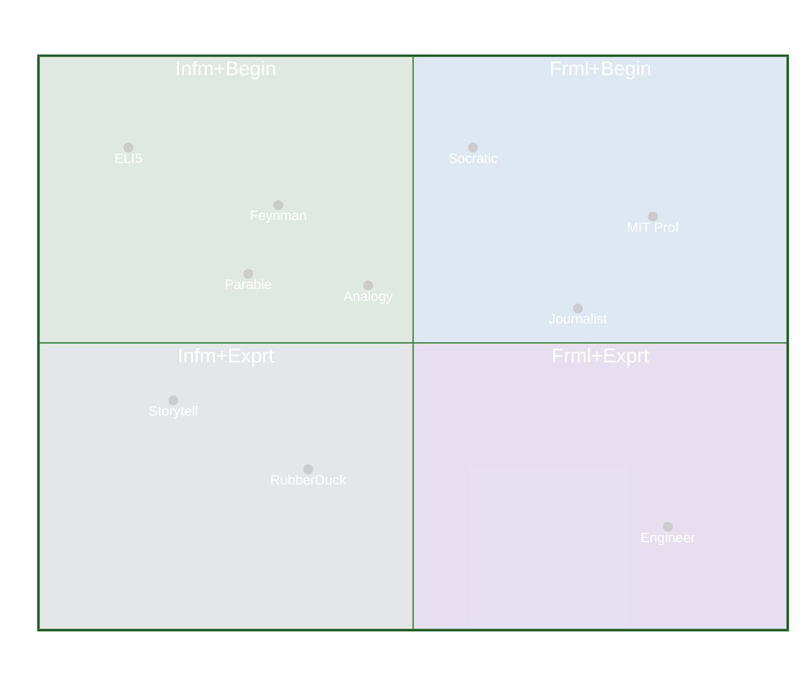
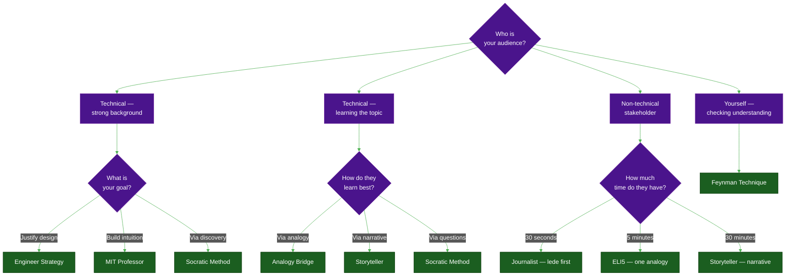

# Explanation Strategies

> **The measure of understanding is not what you know — it's whether you can make someone else understand.**

There are many ways to explain something complex. The right strategy depends on your **audience** and your **goal**.

---

## Strategies

| # | Strategy | Best For |
| :--- | :--- | :--- |
| [01](01-mit-professor.md) | **MIT Professor** | Deep learners, technical docs |
| [02](02-feynman-technique.md) | **Feynman Technique** | Self-check, teaching prep |
| [03](03-eli5.md) | **ELI5** | Non-technical, first contact |
| [04](04-analogy-bridge.md) | **Analogy Bridge** | Cross-domain learners |
| [05](05-socratic-method.md) | **Socratic Method** | Mentoring, code review |
| [06](06-journalist-inverted-pyramid.md) | **Journalist** | Busy readers, postmortems |
| [07](07-storyteller-narrative-arc.md) | **Storyteller** | Talks, blog posts, retros |
| [08](08-engineer-requirements-constraints-solution.md) | **Engineer** | Design docs, ADRs |
| [09](09-the-parable.md) | **The Parable** | Cognitive biases, psychology, ethics |

---

## Choosing the Right Strategy

---

## The Meta-Rule

> **No single strategy works for all audiences.**  
> The best communicators carry all of these as tools and switch fluently between them — even mid-explanation. Start with ELI5 to build trust, shift to MIT Professor for depth, close with Engineer to justify the trade-offs.

---

## Summary

| Strategy | Best For | Signature |
| :--- | :--- | :--- |
| **MIT Professor** | Deep learners, technical docs | "The only way to achieve X is Y, therefore..." |
| **Feynman** | Self-check, teaching prep | "Explain without the word X" |
| **ELI5** | Non-technical, first contact | "Think of it like..." |
| **Analogy Bridge** | Cross-domain learners | "X in A is exactly Y in B, because both..." |
| **Socratic** | Mentoring, code review | Never state — always ask |
| **Journalist** | Busy readers, postmortems | Most important sentence first |
| **Storyteller** | Talks, blog posts, retros | Hero → villain → conflict → resolution |
| **Engineer** | Design docs, ADRs | Requirements → constraints → elimination |
| **The Parable** | Cognitive biases, ethics, psychology | Tell story → pause → "why?" → debrief |

---

## Related

- [Visual Communication Guide](../README.md)
- [Developer Habits](../../README.md)
- [Mental Models & Concepts](../../../../concepts/README.md)
