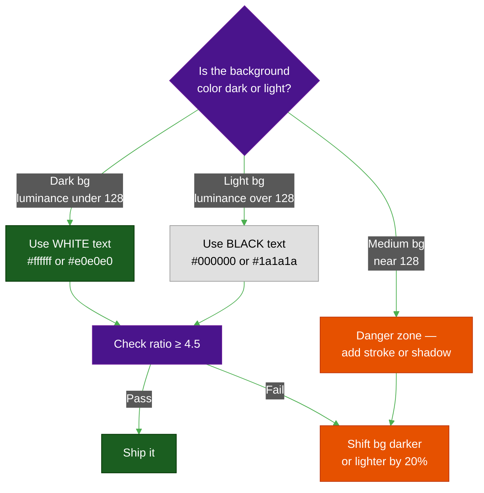
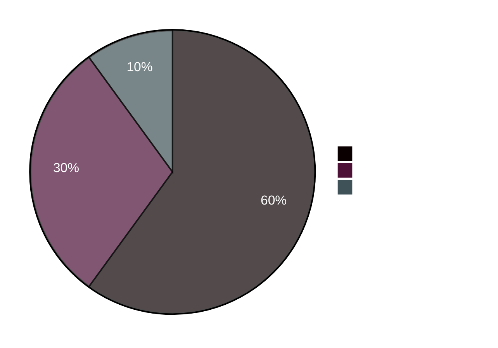

# Part 1 — Color Science

> **The goal of color is not beauty. It is clarity.**  
> A beautiful diagram no one can read is a failure. An ugly diagram everyone understands is a success.

---

## The Contrast Ratio Formula

The **WCAG (Web Content Accessibility Guidelines)** defines a mathematical formula for legibility. It is the single most important rule in visual design.

### The Formula

```
Contrast Ratio = (L_lighter + 0.05) / (L_darker + 0.05)
```

Where `L` is the **relative luminance** of a color, calculated as:

```
L = 0.2126 × R_lin + 0.7152 × G_lin + 0.0722 × B_lin
```

And each channel is linearized from its 0–255 value:

```
channel_lin = (channel / 255)^2.2   (simplified gamma correction)
```

### The Thresholds

| Ratio | Grade | Meaning |
| :--- | :--- | :--- |
| **≥ 7.0 : 1** | AAA | Maximum accessibility — use for body text |
| **≥ 4.5 : 1** | AA | Minimum for normal text — required by law in many jurisdictions |
| **≥ 3.0 : 1** | AA Large | Minimum for large text (18px+ bold, 24px+ normal) |
| **< 3.0 : 1** | Fail | Do not use for text — invisible to many users |

### Quick Reference Table

| Background | Text Color | Approx. Ratio | Grade |
| :--- | :--- | :--- | :--- |
| `#1e1e1e` (near-black) | `#ffffff` | **18.1 : 1** | AAA |
| `#1e1e1e` | `#e0e0e0` | **13.2 : 1** | AAA |
| `#1e1e1e` | `#9e9e9e` | **5.4 : 1** | AA |
| `#e65100` (orange) | `#ffffff` | **4.7 : 1** | AA |
| `#e65100` | `#000000` | **4.5 : 1** | AA |
| `#01579b` (blue) | `#ffffff` | **5.9 : 1** | AA |
| `#1b5e20` (green) | `#ffffff` | **7.1 : 1** | AAA |
| `#b71c1c` (red) | `#ffffff` | **5.1 : 1** | AA |
| `#4a148c` (purple) | `#ffffff` | **9.4 : 1** | AAA |
| `#ffeb3b` (yellow) | `#000000` | **15.3 : 1** | AAA |
| `#ffeb3b` | `#ffffff` | **1.4 : 1** | FAIL |

---

## Choosing Text Color

### The Decision Formula

```
luminance = 0.299 × R + 0.587 × G + 0.114 × B   (perceived brightness)

if luminance > 128:
    use black text  (#000000 or #1a1a1a)
else:
    use white text  (#ffffff or #e0e0e0)
```

This is the **YIQ formula**, widely used in UI frameworks. It weighs green heavily because the human eye is most sensitive to green light.

### Practical Rules



---

## Background Color Rules

### The Three-Layer System

Every well-designed dark theme uses **three background depths**:

| Layer | Purpose | Recommended Value | Use For |
| :--- | :--- | :--- | :--- |
| **Base** | Page / canvas | `#121212` | The overall page background |
| **Surface** | Cards, panels | `#1e1e1e` | Diagram backgrounds, code blocks |
| **Elevated** | Tooltips, modals | `#2d2d2d` | Hover states, active elements |

**Why three layers?** Depth communicates hierarchy. Elements that "float above" the surface should be slightly lighter, not brighter. This is called **elevation** in Material Design.

### The Saturation Rule for Dark Themes

On dark backgrounds, **desaturate your accent colors slightly**. Pure `#ff0000` red vibrates against dark backgrounds — it looks aggressive, not informative. Shift to `#ef5350` (less saturated) for the same semantic meaning but better readability.

```
Dark theme accent = Hue + reduced saturation (–10% to –20%) + slightly raised lightness (+5%)
```

| Pure (Avoid on Dark) | Dark-Adapted | Category |
| :--- | :--- | :--- |
| `#ff0000` | `#ef5350` | Error / Danger |
| `#00ff00` | `#66bb6a` | Success |
| `#0000ff` | `#42a5f5` | Info |
| `#ff9900` | `#ffa726` | Warning |

---

## Line & Border Colors

Borders and lines should be **visible but not loud**. They define structure without competing with content.

### The Border Formula

```
Border color = Background color + 15–25 lightness points (HSL)

Example:
  Background: #1e1e1e  (HSL: 0°, 0%, 12%)
  Border:     #424242  (HSL: 0°, 0%, 26%)  → +14 lightness

  Background: #1b5e20  (HSL: 124°, 56%, 24%)
  Border:     #388e3c  (HSL: 123°, 43%, 38%)  → +14 lightness, –13 saturation
```

### Line Types in Diagrams

| Line Weight | Use For | Rule |
| :--- | :--- | :--- |
| Thin `1px` | Grid lines, guides | Should barely be visible |
| Medium `2px` | Borders, edges | Should define shape without dominating |
| Thick `3px+` | Emphasis, active state | Use sparingly — 1 or 2 elements max |
| Dashed | Optional / secondary relationship | Never for primary data flow |
| Dotted | Weak / inferred relationship | Lighter color than solid lines |

---

## The 60-30-10 Rule

The most powerful layout rule in design. It applies to pages, diagrams, and even code syntax highlighting.



| Role | Percentage | What It Is | Example |
| :--- | :--- | :--- | :--- |
| **Dominant** | 60% | Background and neutral surfaces | Dark gray, near-black |
| **Secondary** | 30% | Main content color, most nodes | Category color (green/blue/orange) |
| **Accent** | 10% | Highlights, CTAs, warnings | Contrasting bright color |

**Breaking this rule on purpose:** Use the accent color to draw the eye to the one most important thing. If everything is accent-colored, nothing is accented.

---

## Semantic Color Families

Use color consistently to mean the same thing everywhere. This builds **visual vocabulary** — readers learn to decode your diagrams without reading labels.

| Semantic Role | Recommended Color | Hex | Use In Diagrams |
| :--- | :--- | :--- | :--- |
| **Success / Go** | Dark Green | `#1b5e20` | Passing paths, completed states |
| **Warning / Caution** | Deep Orange | `#e65100` | Degraded states, optional paths |
| **Error / Stop** | Dark Red | `#b71c1c` | Failure paths, blocked states |
| **Info / Primary** | Navy Blue | `#01579b` | Main flow, structural elements |
| **Decision** | Deep Purple | `#4a148c` | Decision nodes, branch points |
| **Neutral / Inactive** | Blue-Grey | `#37474f` | Disabled, external, legacy |
| **Highlight / Focus** | Amber | `#ff6f00` | The ONE thing the reader should look at |

---

## Ready-to-Use Dark Theme Palette

Copy this palette for any Mermaid `%%{init}%%` block:

```javascript
// For classDiagram, flowchart, graph
%%{init: {
  'theme': 'dark',
  'themeVariables': {
    'background':      '#1e1e1e',   // canvas background
    'primaryColor':    '#1b5e20',   // main node fill
    'primaryBorderColor': '#003300', // main node stroke
    'primaryTextColor': '#ffffff',  // text on primary nodes
    'lineColor':       '#4caf50',   // arrows and edges
    'secondaryColor':  '#01579b',   // secondary nodes
    'tertiaryColor':   '#4a148c',   // decision / accent nodes
    'mainBkg':         '#1b5e20',   // classDiagram class background
    'nodeBorder':      '#003300',   // classDiagram node border
    'clusterBkg':      '#37474f',   // subgraph background
    'titleColor':      '#ffffff',   // diagram title text
    'edgeLabelBackground': '#2d2d2d', // label on edges background
    'classText':       '#ffffff'    // classDiagram text
  }
}}%%
```

```javascript
// For sequenceDiagram
%%{init: {
  'theme': 'dark',
  'themeVariables': {
    'background':          '#1e1e1e',
    'actorBkg':            '#1b5e20',
    'actorBorder':         '#003300',
    'actorTextColor':      '#ffffff',
    'signalColor':         '#4caf50',
    'signalTextColor':     '#ffffff',
    'noteBkgColor':        '#004d40',
    'noteBorderColor':     '#003300',
    'noteTextColor':       '#ffffff',
    'activationBkgColor':  '#2e7d32',
    'activationBorderColor': '#003300',
    'labelBoxBkgColor':    '#003300',
    'labelTextColor':      '#ffffff',
    'loopTextColor':       '#ffffff'
  }
}}%%
```

---
