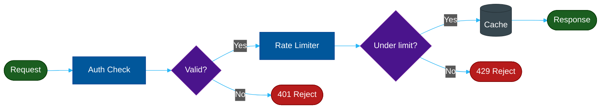
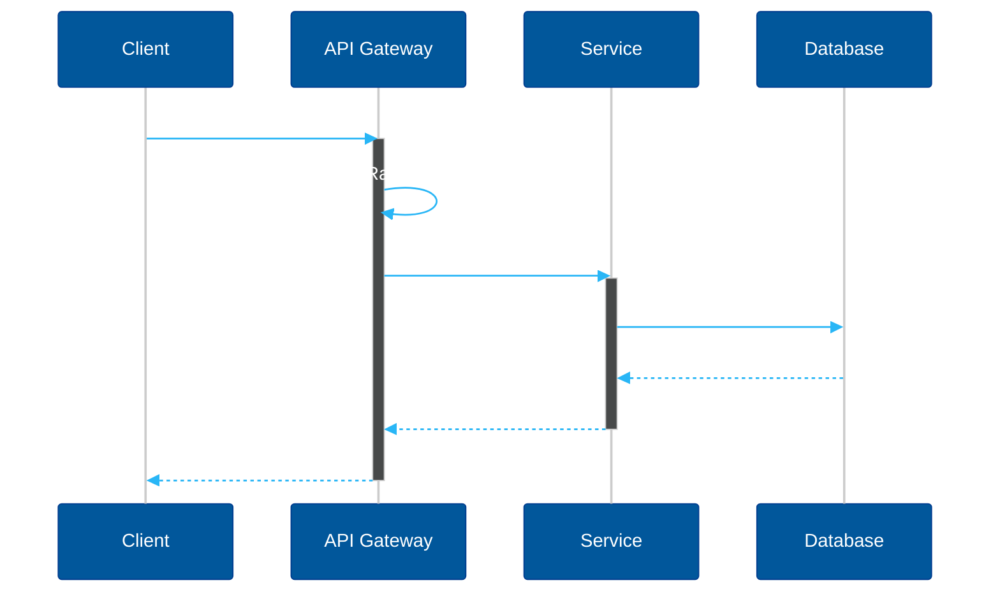
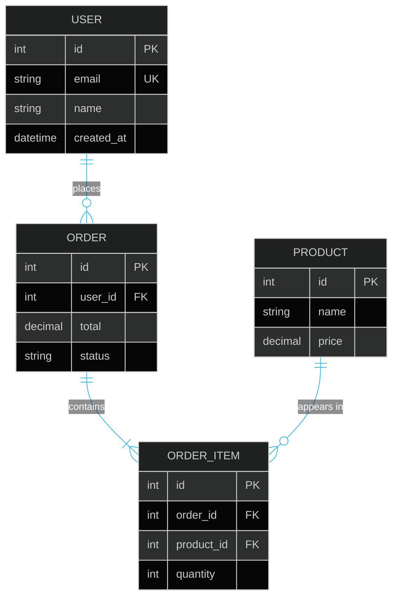

# Part 2 — Mermaid Diagram Catalog

> **Choosing the wrong diagram type is like using a hammer to cut wood. The tool exists — you're just misusing it.**

---

## The Diagram Decision Tree

```mermaid
%%{init: {'theme': 'dark', 'themeVariables': {'primaryColor': '#01579b', 'primaryTextColor': '#fff', 'lineColor': '#29b6f6',
    'background': '#1e1e1e'},
  'themeCSS': 'svg { background-color: #1e1e1e !important; padding: 1rem !important; border-radius: 8px !important; } .edgeLabel rect { fill: #1e1e1e !important; } text, tspan, .messageText, .signalText, .edgeLabel, .edgeLabel span, .pointLabel, .axisLabel, .quadrantTitle, .quadrantLabel { fill: #ffffff !important; color: #ffffff !important; stroke: none !important; }'
}}%%
flowchart TD
    classDef q    fill:#4a148c,stroke:#6a1b9a,color:#fff
    classDef ans  fill:#01579b,stroke:#003c8f,color:#fff
    classDef note fill:#37474f,stroke:#263238,color:#fff

    A{What are<br/>you showing?}:::q

    A --> B[How things<br/>interact over TIME]:::q
    A --> C[How things<br/>are STRUCTURED]:::q
    A --> D[How a process<br/>FLOWS or decides]:::q
    A --> E[Data or<br/>PROPORTIONS]:::q
    A --> F[Relationships<br/>CONCEPTUALLY]:::q

    B --> B1[sequenceDiagram<br/>actors + messages]:::ans
    B --> B2[stateDiagram-v2<br/>object lifecycle]:::ans
    B --> B3[timeline<br/>history / milestones]:::ans
    B --> B4[gitgraph<br/>git branches]:::ans

    C --> C1[classDiagram<br/>OOP relationships]:::ans
    C --> C2[erDiagram<br/>database schema]:::ans
    C --> C3[graph TD<br/>tree hierarchy]:::ans

    D --> D1[flowchart<br/>decision + process]:::ans
    D --> D2[graph LR<br/>pipeline / data flow]:::ans

    E --> E1[pie<br/>parts of a whole]:::ans
    E --> E2[xychart-beta<br/>bar / line chart]:::ans
    E --> E3[quadrantChart<br/>2D trade-off matrix]:::ans

    F --> F1[mindmap<br/>brainstorm / concepts]:::ans
    F --> F2[graph LR<br/>dependency graph]:::ans
```



---

## Every Diagram Type Explained

### 1. `flowchart` / `graph` — Process & Decision

**Use when:** You need to show a process with decisions, branches, loops, or pipelines.

**`flowchart`** vs **`graph`**: `flowchart` is the modern syntax. `graph` is the legacy alias — they render identically. Prefer `flowchart`.

**Direction options:** `TD` (top-down), `LR` (left-right), `BT` (bottom-top), `RL` (right-left).

**Node shapes:**
```
A[Rectangle]          → regular step
B{Diamond}            → decision / branch
C([Stadium])          → start / end terminal
D((Circle))           → event / trigger
E>Asymmetric]         → tag / annotation
F[(Database cylinder)]→ data store
```

**Best for:** API middleware chains, deployment pipelines, decision trees, data flow diagrams.

**Avoid when:** You need to show time order between actors (use `sequenceDiagram`) or object structure (use `classDiagram`).



---

### 2. `sequenceDiagram` — Time-Ordered Interactions

**Use when:** You need to show **who talks to whom, in what order, and what they say**. Time flows downward.

**Best for:** API call chains, authentication flows, microservice communication, explaining a database query lifecycle.

**Key syntax:**
```
participant A as "Display Name"
A->>B: message          → solid arrow (sync call)
A-->>B: message         → dashed arrow (async / return)
A-xB: message           → X arrow (failure)
Note over A,B: text     → annotation spanning actors
activate A / deactivate A → show active lifeline
loop Every 30s ... end  → loop block
alt condition ... else ... end → conditional block
```

**Avoid when:** You have more than 5–6 actors (becomes unreadable) or you're showing structure (use `classDiagram`).



---

### 3. `classDiagram` — Object Structure

**Use when:** You need to show **how classes, interfaces, and objects relate** to each other — inheritance, composition, dependencies.

**Best for:** Design pattern structure, API contract design, domain model documentation.

**Relationship symbols:**
```
A <|-- B        → B inherits from A (inheritance)
A *-- B         → A has B (composition — B can't exist without A)
A o-- B         → A has B (aggregation — B can exist independently)
A --> B         → A uses B (dependency / association)
A ..> B         → A depends on B (dashed — weaker dependency)
A ..|> B        → B implements A (interface implementation)
```

**Avoid when:** You need to show runtime behavior (use `sequenceDiagram`) or database tables (use `erDiagram`).

---

### 4. `stateDiagram-v2` — Object Lifecycle

**Use when:** An object moves through **discrete states** and you want to show the valid transitions between them.

**Best for:** Order lifecycle (Pending → Confirmed → Shipped → Delivered), connection states, workflow approval chains, game character states.

**Key syntax:**
```
[*] --> StateName      → initial transition
StateName --> [*]      → final transition
StateA --> StateB : event [guard]  → labeled transition
state "Display Name" as shortName  → rename
state Choice <<choice>>            → branch point
```

**Avoid when:** The transitions have complex logic that needs annotation — use `flowchart` instead.

```mermaid
%%{init: {'theme': 'dark', 'themeVariables': {'primaryColor': '#1b5e20', 'primaryTextColor': '#fff', 'lineColor': '#4caf50',
    'background': '#1e1e1e'},
  'themeCSS': 'svg { background-color: #1e1e1e !important; padding: 1rem !important; border-radius: 8px !important; } .edgeLabel rect { fill: #1e1e1e !important; } text, tspan, .messageText, .signalText, .edgeLabel, .edgeLabel span, .pointLabel, .axisLabel, .quadrantTitle, .quadrantLabel { fill: #ffffff !important; color: #ffffff !important; stroke: none !important; }'
}}%%
stateDiagram-v2
    classDef active fill:#1b5e20,stroke:#003300,color:#fff
    classDef warn   fill:#e65100,stroke:#bf360c,color:#fff
    classDef done   fill:#01579b,stroke:#003c8f,color:#fff

    [*] --> Pending
    Pending --> Confirmed : payment verified
    Pending --> Cancelled : user cancelled
    Confirmed --> Shipped : warehouse dispatched
    Confirmed --> Cancelled : refund initiated
    Shipped --> Delivered : customer received
    Delivered --> [*]
    Cancelled --> [*]

    class Pending warn
    class Confirmed,Shipped active
    class Delivered,Cancelled done
```



---

### 5. `erDiagram` — Database Schema

**Use when:** You need to document **database tables and their relationships** (one-to-many, many-to-many, foreign keys).

**Best for:** Database design documentation, API resource modeling, onboarding new team members to the data model.

**Key syntax:**
```
TABLE_A ||--o{ TABLE_B : "relationship label"
```
Cardinality symbols:
```
||   exactly one
|o   zero or one
}o   zero or many
}|   one or many
```

**Avoid when:** You're showing code structure (use `classDiagram`) — `erDiagram` is strictly for data/schema.



---

### 6. `quadrantChart` — Trade-off Matrix

**Use when:** You want to show **how options compare across two independent dimensions** — effort vs. impact, cost vs. benefit, complexity vs. performance.

**Label length formula (critical for no overflow):**
```
Max label length = floor(chartWidth × 0.10)

Default 460px chart → max 46 × 0.10 = ~10 chars per label
Safe rule: keep point labels ≤ 10 chars
Axis labels: ≤ 15 chars per side
Title: ≤ 20 chars
```

**Key syntax:**
```
quadrantChart
    title My Chart Title          ← ≤ 20 chars
    x-axis Low Label --> High Label  ← each side ≤ 15 chars
    y-axis Low Label --> High Label
    quadrant-1 TopRight Label    ← quadrant names, ≤ 15 chars
    quadrant-2 TopLeft Label
    quadrant-3 BottomLeft Label
    quadrant-4 BottomRight Label
    PointLabel: [x, y]           ← x,y in 0.0–1.0, label ≤ 10 chars
```

**Avoid when:** You have more than 8–10 data points (chart becomes unreadable) or you need exact numeric precision (use `xychart-beta`).

---

### 7. `mindmap` — Conceptual Relationships

**Use when:** You want to show **how concepts branch from a central idea** — brainstorming, taxonomy, system overview.

**Key syntax:**
```
mindmap
  root((Central Idea))
    Branch 1
      Sub-branch
      Sub-branch
    Branch 2
```

Node shapes in mindmap:
```
((text))   → circle (root)
(text)     → rounded rectangle
[text]     → rectangle
))text((   → cloud / bang
```

**Avoid when:** Relationships are directional or have labels (use `graph`). Mindmaps show hierarchy, not flow.

---

### 8. `pie` — Proportions

**Use when:** You want to show **how a whole is divided into parts**. Simple, no axes needed.

**Rule of thumb:** If you have more than 6 slices, consider a bar chart instead — the human eye can't reliably compare more than 5–6 pie slices.

**Key syntax:**
```
pie title My Title
    "Label A" : 45
    "Label B" : 30
    "Label C" : 25
```

---

### 9. `xychart-beta` — Bar & Line Charts

**Use when:** You need to show **quantitative data trends over a category axis** — performance benchmarks, request counts, latency over time.

**Key syntax:**
```
xychart-beta
    title "Request Latency (ms)"
    x-axis [Jan, Feb, Mar, Apr]
    y-axis "Latency (ms)" 0 --> 200
    bar  [45, 62, 38, 51]
    line [45, 62, 38, 51]
```

---

### 10. `timeline` — Historical Events

**Use when:** You want to show **events along a time axis** with periods and milestones.

**Key syntax:**
```
timeline
    title History of Databases
    section Relational Era
        1970 : Codd proposes relational model
        1979 : Oracle released
    section NoSQL Era
        2007 : Amazon Dynamo paper
        2010 : Cassandra released
```

---

### 11. `gitgraph` — Git Branching

**Use when:** Documenting **git workflows**, branch strategies, or release processes.

---

### Summary: Diagram Type Quick Reference

| Diagram | Best For | Avoid When |
| :--- | :--- | :--- |
| `flowchart` | Decisions, pipelines, processes | Time-ordered messages |
| `sequenceDiagram` | API flows, actor interactions | More than 6 actors |
| `classDiagram` | OOP structure, design patterns | Runtime behavior |
| `stateDiagram-v2` | Object lifecycle, state machines | Complex transition logic |
| `erDiagram` | Database schema, data model | Code structure |
| `quadrantChart` | Trade-off comparisons | More than 8 points |
| `mindmap` | Brainstorming, concept taxonomy | Directional flows |
| `pie` | Parts of a whole | More than 6 segments |
| `xychart-beta` | Quantitative trends | Categorical relationships |
| `timeline` | Historical milestones | Non-chronological data |
| `gitgraph` | Git workflows | Non-git branching |

---
