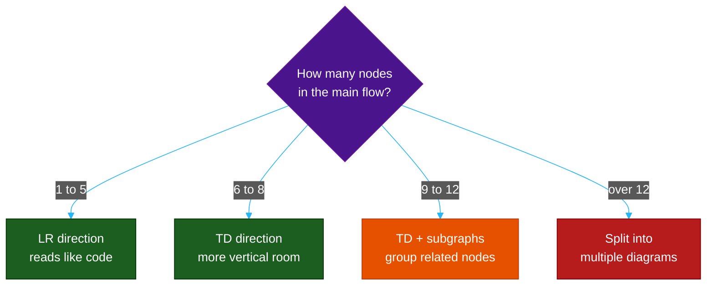
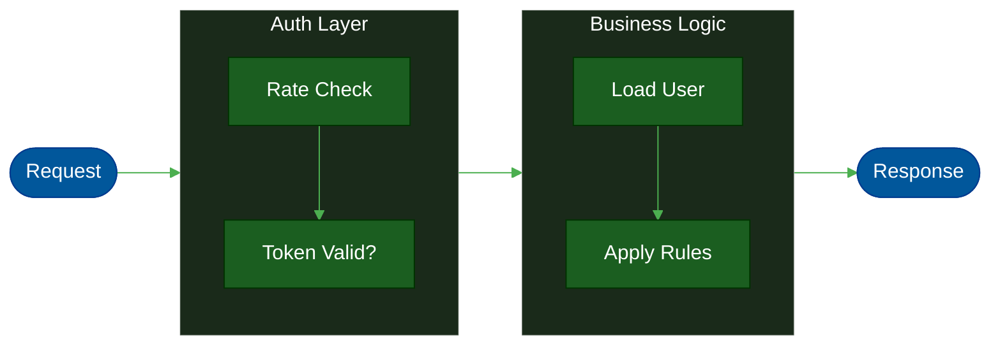

# Part 3 — Mermaid Wrap & Anti-Collapse Formula

> A Mermaid diagram breaks in two ways: **text overflow** (labels cut off or hidden) and **layout collapse** (nodes or containers overlapping). Both are 100% preventable with the right formula.

---

## ⚠️ The #1 Mistake AI Models Make: `\n` Instead of `<br/>`

> **Claude, Gemini, Codex, and most AI code generators frequently write `\n` for line breaks inside Mermaid node labels. This is always wrong. `\n` renders as literal text or is silently ignored — it does NOT create a line break.**

This is the single most common source of overflowing Mermaid labels in AI-generated documentation.

### Side-by-Side: What Goes Wrong vs What Works

**Wrong — `\n` (what AI models often generate):**

```
flowchart TD
    A[Check authentication\nand validate token] --> B{Token\nvalid?}
    B -- Yes\nProceed --> C[Load user\nfrom database]
    B -- No\nReject --> D[Return 401\nUnauthorized]
```

What you actually see rendered:
```
┌────────────────────────────────────────┐
│ Check authentication\nand validate     │  ← \n appears as literal text
│ token                                  │     or the whole label overflows
└────────────────────────────────────────┘
```

The node box expands horizontally to fit the entire unsplit string, or clips it — either way the diagram looks broken.

---

**Correct — `<br/>` (what you must write):**

```
flowchart TD
    A[Check authentication<br/>and validate token] --> B{Token<br/>valid?}
    B -- Yes --> C[Load user<br/>from database]
    B -- No --> D[Return 401<br/>Unauthorized]
```

What you actually see rendered:
```
┌───────────────────────┐
│ Check authentication  │  ← clean two-line node
│ and validate token    │
└───────────────────────┘
```

---

### Why This Happens in Every Diagram Type

| Diagram Type | Wrong (AI writes) | Right (you write) | Result of `\n` |
| :--- | :--- | :--- | :--- |
| `flowchart` node | `A[line one\nline two]` | `A[line one<br/>line two]` | Shows `\n` literally or overflows |
| `flowchart` diamond | `B{yes?\ncheck}` | `B{yes?<br/>check}` | Single long line overflows |
| `classDiagram` note | `note "line1\nline2"` | `note "line1<br/>line2"` | `\n` shown as text in note box |
| `stateDiagram-v2` state | `StateA: long\nname` | `StateA: long<br/>name` | State box overflows |
| `sequenceDiagram` Note | `Note over A: msg\nhere` | `Note over A: msg<br/>here` | Single overflowing line |
| `mindmap` node | `root((line1\nline2))` | `root((line1<br/>line2))` | Overflow or literal `\n` |

> **The rule is absolute: use `<br/>` everywhere. There are zero exceptions.**

---

### Where `<br/>` Does NOT Work

Some Mermaid elements do not support HTML entities inside their text — these have **no line break support at all**. The only fix is to shorten the text:

| Element | Supports `<br/>`? | Fix if too long |
| :--- | :--- | :--- |
| `pie title` | ✗ No | Shorten to ≤20 chars |
| `quadrantChart` title | ✗ No | Shorten to ≤20 chars |
| `quadrantChart` point label | ✗ No | Abbreviate to ≤10 chars |
| `quadrantChart` axis label | ✗ No | Shorten to ≤12 chars |
| `gantt` task names | ✗ No | Shorten |
| `timeline` event text | ✗ No | Shorten |
| `gitgraph` commit message | ✗ No | Shorten |
| Edge labels `-- text -->` | ✗ No | Shorten to ≤15 chars |
| Flowchart node text | ✓ Yes | Use `<br/>` |
| Sequence `Note over` | ✓ Yes | Use `<br/>` |
| `classDiagram` note | ✓ Yes | Use `<br/>` |
| `stateDiagram` transition | ✓ Yes | Use `<br/>` |
| `mindmap` node | ✓ Yes | Use `<br/>` |

---

## The Overflow Hidden Problem

**Overflow hidden** is when a Mermaid node silently clips text that extends beyond its rendered boundary. The text exists in the source but is invisible in the output — no error, no warning. This is the most dangerous failure mode because you don't know it's broken until someone reads it.

### What Triggers Overflow Hidden

```
Trigger condition:
  rendered_text_width_px > node_box_width_px

  rendered_text_width_px = len(label) × char_width_px
  char_width_px          = font_size_px × 0.55  (default: 14 × 0.55 = ~8px)

  node_box_width_px:
    - flowchart []:  auto, but clipped at ~220px in most renderers
    - flowchart {}:  auto, but clipped at ~180px
    - classDiagram note: fixed 200px
    - sequenceDiagram Note: wraps at 150px
    - quadrantChart point: ~80px (hard limit — no wrap support)
```

### The Overflow Threshold Formula

```
safe_chars_per_line = floor(node_box_width_px / char_width_px)
                    = floor(node_box_width_px / (font_size × 0.55))
                    = floor(node_box_width_px / 7.7)
                    ≈ floor(node_box_width_px / 8)   ← simplified
```

### Safe Limits Per Node Type

| Node / Element | Box Width | `÷ 8` | Safe Limit | Supports `<br/>`? |
| :--- | :--- | :--- | :--- | :--- |
| `flowchart` rectangle `[text]` | ~200px | 25 | **≤ 25 chars/line** | ✓ |
| `flowchart` diamond `{text}` | ~160px | 20 | **≤ 20 chars/line** | ✓ |
| `flowchart` terminal `([text])` | ~180px | 22 | **≤ 22 chars/line** | ✓ |
| `flowchart` cylinder `[(text)]` | ~160px | 20 | **≤ 20 chars/line** | ✓ |
| `classDiagram` note | 200px | 25 | **≤ 22 chars/line** | ✓ |
| `sequenceDiagram` Note | 150px | 18 | **≤ 18 chars/line** | ✓ |
| `sequenceDiagram` message | ~250px | 31 | **≤ 30 chars/line** | ✓ |
| `stateDiagram-v2` state | ~180px | 22 | **≤ 20 chars/line** | ✓ |
| `mindmap` root `((text))` | ~200px | 25 | **≤ 22 chars/line** | ✓ |
| `mindmap` branch `(text)` | ~160px | 20 | **≤ 18 chars/line** | ✓ |
| `mindmap` leaf `[text]` | ~130px | 16 | **≤ 14 chars/line** | ✓ |
| `quadrantChart` point | ~80px | 10 | **≤ 10 chars total** | ✗ |
| `quadrantChart` axis | ~96px | 12 | **≤ 12 chars total** | ✗ |
| `quadrantChart` title | ~460px | 57 | **≤ 20 chars total** | ✗ |
| `pie` title | full width | — | **≤ 20 chars total** | ✗ |
| `pie` slice label | ~160px | 20 | **≤ 20 chars total** | ✗ |
| Edge label `-- text -->` | ~120px | 15 | **≤ 15 chars total** | ✗ |

> **Why is classDiagram note safe limit 22 not 25?** Apply a 10% safety margin on fixed-width containers. `floor(25 × 0.9) = 22`. Fixed boxes have no flex — go right up to the edge and a slightly wider font rendering clips text.

---

## The Step-by-Step Wrap Algorithm

Use this algorithm for any label before writing it into Mermaid source:

```
WRAP(text, max_chars, supports_br):

  if NOT supports_br:
    if len(text) > max_chars:
      ABBREVIATE(text, max_chars)   ← see Abbreviation Rules below
    return text

  lines = []
  remaining = text

  while len(remaining) > max_chars:
    # Find the last space at or before the limit
    cut_index = remaining.rfind(' ', 0, max_chars + 1)

    if cut_index == -1:
      # No space found — word itself is too long
      ABBREVIATE the offending word, then retry
    else:
      lines.append(remaining[:cut_index])
      remaining = remaining[cut_index + 1:]   # skip the space

  lines.append(remaining)
  return '<br/>'.join(lines)
```

### Worked Examples

**Example 1 — flowchart rectangle, limit 25:**
```
Input:  "Check authentication and validate the JWT token"
Length: 48 chars  →  exceeds 25

Pass 1: rfind(' ', 0, 26) → position 24 (space before "and")
        line 1 = "Check authentication and"   ← 24 chars ✓
        remaining = "validate the JWT token"   ← 22 chars ✓

Result: "Check authentication and<br/>validate the JWT token"
```

**Example 2 — flowchart diamond, limit 20:**
```
Input:  "Is the payment verified by stripe?"
Length: 34 chars  →  exceeds 20

Pass 1: rfind(' ', 0, 21) → position 15 (space before "verified")
        line 1 = "Is the payment"         ← 14 chars ✓
        remaining = "verified by stripe?"  ← 19 chars ✓

Result: "Is the payment<br/>verified by stripe?"
```

**Example 3 — classDiagram note, limit 22:**
```
Input:  "createNotifier() is the Factory Method. Subclass overrides it."
Length: 62 chars  →  exceeds 22

Pass 1: rfind(' ', 0, 23) → position 22 (space before "the")
        line 1 = "createNotifier() is the"   ← 23 chars ← over by 1, try again
        rfind(' ', 0, 22) → position 17 (space before "is")
        line 1 = "createNotifier() is"        ← 19 chars ✓
        remaining = "the Factory Method. Subclass overrides it."

Pass 2: rfind(' ', 0, 23) → position 19 (space before "Subclass")
        line 2 = "the Factory Method."         ← 19 chars ✓
        remaining = "Subclass overrides it."   ← 22 chars ✓

Result: "createNotifier() is<br/>the Factory Method.<br/>Subclass overrides it."
```

**Example 4 — quadrantChart point, limit 10, no `<br/>` support:**
```
Input:  "Log Viewer Characters"
Length: 20 chars  →  exceeds 10
<br/> not supported  →  must ABBREVIATE

Abbreviation: remove last word → "Log Viewer" (10) ← still at limit
              remove another  → "LogViewer"   (9) ✓  (compound)

Result: "LogViewer"
```

---

## Abbreviation Rules

When a label is too long AND wrapping is not supported (or a single word already exceeds the limit):

| Priority | Rule | Example | Result |
| :--- | :--- | :--- | :--- |
| 1 | Keep core noun, drop adjective | `Game Particle System` | `Particles` |
| 2 | Compound the words (remove spaces) | `Log Viewer` | `LogViewer` |
| 3 | Acronym + core noun | `Database Connection Pool` | `DB Pool` |
| 4 | Initial + core noun | `Prototype Registry` | `P.Registry` |
| 5 | Truncate with dot | `Authentication` | `Auth` |
| 6 | Domain abbreviation | `Single-User Config` | `UserCfg` |

---

## The Anti-Collapse Formula

> Text overflow is only one way a Mermaid diagram breaks. **Layout collapse** (nodes overlapping), **container collapse** (subgraphs or charts too small), and **density collapse** (too many nodes in a row) are equally common — and have different fixes.

There are three distinct types of collapse:

| Type | What It Looks Like | Root Cause |
| :--- | :--- | :--- |
| **Text overflow** | Label cut off or spills outside node | Label too long for node width |
| **Layout collapse** | Nodes overlap or crowd each other | Too many nodes in one direction |
| **Container collapse** | Content spills outside a subgraph or chart | Container too small for content |

---

### Rule 1 — Direction Budget (Layout Collapse)

Every diagram has a **direction budget**: the maximum number of nodes that can sit comfortably side-by-side before they start colliding.

```
LR (left-right) direction budget:
  max_nodes_per_row = floor(viewport_width_px / (avg_node_width_px + gap_px))

  typical viewport: 800px
  avg node width:   120px
  gap between nodes: 40px
  → max_nodes_per_row = floor(800 / 160) = 5

TD (top-down) direction budget:
  max_nodes_per_column = floor(viewport_height_px / (avg_node_height_px + gap_px))

  typical viewport: 600px
  avg node height:  50px
  gap:              30px
  → max_nodes_per_column = floor(600 / 80) = 7
```

**Decision rule:**

```
if nodes_in_main_flow > 5:  use TD not LR
if nodes_in_main_flow > 8:  split into subgraphs
if subgraph has > 4 nodes:  give it its own column or row
```



---

### Rule 2 — Edge Label Budget

Arrow labels in `flowchart`/`graph` collapse when they are wider than the edge they sit on.

```
Max edge label = floor(avg_edge_length_px / char_width_px)

For LR diagrams: avg edge ≈ 120px → max ~15 chars
For TD diagrams: avg edge ≈  60px → max ~8 chars
```

| Situation | What to Write | Why |
| :--- | :--- | :--- |
| Edge label ≤ 8 chars | Write on the edge | Always safe |
| Edge label 9–15 chars | Use only on LR diagrams | TD edges are too short |
| Edge label > 15 chars | Use a `Note` node instead | Edge becomes unreadable |
| Multiple conditions | `-- Yes -->` / `-- No -->` | Boolean labels always fit |

**Before (collapses):**
```
A -- "payment verified by stripe webhook" --> B
```

**After (safe):**
```
A -- payment OK --> B
Note right of A: verified by<br/>stripe webhook
```

---

### Rule 3 — Subgraph Sizing

Subgraphs collapse when their title is longer than their content, or when content nodes are too wide for the subgraph's auto-calculated width.

```
Subgraph title:    ≤ 20 chars
Nodes inside:      reduce max-chars-per-line by 20% vs standalone nodes
  → flowchart node inside subgraph: 25 × 0.8 = 20 chars max
  → diamond inside subgraph:        20 × 0.8 = 16 chars max
```

**Subgraph anti-collapse checklist:**
- [ ] Title ≤ 20 chars
- [ ] No more than 4–5 nodes wide inside the subgraph
- [ ] Nodes inside are at least 2 chars shorter than the subgraph title
- [ ] If subgraph contains another subgraph (nested): reduce max chars by another 20%



---

### Rule 4 — Per-Diagram Anti-Collapse Limits

#### `flowchart` / `graph`

| Element | Max | If Exceeded |
| :--- | :--- | :--- |
| Nodes in LR row | 5 | Switch to TD or add subgraph |
| Node label `[]` | 25 chars/line | Use `<br/>` to split |
| Node label `{}` diamond | 20 chars/line | Use `<br/>` to split |
| Edge label | 15 chars | Shorten or use Note node |
| Subgraph title | 20 chars | Shorten |
| Nesting depth | 2 levels | Flatten or split diagram |

#### `sequenceDiagram`

| Element | Max | If Exceeded |
| :--- | :--- | :--- |
| Participants | 6 | Split into two diagrams |
| Message text | 35 chars | Split with `<br/>` |
| Note text | 18 chars/line | Split with `<br/>` |
| `loop` / `alt` label | 20 chars | Shorten |
| Activation depth | 3 nested | Flatten the flow |

#### `classDiagram`

| Element | Max | If Exceeded |
| :--- | :--- | :--- |
| Class name | 20 chars | Abbreviate |
| Method signature | 35 chars | Use abbreviated params: `save(T): void` |
| `note for` text | 22 chars/line | Use `<br/>` to split |
| Classes per diagram | 8 | Split by package/module |
| Relationship label | 12 chars | Shorten verb |

#### `stateDiagram-v2`

| Element | Max | If Exceeded |
| :--- | :--- | :--- |
| State name | 15 chars | Abbreviate |
| Transition label | 20 chars | Use `<br/>` |
| States total | 8 | Split into sub-state diagrams |
| Parallel regions | 2 | More than 2 becomes unreadable |

#### `erDiagram`

| Element | Max | If Exceeded |
| :--- | :--- | :--- |
| Table name | 20 chars | Abbreviate |
| Column name | 15 chars | Abbreviate |
| Relationship label | 12 chars | Shorten verb |
| Tables per diagram | 7 | Split by domain aggregate |

#### `quadrantChart`

| Element | Max | Formula |
| :--- | :--- | :--- |
| Point label | 10 chars | `floor(chartWidth × 0.10)` |
| Axis end label | 12 chars | `floor(chartWidth × 0.12)` |
| Quadrant label | 12 chars | `floor(chartWidth × 0.12)` |
| Title | 20 chars | `floor(chartWidth × 0.20)` |
| Data points | 8 max | More = overlapping labels |
| Chart width | ≥ 460px | Below this, all labels collapse |

#### `pie`

| Element | Max | If Exceeded |
| :--- | :--- | :--- |
| Title | 20 chars | Shorten — no `<br/>` support |
| Slice label | 20 chars | Shorten — long labels overlap |
| Slices | 6 max | More → use bar chart instead |

#### `mindmap`

```
Max chars per level (depth × shrink factor):
  Level 1 (root):  20 chars  (1.0 × 20)
  Level 2:         16 chars  (0.8 × 20)
  Level 3:         12 chars  (0.6 × 20)
  Level 4:          8 chars  (0.4 × 20)
  Level 5+:   collapse risk — avoid or split
```

Max branches per node: 5. More than 5 branches from one node causes vertical crowding.

#### `xychart-beta`

| Element | Max | If Exceeded |
| :--- | :--- | :--- |
| X-axis label | 8 chars | Rotate or abbreviate |
| Y-axis title | 15 chars | Shorten |
| Chart title | 25 chars | Shorten |
| Data points | 12 per series | More → line chart, not bar |

---

### Rule 5 — The `%%{init}%%` Size Override

When content is too large for the default canvas, override dimensions in `%%{init}%%`:

```javascript
// quadrantChart — increase canvas
%%{init: {
  'quadrantChart': {
    'chartWidth': 500,      // default: 500 — increase to 600+ if labels overflow
    'chartHeight': 440,     // default: 500
    'pointRadius': 5,       // default: 5 — reduce to 3 if points overlap
    'pointLabelFontSize': 12 // default: 14 — reduce if labels crowd
  }
}}%%

// xychart-beta — control bar width
%%{init: {
  'xychart': {
    'width': 600,
    'height': 400,
    'plotReservedSpacePercent': 50  // percentage of height for the plot area
  }
}}%%
```

---

### The Anti-Collapse Decision Checklist

Run this checklist before finalizing any Mermaid diagram:

```
□ 1. Count nodes in the main flow.
      > 5 in LR? → switch to TD or add subgraphs.

□ 2. Measure longest node label.
      > 25 chars? → split with <br/> at last space before limit.
      > 25 chars AND no space? → abbreviate.

□ 3. Check edge labels.
      > 15 chars? → shorten or move to a Note node.

□ 4. Count participants / classes / tables.
      > per-diagram limit? → split into two diagrams.

□ 5. Check subgraph titles.
      > 20 chars? → shorten.
      Content wider than title? → add padding or split.

□ 6. For quadrantChart: verify every label.
      Point labels > 10 chars? → abbreviate.
      chartWidth < 460? → increase to 500+.

□ 7. For pie: verify title ≤ 20 chars, labels ≤ 20 chars, slices ≤ 6.

□ 8. For mindmap: check depth.
      Depth > 4? → flatten or split.
      Branches per node > 5? → group into a parent node.

□ 9. All %%{init}%% use 'theme': 'dark' and 'background': '#1e1e1e'.

□ 10. All line breaks use <br/> not \n.
```

---
