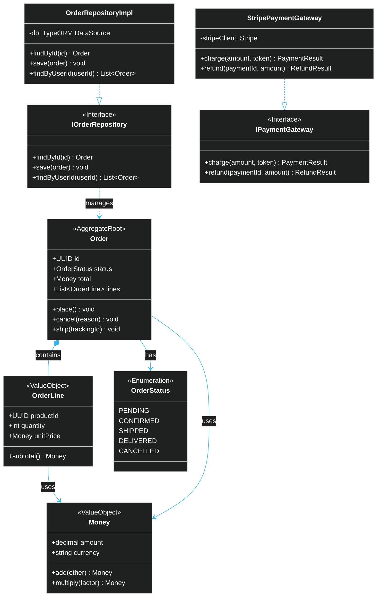

# Example — IcePanel C4 Level 4: Code

> **Use when:** Showing the internal implementation of a single component — classes, interfaces, relationships.

**Tool:** IcePanel | **C4 Level:** 4 — Code | **Formats:** YAML or JSON (both supported) + Mermaid classDiagram

---

## When to Use Code Diagrams

The C4 Level 4 (Code) diagram is the **most granular** and **least frequently needed**. Most teams skip it — the code itself is the most accurate documentation at this level.

**Use it when:**
- Onboarding developers to a non-obvious design pattern
- Documenting an abstract interface contract shared across teams
- Explaining a DDD aggregate boundary

**Skip it when:**
- The structure is straightforward CRUD
- You're documenting implementation details that change frequently

---

## Option A: IcePanel YAML (structural model)

IcePanel Level 4 uses `type: component` within a parent component, modelling classes and interfaces as nested objects.

```yaml
# yaml-language-server: $schema=https://api.icepanel.io/v1/schemas/LandscapeImportData

namespace: ecommerce-platform

modelObjects:
  - id: domain-ecommerce
    name: E-Commerce Domain
    type: domain

  - id: system-ecommerce
    name: E-Commerce Platform
    type: system
    parentId: domain-ecommerce

  - id: app-order-service
    name: Order Service
    type: app
    parentId: system-ecommerce

  - id: comp-order-logic
    name: Order Service Logic
    type: component
    parentId: app-order-service

  # Code-level objects (classes / interfaces inside the component)
  - id: code-order
    name: Order (Aggregate Root)
    type: component
    parentId: comp-order-logic
    description: "Fields: id, status, total, lines. Methods: place(), cancel(), ship()"

  - id: code-order-line
    name: OrderLine (Value Object)
    type: component
    parentId: comp-order-logic
    description: "Fields: productId, quantity, unitPrice. Method: subtotal()"

  - id: code-money
    name: Money (Value Object)
    type: component
    parentId: comp-order-logic
    description: "Fields: amount, currency. Methods: add(), multiply()"

  - id: code-order-status
    name: OrderStatus (Enum)
    type: component
    parentId: comp-order-logic
    description: "PENDING | CONFIRMED | SHIPPED | DELIVERED | CANCELLED"

  - id: code-iorder-repo
    name: IOrderRepository (Interface)
    type: component
    parentId: comp-order-logic
    description: "findById(id), save(order), findByUserId(userId)"

  - id: code-order-repo-impl
    name: OrderRepositoryImpl
    type: component
    parentId: comp-order-logic
    description: TypeORM implementation of IOrderRepository

  - id: code-ipayment-gw
    name: IPaymentGateway (Interface)
    type: component
    parentId: comp-order-logic
    description: "charge(amount, token), refund(paymentId, amount)"

  - id: code-stripe-gw
    name: StripePaymentGateway
    type: component
    parentId: comp-order-logic
    description: Stripe SDK implementation of IPaymentGateway

modelConnections:
  - id: cc-order-lines
    name: contains
    originId: code-order
    targetId: code-order-line
    direction: outgoing

  - id: cc-order-money
    name: uses
    originId: code-order
    targetId: code-money
    direction: outgoing

  - id: cc-order-status
    name: has
    originId: code-order
    targetId: code-order-status
    direction: outgoing

  - id: cc-repo-impl-interface
    name: implements
    originId: code-order-repo-impl
    targetId: code-iorder-repo
    direction: outgoing

  - id: cc-stripe-impl-interface
    name: implements
    originId: code-stripe-gw
    targetId: code-ipayment-gw
    direction: outgoing
```

---

## Option B: Mermaid classDiagram (recommended for code level)

For code-level documentation, a Mermaid `classDiagram` embedded in your README or IcePanel note is often clearer than YAML objects.



---

## YAML vs JSON vs Mermaid at Code Level

| Approach | Best for |
| :--- | :--- |
| IcePanel YAML/JSON | Keeping code structure inside the IcePanel model for C4 drill-down navigation |
| Mermaid `classDiagram` | Embedding in README, Confluence, or GitHub PR — renders inline |
| PlantUML class diagram | When you need fine-grained layout control |

---

## Rules for a Good Code Diagram

1. **Show one aggregate or module** — not the whole codebase
2. **Use stereotypes** — `<<Interface>>`, `<<ValueObject>>`, `<<AggregateRoot>>`
3. **Only show public API** — don't expose private implementation fields
4. **Update or delete it** — stale code diagrams are worse than no diagrams
