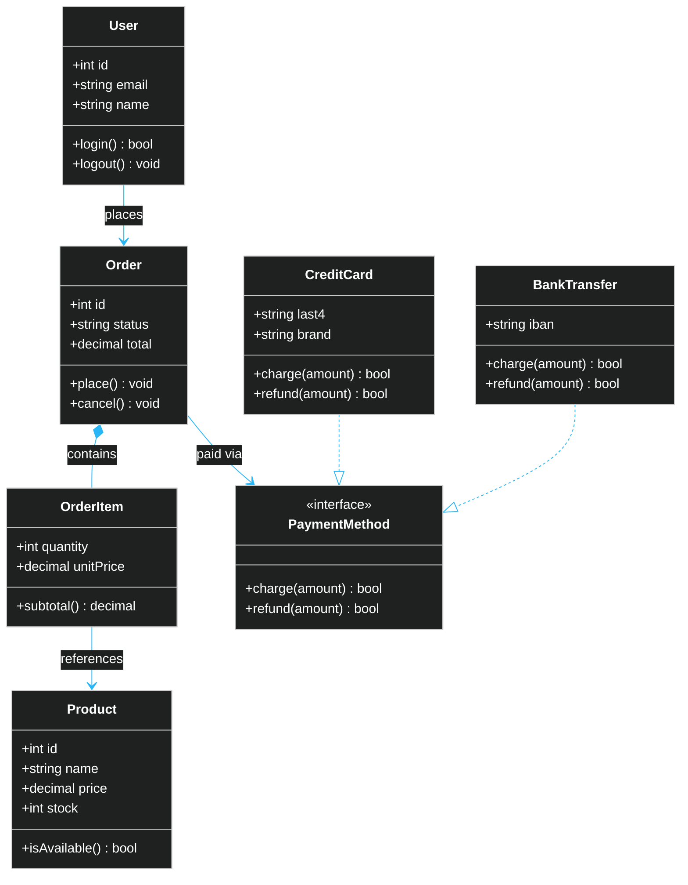

# Example — Mermaid `classDiagram`

> **Use when:** Showing how classes, interfaces, and objects relate — inheritance, composition, dependencies.

**Tool:** Mermaid | **Type:** classDiagram

---

## Example: E-Commerce Domain Model

---

## Relationship Symbol Reference

| Symbol | Relationship | Meaning |
| :--- | :--- | :--- |
| `A <\|-- B` | Inheritance | B extends A |
| `A *-- B` | Composition | B can't exist without A |
| `A o-- B` | Aggregation | B can exist independently |
| `A --> B` | Association | A uses B |
| `A ..> B` | Dependency | Weak / dashed usage |
| `A ..\|> B` | Realization | B implements interface A |

---

**Avoid:** Runtime behavior (use `sequenceDiagram`). Database tables (use `erDiagram`).
