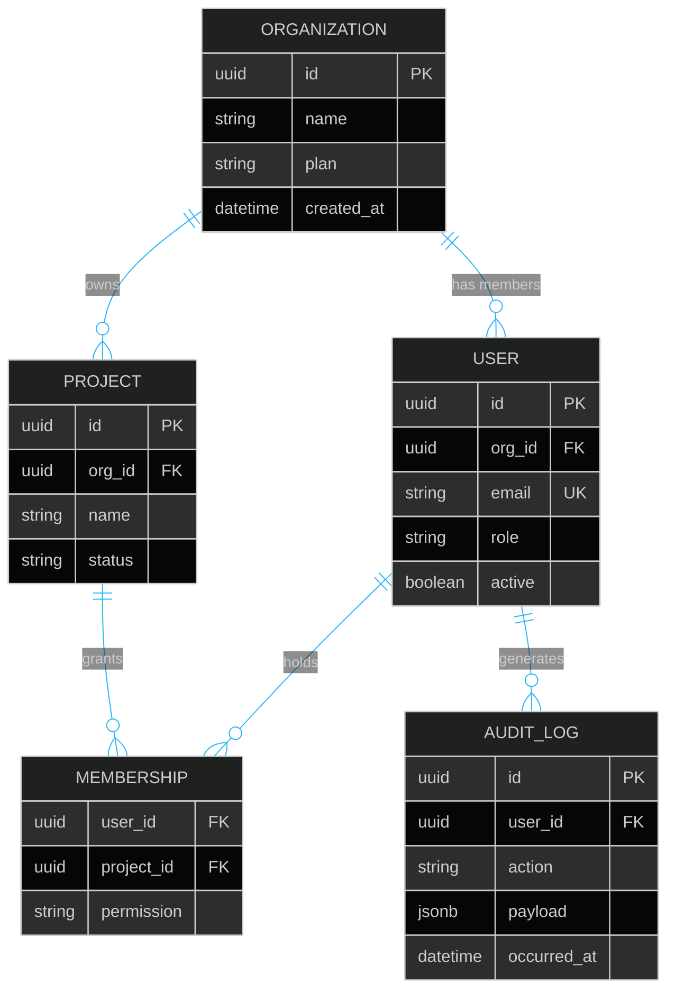

# Example — Mermaid `erDiagram`

> **Use when:** Documenting database tables and their relationships — one-to-many, many-to-many, foreign keys.

**Tool:** Mermaid | **Type:** erDiagram

---

## Example: SaaS Multi-Tenant Schema

---

## Cardinality Symbol Reference

| Symbol | Meaning |
| :--- | :--- |
| `\|\|` | Exactly one |
| `\|o` | Zero or one |
| `}o` | Zero or many |
| `}\|` | One or many |

**Pattern:** `LEFT_TABLE LEFT_CARD--RIGHT_CARD RIGHT_TABLE : "label"`

Example: `USER ||--o{ ORDER : "places"` → one user places zero or many orders.

---

**Avoid:** Code structure (use `classDiagram`). This is strictly for data/schema relationships.
