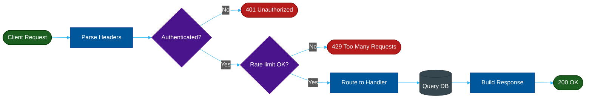

# Example — Mermaid `flowchart`

> **Use when:** Showing a process with decisions, branches, loops, or pipelines.

**Tool:** Mermaid | **Type:** flowchart | **Direction:** LR (left-right)

---

## Example: API Request Lifecycle

---

## Node Shape Reference

| Syntax | Shape | Use for |
| :--- | :--- | :--- |
| `A[text]` | Rectangle | Regular step |
| `A{text}` | Diamond | Decision / branch |
| `A([text])` | Stadium | Start / end terminal |
| `A((text))` | Circle | Event / trigger |
| `A[(text)]` | Cylinder | Database / storage |
| `A>text]` | Asymmetric | Tag / annotation |

## Direction Options

| Code | Direction |
| :--- | :--- |
| `TD` | Top → Down |
| `LR` | Left → Right |
| `BT` | Bottom → Top |
| `RL` | Right → Left |

---

**Avoid:** Time-ordered actor messages → use `sequenceDiagram` instead.
