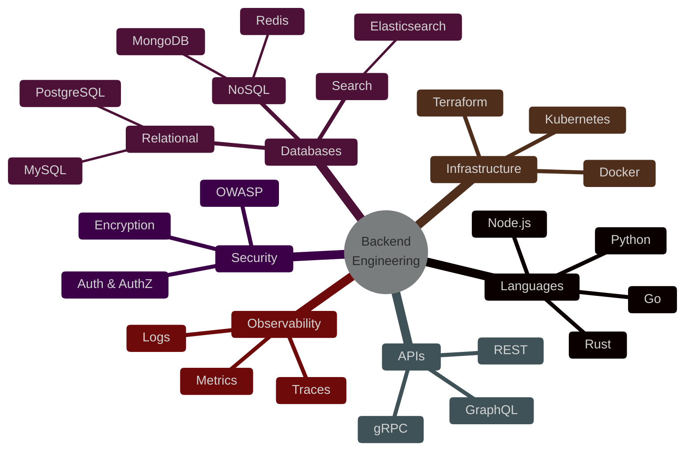

# Example — Mermaid `mindmap`

> **Use when:** Showing how concepts branch from a central idea — brainstorming, taxonomy, system overview.

**Tool:** Mermaid | **Type:** mindmap

---

## Example: Backend Engineering Skills Map

---

## Node Shape Reference

| Syntax | Shape | Use for |
| :--- | :--- | :--- |
| `((text))` | Circle | Root node |
| `(text)` | Rounded rectangle | Primary branch |
| `[text]` | Rectangle | Sub-branch |
| `))text((` | Cloud / bang | Highlight / callout |

---

**Avoid:** Directional relationships with labels — use `graph LR` instead. Mindmaps show hierarchy, not flow.
