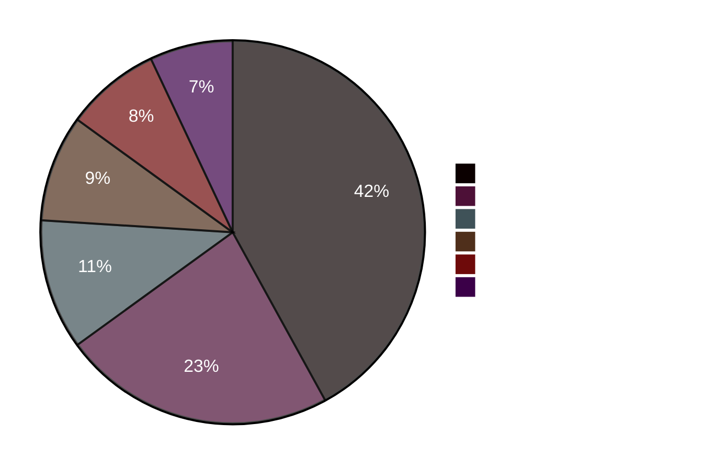
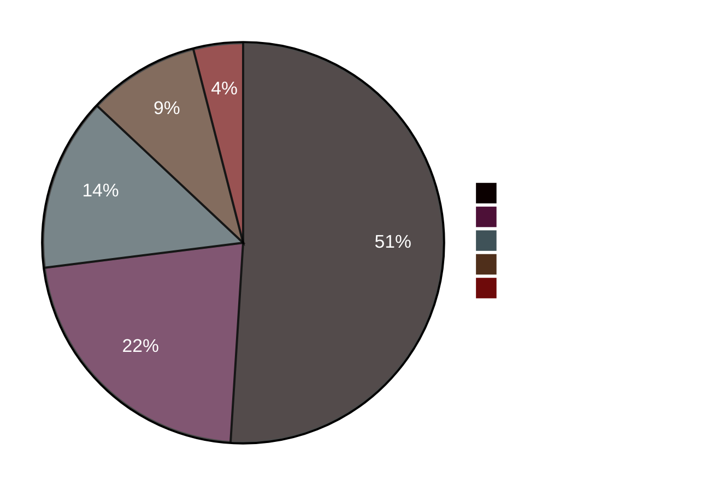

# Example — Mermaid `pie`

> **Use when:** Showing how a whole is divided into parts. Simple, no axes needed.

**Tool:** Mermaid | **Type:** pie

---

## Example: Infrastructure Cost Breakdown



---

## Example: API Error Distribution



---

## Key Syntax

```
pie title My Title
    "Label A" : 45
    "Label B" : 30
    "Label C" : 25
```

Values are relative weights — they do not need to sum to 100.

---

**Rule of thumb:** More than 6 slices → use `xychart-beta` bar chart instead. The human eye can't reliably compare more than 5–6 pie slices.
