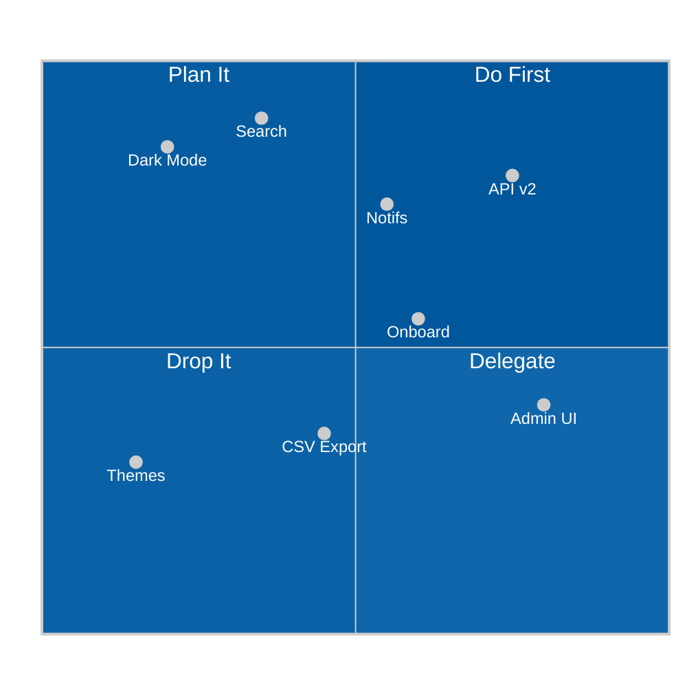

# Example — Mermaid `quadrantChart`

> **Use when:** Comparing options across two independent dimensions — effort vs. impact, risk vs. value.

**Tool:** Mermaid | **Type:** quadrantChart

---

## Example: Feature Prioritization Matrix



---

## Label Length Rules (prevents overflow)

| Element | Max Characters |
| :--- | :--- |
| Chart title | ≤ 20 chars |
| Axis labels (each side) | ≤ 15 chars |
| Quadrant labels | ≤ 15 chars |
| Point labels | ≤ 10 chars |

**Formula:** `Max point label = floor(chartWidth × 0.10)` — default chart is ~460px wide → ~10 chars max.

---

## Key Syntax

```
quadrantChart
    title My Title          ← ≤ 20 chars
    x-axis Low --> High     ← each side ≤ 15 chars
    y-axis Low --> High
    quadrant-1 TopRight     ← top-right quadrant label
    quadrant-2 TopLeft
    quadrant-3 BotLeft
    quadrant-4 BotRight
    Label: [x, y]           ← x, y in 0.0–1.0
```

---

**Avoid:** More than 8–10 data points. Exact numeric precision (use `xychart-beta`).
