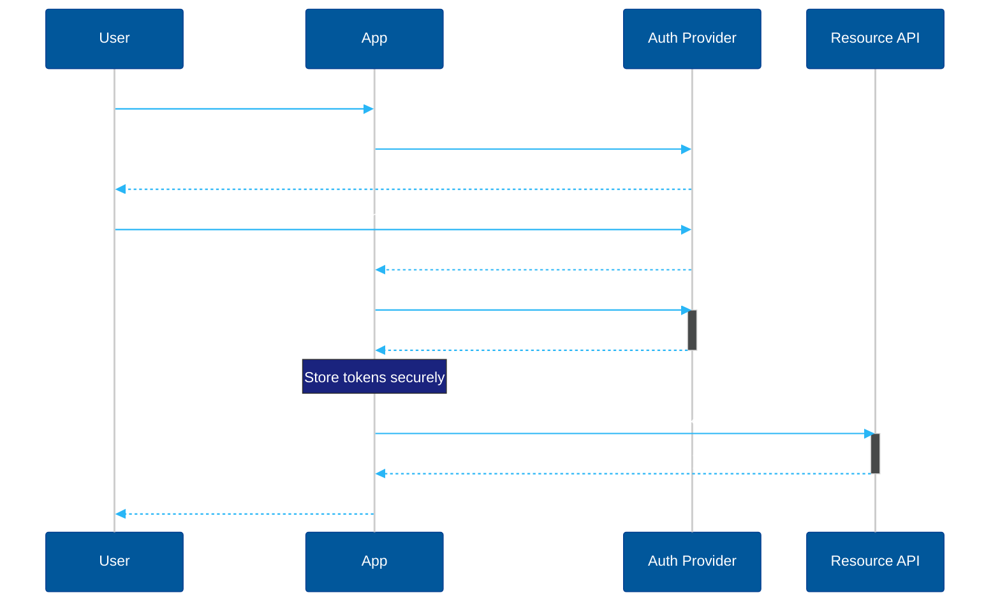

# Example — Mermaid `sequenceDiagram`

> **Use when:** Showing who talks to whom, in what order, and what they say. Time flows downward.

**Tool:** Mermaid | **Type:** sequenceDiagram

---

## Example: OAuth 2.0 Authorization Code Flow

---

## Key Syntax Reference

| Syntax | Meaning |
| :--- | :--- |
| `A->>B: msg` | Solid arrow — synchronous call |
| `A-->>B: msg` | Dashed arrow — async / return |
| `A-xB: msg` | X arrow — failure / rejection |
| `activate A` | Show active lifeline bar |
| `deactivate A` | End lifeline bar |
| `Note over A,B: text` | Annotation spanning actors |
| `loop Every 30s ... end` | Loop block |
| `alt cond ... else ... end` | Conditional block |
| `par ... and ... end` | Parallel execution block |

---

**Avoid:** More than 5–6 actors (becomes unreadable). Use `flowchart` for process logic without actors.
