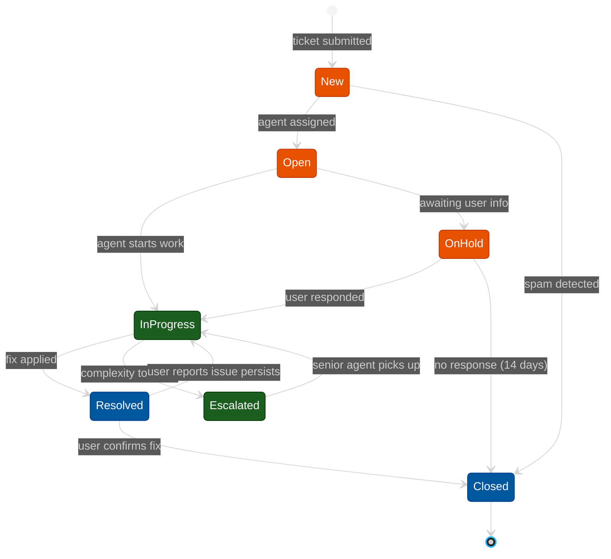

# Example — Mermaid `stateDiagram-v2`

> **Use when:** An object moves through discrete states and you want to show valid transitions between them.

**Tool:** Mermaid | **Type:** stateDiagram-v2

---

## Example: Support Ticket Lifecycle

---

## Key Syntax Reference

| Syntax | Meaning |
| :--- | :--- |
| `[*] --> State` | Initial transition (entry point) |
| `State --> [*]` | Final transition (exit point) |
| `A --> B : event` | Labeled transition |
| `state "Label" as S` | Rename a state |
| `state S <<choice>>` | Branch / fork point |
| `state S <<fork>>` | Parallel fork |
| `state S <<join>>` | Parallel join |

---

**Avoid:** Complex transition logic with conditions — use `flowchart` instead. More than 8–10 states on one diagram.
