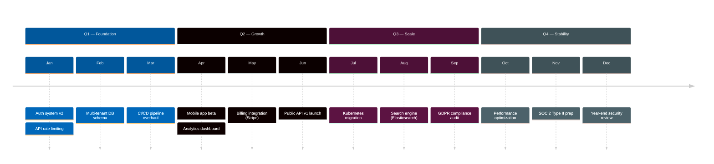
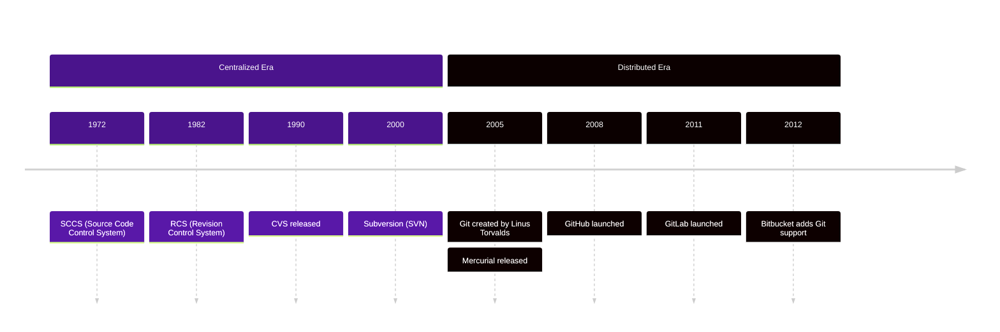

# Example — Mermaid `timeline`

> **Use when:** Showing events along a time axis with periods and milestones.

**Tool:** Mermaid | **Type:** timeline

---

## Example: Product Roadmap Q1–Q4



---

## Example: History of Version Control



---

## Key Syntax

```
timeline
    title My Title
    section Period Name
        Label : Event description
              : Second event (same label = same time point)
        Label2 : Another event
```

---

**Avoid:** Non-chronological data. Use `flowchart` if events have causal branches, not just time order.
