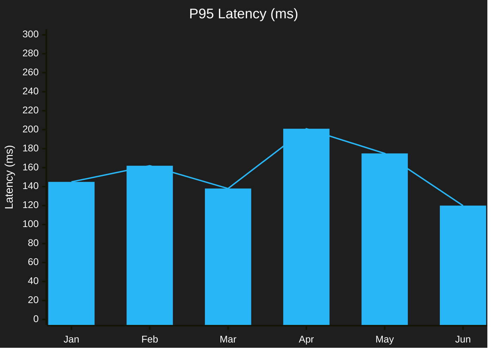
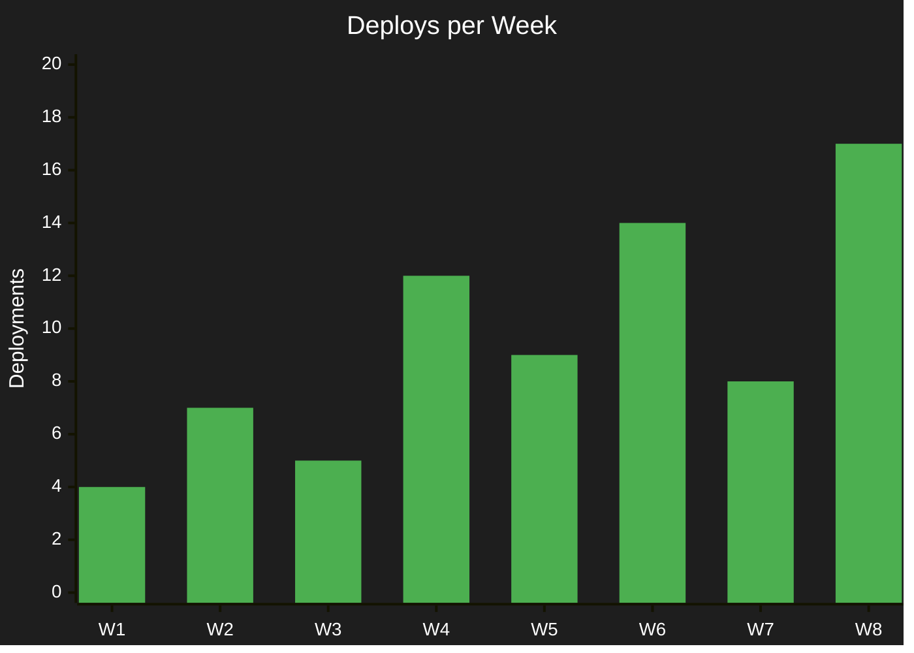

# Example — Mermaid `xychart-beta`

> **Use when:** Showing quantitative data trends over a category axis — benchmarks, request counts, latency over time.

**Tool:** Mermaid | **Type:** xychart-beta

---

## Example: API Latency Over 6 Months (Bar + Line)



---

## Example: Weekly Deployment Frequency



---

## Key Syntax

```
xychart-beta
    title "Chart Title"
    x-axis [Label1, Label2, Label3]
    y-axis "Axis Label" minVal --> maxVal
    bar  [v1, v2, v3]     ← bar chart series
    line [v1, v2, v3]     ← line overlay (optional)
```

Multiple `bar` or `line` entries = multi-series chart.

---

**Avoid:** Categorical relationships (use `flowchart` or `mindmap`). Fewer than 3 data points (use a table instead).
