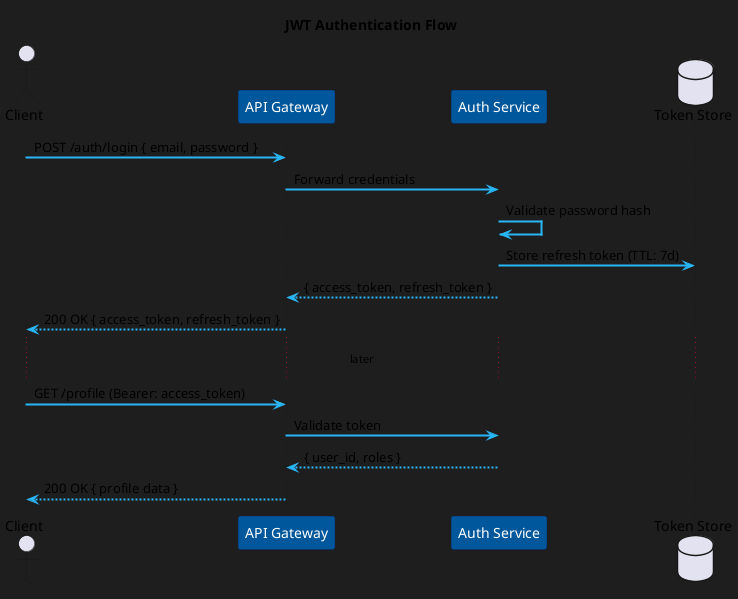
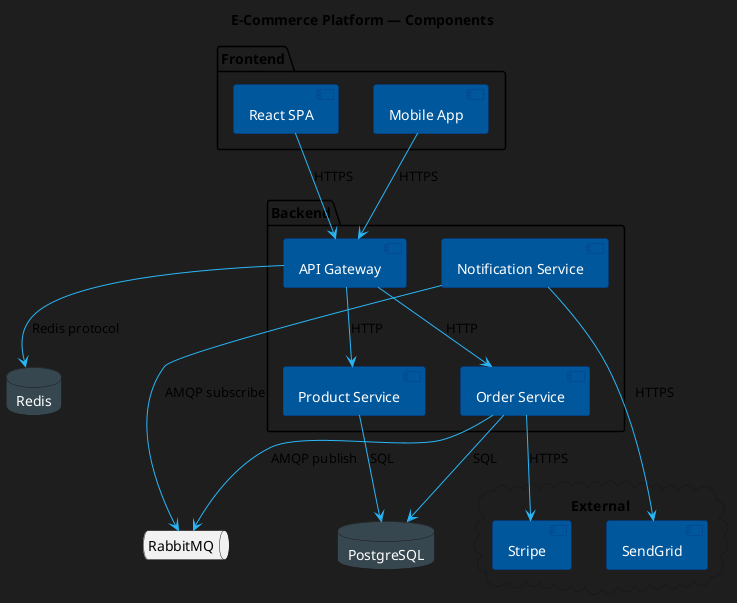
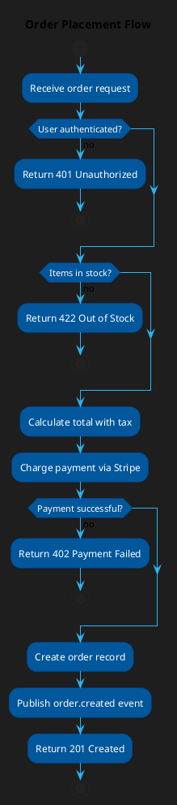
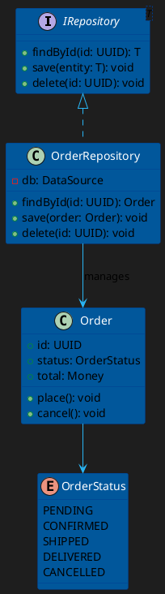

# Example — PlantUML

> **Use when:** You need richly typed diagrams (sequence, component, deployment, use case, activity) with fine-grained control over layout and styling. PlantUML is text-based and renders via a JAR, VS Code extension, or online server.

**Tool:** PlantUML | **Formats:** Sequence, Component, Deployment, Activity, Use Case, Class

---

## Setup

```bash
# Option 1: Docker (no local Java needed)
docker run -d -p 8080:8080 plantuml/plantuml-server

# Option 2: VS Code Extension
# Install "PlantUML" by jebbs → renders on save

# Option 3: CLI (requires Java)
java -jar plantuml.jar diagram.puml
```

---

## Example 1: Sequence Diagram



---

## Example 2: Component Diagram



---

## Example 3: Activity Diagram (Decision Flow)



---

## Example 4: Class Diagram



---

## PlantUML vs Mermaid — When to Choose

| Factor | PlantUML | Mermaid |
| :--- | :--- | :--- |
| Rendering | Requires server/JAR | Built into GitHub, Notion, Obsidian |
| Diagram types | More types (use case, deployment, object) | Fewer, but growing fast |
| Layout control | More precise | More automatic |
| Styling | Verbose `skinparam` system | Simple `%%{init}%%` block |
| Best for | Enterprise docs, fine-grained control | Markdown files, quick diagrams |
