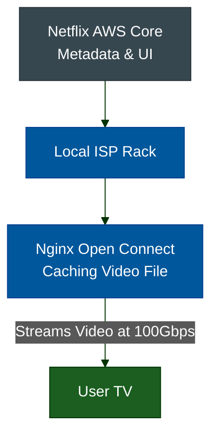
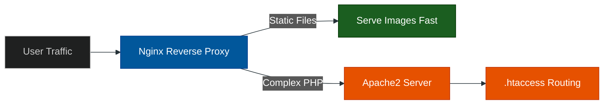

# The Classic Web Servers: Nginx & Apache2

**Author:** ichamrong  
**Category:** DevOps & Infrastructure  
**Read Time:** ~15 min  

---

## 📌 Table of Contents
- [1. Nginx (Engine-X)](#1-nginx-engine-x)
  - [What is it?](#what-is-it-1)
  - [Why use it?](#why-use-it-1)
  - [When to use it?](#when-to-use-it-1)
  - [Case Study #1: Netflix's Open Connect CDN](#case-study-1-netflixs-open-connect-cdn)
- [2. Apache2 (Apache HTTP Server)](#2-apache2-apache-http-server)
  - [What is it?](#what-is-it-1)
  - [Why use it?](#why-use-it-1)
  - [When to use it?](#when-to-use-it-1)
  - [Case Study #2: Enterprise CMS Scaling (Legacy)](#case-study-2-enterprise-cms-scaling-legacy)

---

## 1. Nginx (Engine-X)

### What is it?
Nginx is a high-performance HTTP web server, reverse proxy, and load balancer. It was built specifically to solve the "C10K problem" (handling 10,000 concurrent connections).

### Why use it?
It uses an asynchronous, event-driven architecture. Instead of creating a new heavy process or thread for every user (like older servers), Nginx uses a single worker thread to handle thousands of connections simultaneously. It is incredibly lightweight and consumes very little RAM.

### When to use it?
- As a **Reverse Proxy:** To sit in front of NodeJS, Python, or Go applications to handle SSL termination.
- As a **Load Balancer:** To distribute traffic across multiple backend servers using Round Robin or IP Hashing.
- As a **Static File Server:** It can serve images, CSS, and HTML instantly.

### Case Study #1: Netflix's Open Connect CDN
Netflix streams video to hundreds of millions of users. If all video came from Amazon AWS, the bandwidth costs would bankrupt them, and the latency would be terrible.
- **The Solution:** Netflix built "Open Connect" appliances—massive hard drives wrapped in custom Linux and **Nginx**. They ship these physical boxes to local ISPs (like Comcast or AT&T). 
- **The Result:** When you click play on Netflix, Nginx serves the video file directly from your local city, not from AWS. Nginx's asynchronous I/O is the only reason a single box can stream 100 Gbps of video concurrently.

---

## 2. Apache2 (Apache HTTP Server)

### What is it?
Apache is the grandfather of web servers. Historically, it ran the vast majority of the internet as part of the LAMP stack (Linux, Apache, MySQL, PHP). 

### Why use it?
Unlike Nginx, Apache uses a process-driven approach (using MPM worker/prefork). Its greatest strength is its dynamic module system and the `.htaccess` file, which allows directory-level configuration changes without restarting the main server.

### When to use it?
- When hosting shared environments (like CPanel) where 100 different websites need their own routing rules via `.htaccess`.
- When running legacy PHP applications (like massive WordPress multisite ecosystems) that rely heavily on Apache's `mod_rewrite`.

### Case Study #2: Enterprise CMS Scaling (Legacy)
A major news publisher (like The New York Times historically) ran massive WordPress ecosystems.
- **The Problem:** They had thousands of different journalists who needed specific directory permissions, custom redirects for old articles, and specific authentication protocols that changed daily.
- **The Solution:** They used Apache2 because the `.htaccess` file allowed them to inject routing changes directly into the file directories without restarting the global server.
- **The Modern Evolution:** Most companies have now placed **Nginx** *in front* of Apache. Nginx handles the thousands of static image requests, and passes the heavy, complex PHP requests back to Apache.

---

**Navigation:** [Next: Kong & Gravitee](./02-kong-and-gravitee.md) | [Gateways Index](./README.md)

*Last updated: 2026-05-17*

## Related

- [Network Protocols & API Architectures](../fundamentals/01-network-protocols-and-api-architectures.md)
- [Distributed Architecture Patterns](../../clean-code/software-architecture/distributed-patterns/README.md)
- [Observability & Monitoring](../observability/README.md)
