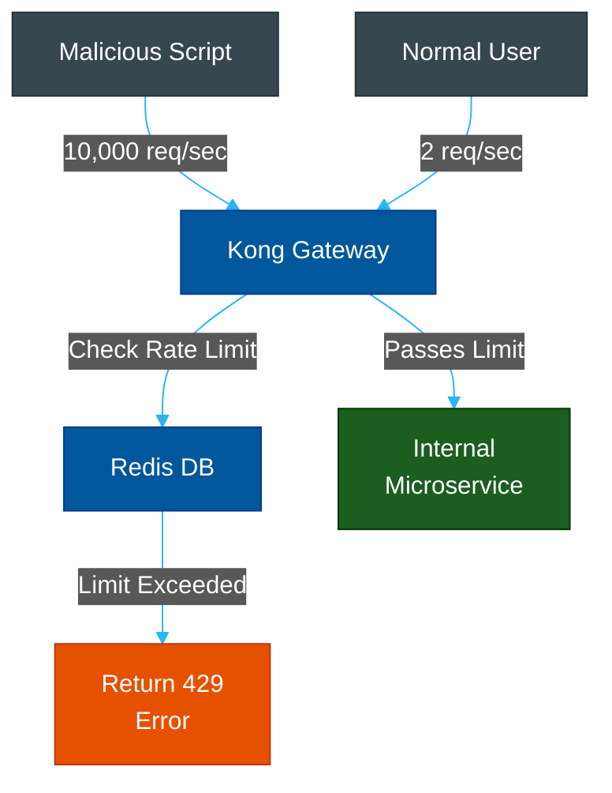
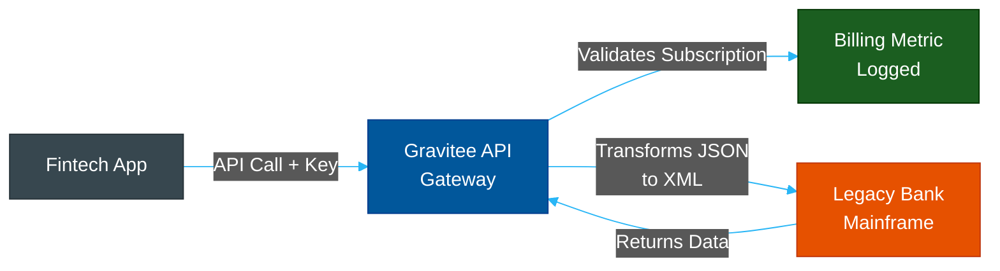

# Enterprise API Gateways: Kong, Gravitee & WSO2

**Author:** ichamrong  
**Category:** DevOps & Infrastructure  
**Read Time:** ~15 min  

---

## 📌 Table of Contents
- [1. What is an API Gateway?](#1-what-is-an-api-gateway)
- [2. Kong API Gateway](#2-kong-api-gateway)
  - [What is it?](#what-is-it-2)
  - [Why use it?](#why-use-it-2)
  - [Case Study #3: Spotify's Microservices Mesh](#case-study-3-spotifys-microservices-mesh)
- [3. Gravitee.io](#3-graviteeio)
  - [What is it?](#what-is-it-2)
  - [Why use it?](#why-use-it-2)
  - [Case Study #4: Fintech Open Banking (API Monetization)](#case-study-4-fintech-open-banking-api-monetization)
- [4. WSO2 API Manager](#4-wso2-api-manager)
  - [What is it?](#what-is-it-2)
  - [Why use it?](#why-use-it-2)
  - [Case Study #13: Government Citizen Portals (SOAP to REST)](#case-study-13-government-citizen-portals-soap-to-rest)

---

## 1. What is an API Gateway?
While Nginx is a fantastic reverse proxy for routing traffic, an **API Gateway** is a higher-level abstraction. It sits in front of your microservices and handles cross-cutting concerns: **Authentication (JWT/OAuth), Rate Limiting, Request Transformation, and Monetization/Billing.**

---

## 2. Kong API Gateway

### What is it?
Kong is an open-source, highly scalable API Gateway built *on top* of Nginx. It uses the OpenResty framework to execute Lua scripts inside Nginx, allowing incredible performance with dynamic plugins.

### Why use it?
If you have 50 microservices, you do not want to write rate-limiting and JWT validation code 50 times in 50 different languages. You use Kong. Kong intercepts the request, validates the token, checks the rate limit, and *then* passes it to your microservice.

### Case Study #3: Spotify's Microservices Mesh
Spotify has thousands of backend microservices (User Auth, Playlist Generator, Audio Streaming). 
- **The Problem:** If a malicious user writes a script to generate 10,000 playlists a second, the internal microservices would crash, causing a cascading failure.
- **The Solution:** Spotify places an API Gateway (like Kong) in front of their internal services. Kong uses a Redis-backed rate-limiting plugin to track User IDs.
- **The Result:** If the user exceeds 50 requests per second, Kong instantly rejects the request with a `429 Too Many Requests` error *before* the request ever touches the internal Java/Go microservices.

---

## 3. Gravitee.io

### What is it?
Gravitee is an open-source, Java-based API Gateway and comprehensive API Management platform. While Kong is highly focused on raw throughput and latency, Gravitee is focused on the **Developer Experience and Enterprise Governance**.

### Why use it?
Gravitee comes with a massive UI portal where developers can log in, view Swagger/OpenAPI documentation, subscribe to an API plan (e.g., $10/month for 10,000 API calls), and generate their own API keys. It handles the entire lifecycle of API Monetization.

### Case Study #4: Fintech Open Banking (API Monetization)
In the European Union, the PSD2 regulation requires banks to open up their customer data via APIs to third-party fintech apps (like Mint or Plaid).
- **The Problem:** A massive bank needs to expose legacy mainframe data safely. They also want to charge third-party apps for accessing premium data tiers.
- **The Solution:** The bank deploys Gravitee. Gravitee acts as the "Storefront." Plaid developers log into the Gravitee Developer Portal, read the API docs, and subscribe to a "Premium Tier." 
- **The Result:** When Plaid makes an API call, Gravitee validates their API key, logs the metric for monthly billing, and seamlessly transforms the bank's legacy XML data into modern JSON for the client.

---

## 4. WSO2 API Manager

### What is it?
WSO2 is a massive, open-source, Java-based API Management platform. While Kong is built for lightweight speed and Gravitee focuses on the developer portal, **WSO2 has deep roots in ESB (Enterprise Service Bus) architecture**. It excels at heavy, complex integrations and strict identity management.

### Why use it?
You use WSO2 when you are dealing with ancient, rigid enterprise environments (like Governments or massive Healthcare networks) that rely heavily on SOAP protocols, XML, and complex federated identity systems. WSO2 is not just a gateway; it is a full integration suite.

### Case Study #13: Government Citizen Portals (SOAP to REST)
- **The Problem:** A national government wants to create a unified "Citizen App" (for taxes, vehicle registration, and voting). However, the tax department uses a 20-year-old SOAP/XML backend, and the vehicle department uses an Oracle database. The mobile app developers only know how to consume modern REST/JSON APIs.
- **The Solution:** The government deploys **WSO2 API Manager** and its companion, **WSO2 Identity Server**.
- **The Result:** When the mobile app requests tax data, WSO2 intercepts the JSON request, translates it into a complex SOAP XML envelope, securely talks to the legacy tax mainframe, receives the XML response, translates it back to JSON, and sends it to the mobile app. It completely hides the legacy chaos from the mobile developers.

```mermaid
%%{init: {'theme': 'dark', 'themeVariables': {'primaryColor': '#01579b', 'primaryTextColor': '#ffffff', 'lineColor': '#29b6f6',
    'background': '#1e1e1e'},
  'themeCSS': 'svg { background-color: #1e1e1e !important; padding: 1rem !important; border-radius: 8px !important; } .edgeLabel rect { fill: #1e1e1e !important; } text, tspan, .messageText, .signalText, .edgeLabel, .edgeLabel span, .pointLabel, .axisLabel, .quadrantTitle, .quadrantLabel { fill: #ffffff !important; color: #ffffff !important; stroke: none !important; }'
}}%%
flowchart LR
    classDef mobile fill:#4a148c,stroke:#6a1b9a,color:#fff
    classDef wso2 fill:#01579b,stroke:#003c8f,color:#fff
    classDef legacy fill:#e65100,stroke:#bf360c,color:#fff
    
    A[Citizen<br/>Mobile App]:::mobile -->|Clean JSON| B[WSO2 API<br/>Manager]:::wso2
    B -->|Translates JSON<br/>to SOAP| C[WSO2 Enterprise<br/>Integrator]:::wso2
    C -->|Complex XML| D[1990s Tax<br/>Mainframe]:::legacy
    D -->|XML Response| C
```

---

**Navigation:** [Previous: Nginx & Apache](./01-nginx-and-apache.md) | [Next: Cloudflare](./03-cloudflare.md) | [Gateways Index](./README.md)

*Last updated: 2026-05-17*

## Related

- [Network Protocols & API Architectures](../fundamentals/01-network-protocols-and-api-architectures.md)
- [Distributed Architecture Patterns](../../clean-code/software-architecture/distributed-patterns/README.md)
- [Observability & Monitoring](../observability/README.md)
