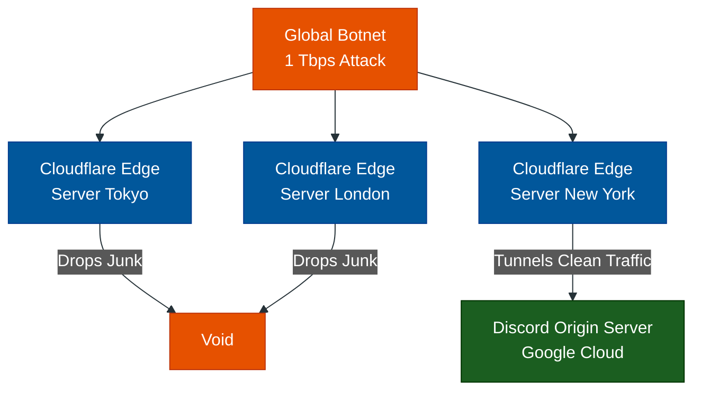

# The Edge & WAF: Cloudflare

**Author:** ichamrong  
**Category:** DevOps & Infrastructure  
**Read Time:** ~10 min  

---

## 📌 Table of Contents
- [1. What is Cloudflare?](#1-what-is-cloudflare)
- [2. Why use it? (The 3 Pillars)](#2-why-use-it-the-3-pillars)
- [3. Case Study #5: Discord Surviving Massive DDoS Attacks](#3-case-study-5-discord-surviving-massive-ddos-attacks)
- [4. How to implement it?](#4-how-to-implement-it)

---

## 1. What is Cloudflare?

Cloudflare is fundamentally different from Nginx or Kong. Nginx and Kong run on *your* servers inside *your* data center. 

Cloudflare is an **Edge Network**. It acts as a massive global proxy that sits between your users and your data center. When a user in Tokyo types in your URL, their request hits a Cloudflare server physically located in Tokyo, not your server in Virginia.

## 2. Why use it? (The 3 Pillars)

1. **CDN (Content Delivery Network):** It caches your images, CSS, and HTML globally. The Tokyo user downloads the image directly from the Tokyo edge server in 5ms, taking the load completely off your origin server.
2. **WAF (Web Application Firewall):** It inspects every incoming packet for SQL Injection, XSS, and botnets *before* the traffic is allowed to route to your servers.
3. **DDoS Protection:** Because Cloudflare's network capacity is larger than the internet bandwidth of entire countries, it can absorb massive volumetric attacks without blinking.

---

## 3. Case Study #5: Discord Surviving Massive DDoS Attacks

Discord handles billions of messages daily, operating primarily on WebSockets. Because it is highly popular in the gaming community, it is a constant target for massive DDoS (Distributed Denial of Service) attacks from rival gaming servers or malicious actors.

- **The Problem:** In a massive volumetric DDoS attack, a botnet of 100,000 hacked IoT devices sends 1 Terabyte per second (Tbps) of junk data to Discord's servers. No matter how powerful Discord's internal Nginx or HAProxy load balancers are, their internet pipe would physically melt. The data center would drop off the internet.
- **The Solution:** Discord's DNS points to **Cloudflare**, not Discord. 
- **The Execution:** 
  1. The botnet attacks the Discord IP, which is actually a Cloudflare IP.
  2. The 1 Tbps of junk traffic hits 200 different Cloudflare edge servers globally.
  3. Cloudflare's Anycast network absorbs the traffic, identifies the packet signatures as malicious, and silently drops them at the edge.
  4. The 0.01% of legitimate traffic is safely tunneled through to Discord's origin servers. Discord's internal servers never even knew an attack happened.

## 4. How to implement it?

Implementing Cloudflare is shockingly simple:
1. You go to your domain registrar (e.g., GoDaddy).
2. You change your Nameservers from GoDaddy's default to Cloudflare's Nameservers (`ns1.cloudflare.com`).
3. Now, Cloudflare owns your DNS. All traffic goes to them first. You point Cloudflare's DNS records to your server's secret Origin IP.

---

**Navigation:** [Previous: Kong & Gravitee](./02-kong-and-gravitee.md) | [Next: Coolify](./04-coolify.md) | [Gateways Index](./README.md)

*Last updated: 2026-05-17*

## Related

- [Network Protocols & API Architectures](../fundamentals/01-network-protocols-and-api-architectures.md)
- [Distributed Architecture Patterns](../../clean-code/software-architecture/distributed-patterns/README.md)
- [Observability & Monitoring](../observability/README.md)
