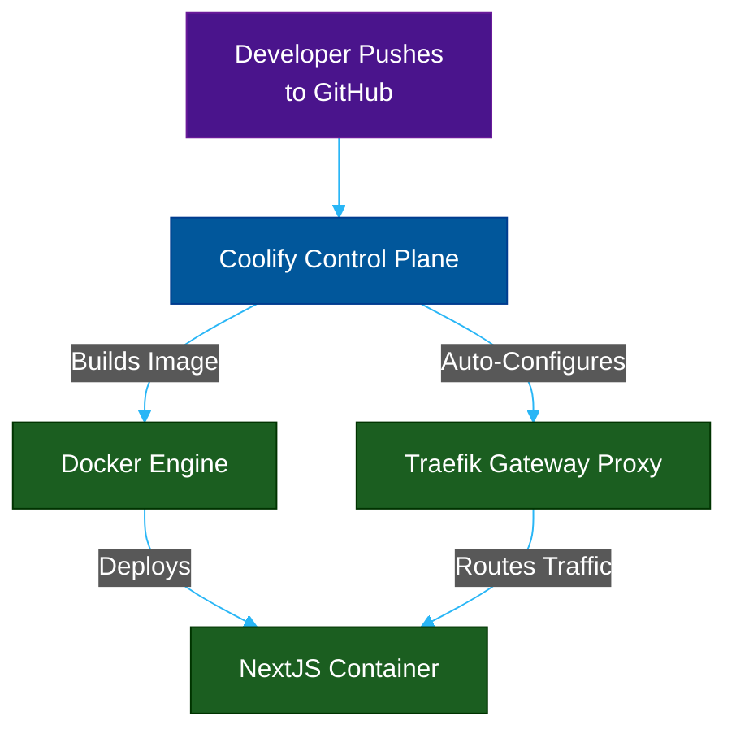

# The Self-Hosted PaaS: Coolify

**Author:** ichamrong  
**Category:** DevOps & Infrastructure  
**Read Time:** ~10 min  

---

## 📌 Table of Contents
- [1. What is Coolify?](#1-what-is-coolify)
- [2. Why use it?](#2-why-use-it)
- [3. Case Study #6: Startup Escaping the "Heroku Tax"](#3-case-study-6-startup-escaping-the-heroku-tax)
- [4. The Gateway Under the Hood](#4-the-gateway-under-the-hood)

---

## 1. What is Coolify?

Coolify is an open-source, self-hostable Platform as a Service (PaaS). It is an alternative to expensive cloud solutions like Heroku, Vercel, or Netlify. 

While Nginx, Kong, and Cloudflare are tools you must configure manually via code or config files, Coolify is a beautiful GUI (Graphical User Interface) that manages the underlying gateways and Docker infrastructure for you.

## 2. Why use it?

Setting up CI/CD, writing Dockerfiles, configuring Nginx reverse proxy routing, and managing Let's Encrypt SSL certificates is incredibly tedious for a small team. 
Coolify automates all of this. You give it a GitHub repository, and it automatically builds the code, provisions a Docker container, sets up a reverse proxy (usually Traefik or Caddy under the hood), and generates the SSL certificate with one click.

## 3. Case Study #6: Startup Escaping the "Heroku Tax"

Many startups begin their journey on Heroku or Vercel because of the amazing "Push to Deploy" Developer Experience (DX). 

- **The Problem:** Once the startup scales and needs to host multiple background workers, Redis databases, and NextJS frontends, the Heroku/Vercel bill spikes to $2,000+ per month. However, the startup does not have a dedicated DevOps engineer to build a Kubernetes cluster on raw AWS to save money.
- **The Solution:** The startup buys a bare-metal server from Hetzner or a massive EC2 instance from AWS for $100/month and installs **Coolify**.
- **The Execution:** Coolify connects to their GitHub. When a developer pushes code to the `main` branch, Coolify intercepts the webhook, builds the NextJS Docker image, deploys it on the $100/mo server, and automatically updates the internal Reverse Proxy Gateway to route traffic to the new container. 

The startup keeps the "Vercel-like" Developer Experience but drops their infrastructure bill by 90%.

## 4. The Gateway Under the Hood

Coolify itself is not a proxy; it is an orchestrator. It acts as the brain that manipulates the gateways. When you deploy an app, Coolify actually spins up a proxy (Traefik) and dynamically alters its routing table so that `my-app.chamrong.com` points precisely to Docker Container `ID: 98fbc1`.

---

**Navigation:** [Previous: Cloudflare](./03-cloudflare.md) | [Gateways Index](./README.md)

*Last updated: 2026-05-17*

## Related

- [Network Protocols & API Architectures](../fundamentals/01-network-protocols-and-api-architectures.md)
- [Distributed Architecture Patterns](../../clean-code/software-architecture/distributed-patterns/README.md)
- [Observability & Monitoring](../observability/README.md)
