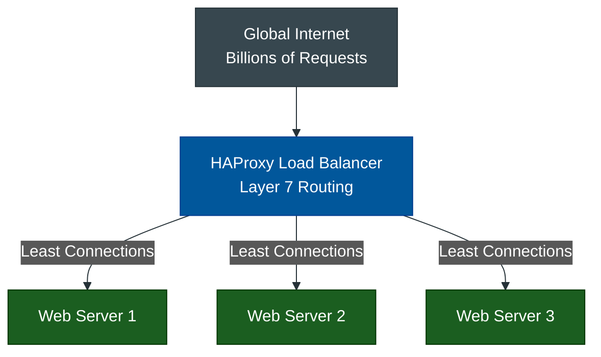
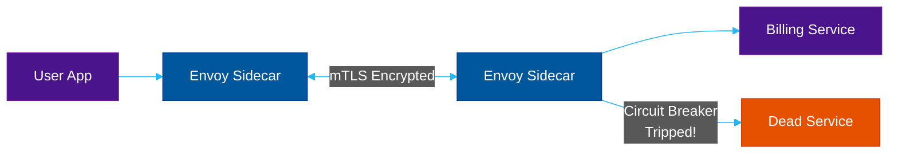

# Advanced Load Balancing & Service Meshes: HAProxy & Envoy

**Author:** ichamrong  
**Category:** DevOps & Infrastructure  
**Read Time:** ~15 min  

---

## 📌 Table of Contents
- [1. HAProxy (High Availability Proxy)](#1-haproxy-high-availability-proxy)
  - [What is it?](#what-is-it-1)
  - [Why use it?](#why-use-it)
  - [Case Study #7: Stack Overflow's Lean Architecture](#case-study-7-stack-overflows-lean-architecture)
- [2. Envoy Proxy & The Service Mesh](#2-envoy-proxy-the-service-mesh)
  - [What is it?](#what-is-it-1)
  - [Why use it? (The Sidecar Pattern)](#why-use-it-the-sidecar-pattern)
  - [Case Study #8: Lyft Moving to Microservices](#case-study-8-lyft-moving-to-microservices)

---

## 1. HAProxy (High Availability Proxy)

### What is it?
While Nginx is a "Web Server that can also do Load Balancing," HAProxy is a dedicated, pure, hyper-optimized **Load Balancer and Proxy server** for TCP (Layer 4) and HTTP (Layer 7). 

### Why use it?
It is legendary for its reliability, low memory footprint, and sheer throughput. It is used by some of the highest-traffic websites on Earth because it excels at keeping thousands of connections open while perfectly distributing traffic across backend servers based on highly advanced algorithms (Least Connections, Round Robin, URI Hashing).

### Case Study #7: Stack Overflow's Lean Architecture
Stack Overflow handles billions of page views a month. Unlike companies that use thousands of microservices, Stack Overflow famously runs a monolithic C# application.
- **The Problem:** They needed an incredibly fast way to distribute massive internet traffic to a very small pool of web servers (they run the site on fewer than 10 web servers).
- **The Solution:** They placed **HAProxy** at the edge of their infrastructure. 
- **The Result:** HAProxy handles the SSL termination and intelligently routes the raw HTTP traffic to the least-busy C# web server. Because HAProxy is so efficient, a single HAProxy machine can handle their entire global traffic load.

---

## 2. Envoy Proxy & The Service Mesh

### What is it?
Envoy is an open-source edge and **service proxy**, originally built by Lyft in C++. Unlike HAProxy or Nginx, which usually sit at the *edge* of a network (facing the internet), Envoy was designed for the **Service Mesh** (sitting *inside* the network, facing other internal servers).

### Why use it? (The Sidecar Pattern)
In a modern Kubernetes cluster with 500 microservices, Service A needs to talk to Service B. How do they handle retries, timeouts, circuit breaking, and mutual TLS encryption between them? 
Instead of writing that logic in Java for Service A and Node.js for Service B, you deploy an **Envoy Proxy as a "Sidecar"** next to every single microservice. The microservices only talk to their local Envoy, and the Envoys talk to each other. Tools like **Istio** are used as the control plane to manage all these Envoys.

### Case Study #8: Lyft Moving to Microservices
- **The Problem:** As Lyft grew, their PHP monolith couldn't scale. They broke it into hundreds of microservices written in different languages. Suddenly, debugging became impossible. If a ride failed, they couldn't trace which of the 20 microservices in the chain dropped the request.
- **The Solution:** They built and deployed **Envoy** next to every microservice.
- **The Result:** Envoy intercepted all internal traffic. It provided automatic distributed tracing, retries, and circuit breaking. If the "Billing Service" went down, Envoy automatically stopped sending traffic to it and returned a graceful error, preventing a cascading system failure.

---

**Navigation:** [Previous: Coolify](./04-coolify.md) | [Next: Traefik & Caddy](./06-traefik-and-caddy.md) | [Gateways Index](./README.md)

*Last updated: 2026-05-17*

## Related

- [Network Protocols & API Architectures](../fundamentals/01-network-protocols-and-api-architectures.md)
- [Distributed Architecture Patterns](../../clean-code/software-architecture/distributed-patterns/README.md)
- [Observability & Monitoring](../observability/README.md)
