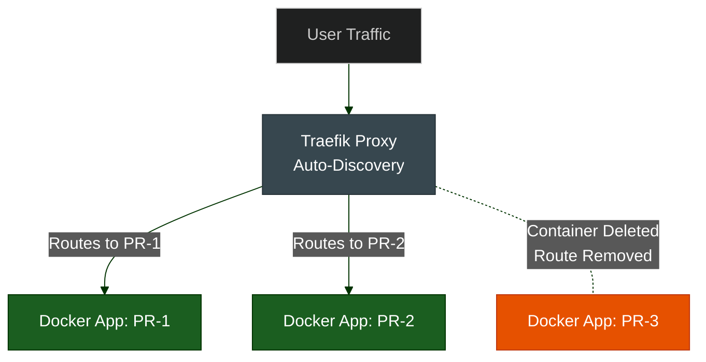
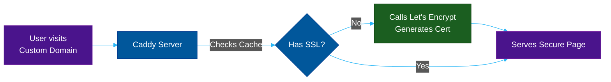

# Cloud-Native Auto-Proxies: Traefik & Caddy

**Author:** ichamrong  
**Category:** DevOps & Infrastructure  
**Read Time:** ~10 min  

---

## 📌 Table of Contents
- [1. Traefik (The Docker-Native Proxy)](#1-traefik-the-docker-native-proxy)
  - [What is it?](#what-is-it-1)
  - [Why use it?](#why-use-it-1)
  - [Case Study #9: Scaling CI/CD Review Environments](#case-study-9-scaling-cicd-review-environments)
- [2. Caddy Server (The HTTPS Machine)](#2-caddy-server-the-https-machine)
  - [What is it?](#what-is-it-1)
  - [Why use it?](#why-use-it-1)
  - [Case Study #10: Massive Multi-Tenant SaaS Routing](#case-study-10-massive-multi-tenant-saas-routing)

---

## 1. Traefik (The Docker-Native Proxy)

### What is it?
Traefik is a modern, HTTP reverse proxy and load balancer that makes deploying microservices incredibly easy. Unlike Nginx, which requires you to manually edit a static configuration file and restart the server every time you add a new app, **Traefik is dynamic.**

### Why use it?
Traefik continuously listens to your container orchestrator (Docker, Kubernetes, Docker Swarm). If you spin up a new Docker container with a label `traefik.http.routers.myapp.rule=Host('myapp.com')`, Traefik automatically discovers it, updates its own routing table instantly without restarting, and begins routing traffic.

### Case Study #9: Scaling CI/CD Review Environments
- **The Problem:** A startup wants to create a unique URL for every GitHub Pull Request (e.g., `pr-123.staging.com`) so QA can test features before merging. If they used Nginx, a DevOps engineer would have to write a script to rewrite `nginx.conf` and restart Nginx every time a PR is opened.
- **The Solution:** The startup uses **Traefik**. When the CI/CD pipeline spins up the PR's Docker container, it simply attaches a label. 
- **The Result:** Traefik detects the new container, requests an SSL certificate from Let's Encrypt automatically, and the PR is live in 5 seconds. When the PR is closed, the container is deleted, and Traefik automatically cleans up the route.

---

## 2. Caddy Server (The HTTPS Machine)

### What is it?
Caddy is an open-source, fast, memory-safe web server written in Go. Its defining feature is that it is the only web server that uses HTTPS automatically and by default.

### Why use it?
Before Caddy, setting up SSL certificates required running separate Certbot scripts, configuring cron jobs to renew them every 90 days, and handling domain validations. Caddy has Let's Encrypt integration baked directly into its core. You literally write a 2-line configuration file, and Caddy handles the SSL generation, renewal, and HTTP-to-HTTPS redirection automatically.

### Case Study #10: Massive Multi-Tenant SaaS Routing
- **The Problem:** A SaaS company (like Shopify or Substack) allows its users to map their own custom domains (e.g., `www.mycoolshop.com`) to the SaaS platform. The SaaS platform must generate and serve a valid SSL certificate for tens of thousands of custom domains dynamically.
- **The Solution:** They deploy **Caddy** via its "On-Demand TLS" feature.
- **The Result:** When a user visits `www.mycoolshop.com` for the very first time, Caddy intercepts the request, pauses it for 2 seconds, reaches out to Let's Encrypt, generates a custom SSL certificate, caches it, and serves the user. The SaaS company never has to manually manage SSL certificates for their users ever again.

---

**Navigation:** [Previous: HAProxy & Envoy](./05-haproxy-and-envoy.md) | [Next: Managed Cloud Gateways](./07-cloud-managed-gateways.md) | [Gateways Index](./README.md)

*Last updated: 2026-05-17*

## Related

- [Network Protocols & API Architectures](../fundamentals/01-network-protocols-and-api-architectures.md)
- [Distributed Architecture Patterns](../../clean-code/software-architecture/distributed-patterns/README.md)
- [Observability & Monitoring](../observability/README.md)
