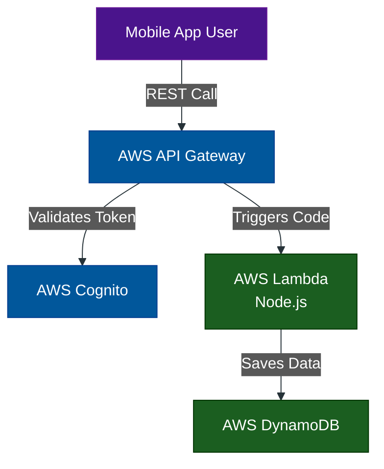
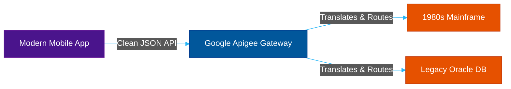

# Managed Enterprise Gateways: AWS & Google Apigee

**Author:** ichamrong  
**Category:** DevOps & Infrastructure  
**Read Time:** ~10 min  

---

## 📌 Table of Contents
- [1. The Managed Cloud Paradigm](#1-the-managed-cloud-paradigm)
- [2. AWS API Gateway](#2-aws-api-gateway)
  - [What is it?](#what-is-it-1)
  - [Why use it?](#why-use-it-1)
  - [Case Study #11: The Serverless Startup](#case-study-11-the-serverless-startup)
- [3. Google Apigee](#3-google-apigee)
  - [What is it?](#what-is-it-1)
  - [Why use it?](#why-use-it-1)
  - [Case Study #12: Telecom Legacy Modernization](#case-study-12-telecom-legacy-modernization)

---

## 1. The Managed Cloud Paradigm

Every gateway we have discussed so far (Nginx, Kong, HAProxy, Traefik) requires you to rent Linux servers, install the software, monitor CPU/RAM, and patch security vulnerabilities. 

**Managed Cloud Gateways** abstract all of this away. You do not manage servers. You simply define your API routes in a cloud dashboard, and Amazon or Google handles the scaling, whether you get 10 requests a day or 10 billion.

---

## 2. AWS API Gateway

### What is it?
A fully managed service from Amazon Web Services that makes it easy for developers to create, publish, maintain, monitor, and secure APIs at any scale.

### Why use it?
It is the ultimate glue for "Serverless" architecture. It natively integrates with AWS Lambda, DynamoDB, and Amazon Cognito (Authentication). You pay per API call, meaning if you have zero traffic, you pay $0.

### Case Study #11: The Serverless Startup
- **The Problem:** A mobile app startup wants to build a global backend without hiring a single DevOps engineer to manage Linux servers or Docker clusters.
- **The Solution:** The app's frontend calls **AWS API Gateway**.
- **The Result:** The API Gateway intercepts the request, validates the user's JWT token via AWS Cognito, and instantly spins up an **AWS Lambda function** to process the data and save it to DynamoDB. There are no servers running idle. When a viral marketing campaign sends 100,000 users to the app in an hour, AWS API Gateway auto-scales the infrastructure invisibly.

---

## 3. Google Apigee

### What is it?
Google acquired Apigee to provide an enterprise-grade, massive-scale API Management platform. It is similar to Gravitee but fully managed within Google Cloud Platform (GCP).

### Why use it?
Apigee is designed for massive legacy enterprises (Banks, Telecoms, Healthcare) that have thousands of ancient, messy backend systems. Apigee sits in front of all of them, wrapping them in modern REST APIs, providing heavy analytics, API monetization, and extreme security compliance (Oauth2, SAML).

### Case Study #12: Telecom Legacy Modernization
- **The Problem:** A massive telecommunications company has billing data stored in a 1980s mainframe, user data in Oracle databases, and network status in a modern microservice. They want to release a single unified Mobile App for their customers.
- **The Solution:** They deploy **Google Apigee** as the "facade." 
- **The Result:** The mobile app only talks to the Apigee Gateway using clean, modern JSON. Apigee intercepts the call and runs complex routing policies—fetching the billing data from the mainframe, formatting it, and combining it with the user data before sending a single clean response back to the phone.

---

**Navigation:** [Previous: Traefik & Caddy](./06-traefik-and-caddy.md) | [Next: Comparison Matrix](./08-gateway-comparison-matrix.md) | [Gateways Index](./README.md)

*Last updated: 2026-05-17*

## Related

- [Network Protocols & API Architectures](../fundamentals/01-network-protocols-and-api-architectures.md)
- [Distributed Architecture Patterns](../../clean-code/software-architecture/distributed-patterns/README.md)
- [Observability & Monitoring](../observability/README.md)
