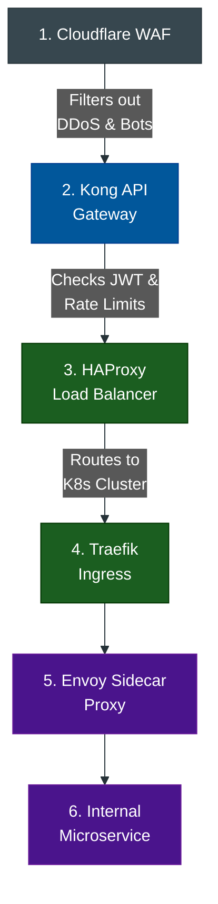

# The Ultimate Gateway Comparison Matrix

**Author:** ichamrong  
**Category:** DevOps & Infrastructure  
**Read Time:** ~10 min  

---

## 📌 Table of Contents
- [1. The Gateway Ecosystem Overview](#1-the-gateway-ecosystem-overview)
- [2. The Comprehensive Comparison Matrix](#2-the-comprehensive-comparison-matrix)
- [3. The Enterprise Deployment Pipeline](#3-the-enterprise-deployment-pipeline)

---

## 1. The Gateway Ecosystem Overview

If you are an architect tasked with building a modern enterprise system, selecting the right gateway is critical. You will rarely use just one. A mature infrastructure utilizes multiple layers of proxies to handle security, routing, and internal communication.

## 2. The Comprehensive Comparison Matrix

| Gateway | Primary Use Case | Key Strength | Weakness / When NOT to use |
| :--- | :--- | :--- | :--- |
| **Nginx** | Classic Reverse Proxy / Web Server | Extremely fast, low RAM, battle-tested. | Hard to update routing dynamically without reloading the config. |
| **Apache2** | Legacy CMS / PHP Routing | Dynamic `.htaccess` directory routing. | Process-heavy; struggles with massive concurrency (C10K). |
| **HAProxy** | Layer 4 / Layer 7 Load Balancing | The undisputed king of raw throughput. | Not an API Gateway; no built-in JWT or billing features. |
| **Kong** | Enterprise API Gateway | High performance (Nginx-based) + Lua plugins. | Can be complex to configure via its database (Cassandra/Postgres). |
| **Gravitee** | API Management & Monetization | Developer portals, API billing, legacy transformations. | Java-based (heavier than Go/C proxies). |
| **WSO2** | Heavy Enterprise Integration | Unbeatable for SOAP/XML to REST translations. | Very heavy, steep learning curve, requires deep Java expertise. |
| **Cloudflare** | Edge WAF & DDoS Protection | Stops attacks at the global edge before they hit you. | You must hand over your DNS to them. |
| **Traefik** | Docker/Kubernetes Auto-Proxy | Auto-discovers containers dynamically. | Overkill for a simple single-server static website. |
| **Caddy** | The "HTTPS Machine" | Auto-generates Let's Encrypt SSL by default. | Smaller plugin ecosystem compared to Nginx. |
| **Envoy (Istio)** | Microservice Mesh (Sidecar) | Observability and circuit-breaking between internal services. | Immensely complex; adds high operational overhead. |
| **AWS API Gateway** | Serverless Cloud Infrastructure | Pay-per-request, zero server management. | Vendor lock-in; expensive at massive, sustained scale. |
| **Coolify** | Self-Hosted PaaS (Vercel alternative) | Amazing GUI developer experience on cheap bare metal. | You are still responsible for server OS security updates. |

---

## 3. The Enterprise Deployment Pipeline

How do all of these tools fit together in a massive, Fortune 500 tech company? They act as sequential filters:

**The Breakdown of the Flow:**
1. **Cloudflare (The Shield):** The user's request hits Cloudflare in their local city. If it's an SQL injection or a DDoS bot, it is dropped instantly.
2. **Kong (The Bouncer):** The clean traffic arrives at the data center. Kong checks if the user has a valid API key and ensures they haven't exceeded their 100 requests/minute limit.
3. **HAProxy (The Traffic Cop):** Kong passes it to HAProxy, which looks at the CPU usage of 50 different servers and routes the request to the least busy one.
4. **Traefik (The Cluster Door):** The request enters the Kubernetes cluster. Traefik reads the URL path and decides which internal Docker container should handle it.
5. **Envoy (The Internal Communicator):** Before reaching the microservice code, Envoy intercepts the request to track tracing metrics. If the microservice needs to talk to a database, Envoy manages that encrypted connection.

---

**Navigation:** [Previous: Managed Cloud Gateways](./07-cloud-managed-gateways.md) | [Gateways Index](./README.md)

*Last updated: 2026-05-17*

## Related

- [Network Protocols & API Architectures](../fundamentals/01-network-protocols-and-api-architectures.md)
- [Distributed Architecture Patterns](../../clean-code/software-architecture/distributed-patterns/README.md)
- [Observability & Monitoring](../observability/README.md)
