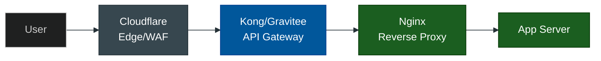

# API Gateways & Reverse Proxies: The Edge Infrastructure

**Author:** ichamrong  
**Category:** DevOps & Infrastructure  
**Read Time:** ~5 min  

---

## 1. The Gateway Ecosystem

In modern software architecture, users rarely communicate directly with your application servers. Between the open internet and your raw code sits a protective, routing, and optimizing layer: **The Gateway**.

Gateways take many forms, from simple web servers to massive, distributed Edge networks. They handle everything from SSL termination and load balancing to DDoS protection and API monetization.

## 2. The Infrastructure Library

This documentation suite categorizes the most powerful and popular gateways used in the industry, detailing exactly when to use them and how enterprise giants scale them.

| Gateway Category | Core Technologies | Document |
| :--- | :--- | :--- |
| **1. The Classic Web Servers** | Nginx, Apache2 | [View Guide](./01-nginx-and-apache.md) |
| **2. The Enterprise API Gateways** | Kong, Gravitee, WSO2 | [View Guide](./02-kong-and-gravitee.md) |
| **3. The Edge & WAF Layer** | Cloudflare | [View Guide](./03-cloudflare.md) |
| **4. The Self-Hosted PaaS** | Coolify | [View Guide](./04-coolify.md) |
| **5. High Availability & Meshes** | HAProxy, Envoy (Istio) | [View Guide](./05-haproxy-and-envoy.md) |
| **6. Dynamic Auto-Proxies** | Traefik, Caddy | [View Guide](./06-traefik-and-caddy.md) |
| **7. Managed Cloud** | AWS API Gateway, Google Apigee | [View Guide](./07-cloud-managed-gateways.md) |
| **8. The Master Comparison** | Summary Matrix & Ecosystem Flow | [View Matrix](./08-gateway-comparison-matrix.md) |

---

## 3. The Conceptual Flow

If you combine all these technologies, a massive enterprise architecture looks like this:

1. **Cloudflare (Edge):** Blocks malicious traffic and caches static images before it even reaches your data center.
2. **Kong/Gravitee (API Gateway):** Checks if the user has a valid JWT token and rate-limits them to 100 requests per minute.
3. **Nginx (Reverse Proxy):** Takes the clean request and load-balances it across 50 different internal Docker containers.

---

*Last updated: 2026-05-17*
