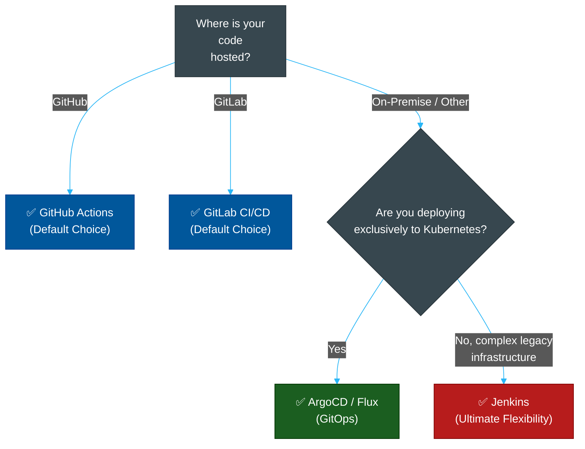

# 🔄 CI/CD Tool Comparison Matrix

> **Series:** DevOps › CI/CD Pipelines · **Level:** Reference · **Read Time:** ~10 min

---

## 📖 Table of Contents

- [1. The Evolution of CI/CD](#1-the-evolution-of-cicd)
- [2. Feature Comparison Matrix](#2-feature-comparison-matrix)
- [3. Decision Guide](#3-decision-guide)

---

## 1. The Evolution of CI/CD

1. **Generation 1 (Jenkins):** Standalone automation servers. You run the server, you maintain the plugins, you write complex scripts (Groovy) to define pipelines.
2. **Generation 2 (GitHub Actions / GitLab CI):** CI/CD is integrated directly into the Git repository. Pipelines are defined in YAML. The vendor manages the servers (Runners).
3. **Generation 3 (GitOps / ArgoCD):** Instead of the CI server *pushing* code to production, an agent runs *inside* production (Kubernetes) and constantly *pulls* the desired state from Git.

---

## 2. Feature Comparison Matrix

| Feature | Jenkins | GitHub Actions | GitLab CI/CD | CircleCI | ArgoCD (GitOps) |
| :--- | :--- | :--- | :--- | :--- | :--- |
| **Model** | Push | Push | Push | Push | **Pull** |
| **Hosting** | Self-Hosted | Managed SaaS / Self | Managed SaaS / Self | Managed SaaS | Self-Hosted in K8s |
| **Config Language** | Groovy (Jenkinsfile) | YAML | YAML | YAML | YAML (K8s Manifests)|
| **Plugin Ecosystem**| Massive (but brittle) | Massive (Marketplace) | Built-in features | Orbs | K8s native |
| **Primary Use Case**| Legacy / Complex jobs| Modern web apps | Enterprise platforms | Fast execution | Kubernetes deployment|
| **Cost** | Free (Pay for compute) | Free tier / Paid | Free tier / Paid | Paid (Expensive) | Free (Open Source) |

---

## 3. Decision Guide

### Strategic Recommendation
1. **The Modern Default:** Use **GitHub Actions**. If your code is on GitHub, it makes zero sense to pay for and maintain a separate CI/CD system. GitHub Actions is incredibly powerful, free for public repos, and has a massive marketplace of pre-built steps.
2. **The Unified Enterprise:** Use **GitLab CI/CD**. If you want a single pane of glass for issue tracking, code hosting, CI/CD, and security scanning, GitLab is arguably superior to GitHub.
3. **The Legacy Behemoth:** Use **Jenkins** only if you have massive, highly complex, cross-platform build requirements that cannot be expressed in simple YAML, or if you are legally required to host everything entirely offline behind a strict corporate firewall.
4. **The Kubernetes Future:** Use **ArgoCD** for deployment. You still use GitHub Actions to run your tests and build your Docker images (CI), but you use ArgoCD to actually deploy them to Kubernetes (CD).

## Related

- [Container Orchestration](../container-orchestration/README.md)
- [Infrastructure as Code](../infrastructure-as-code/README.md)
- [API Gateways & Reverse Proxies](../api-gateways/README.md)
