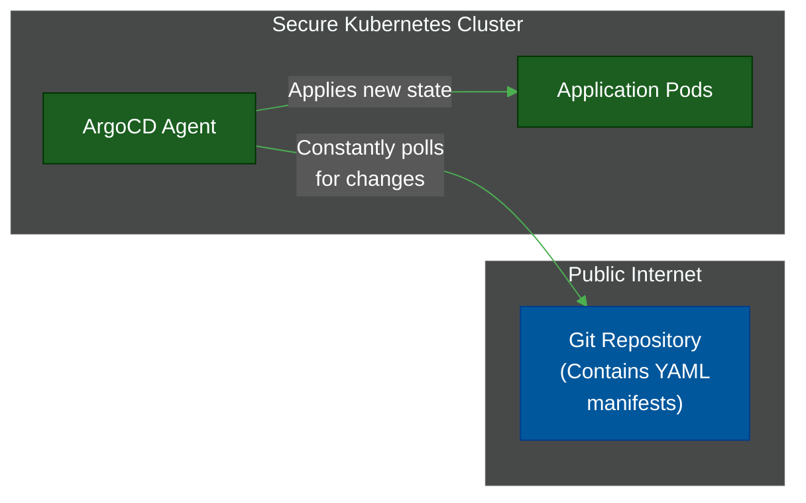

# ⚓ GitOps (ArgoCD & Flux)

> **Series:** DevOps › CI/CD Pipelines · **Level:** Advanced · **Read Time:** ~10 min

---

## 📖 Table of Contents

- [1. The Problem with "Push" Deployments](#1-the-problem-with-push-deployments)
- [2. What Is GitOps?](#2-what-is-gitops)
- [3. The "Pull" Architecture (ArgoCD)](#3-the-pull-architecture-argocd)
- [4. Drift Reconciliation (The Superpower)](#4-drift-reconciliation-the-superpower)
- [5. When to Use GitOps](#5-when-to-use-gitops)

---

## 1. The Problem with "Push" Deployments

In traditional CI/CD (Jenkins, GitHub Actions), deployment works like this:
1. GitHub Actions builds the Docker image.
2. GitHub Actions connects to the Kubernetes cluster using an admin credential.
3. GitHub Actions executes `kubectl apply` to **push** the new application state into the cluster.

**The Security Flaw:** This requires giving your CI/CD server "God Mode" credentials to your production environment. If GitHub Actions is compromised, the attacker has the keys to your entire production cluster.

---

## 2. What Is GitOps?

**GitOps** is a modern operational framework (popularized by Weaveworks) where **Git is the single source of truth** for your declarative infrastructure and applications.

Instead of an external server *pushing* changes into production, a GitOps agent (like ArgoCD or Flux) runs *inside* the secure production cluster and constantly *pulls* the desired state from a Git repository.

---

## 3. The "Pull" Architecture (ArgoCD)

1. **No Inbound Firewalls:** The Kubernetes cluster does not need to allow inbound traffic from GitHub Actions. ArgoCD just needs outbound internet access to read the Git repo.
2. **No Shared Credentials:** GitHub Actions never touches production. It only builds the Docker image and updates the version tag in the Git repository.

---

## 4. Drift Reconciliation (The Superpower)

What happens if a rogue developer bypasses the pipeline, SSHes into the Kubernetes cluster, and manually deletes a deployment using `kubectl delete deployment web-app`?

In traditional CI/CD, the app stays deleted until the next pipeline runs.

In **GitOps (ArgoCD)**, the agent notices **Drift**.
1. ArgoCD looks at Git: "Git says `web-app` should be running."
2. ArgoCD looks at Kubernetes: "`web-app` is missing!"
3. **Reconciliation:** ArgoCD instantly and automatically recreates `web-app` to match the Git repository, effectively healing the cluster and rejecting the manual change.

This ensures that the Git repository is the *absolute, unchangeable truth* of what is running in production.

---

## 5. When to Use GitOps

The two leading tools in the GitOps space are **ArgoCD** (excellent UI, widely adopted) and **FluxCD** (minimalist, heavily integrated with Flagger for progressive delivery).

### When to Choose GitOps
✅ **You use Kubernetes:** GitOps was born out of the Kubernetes declarative model.
✅ **High Security/Compliance:** You cannot allow external CI servers to have admin access to production.
✅ **Disaster Recovery:** If an entire data center burns down, you just spin up a new empty cluster, install ArgoCD, point it at your Git repo, and it recreates your entire architecture in minutes.

### When to Avoid GitOps
❌ **Not using Kubernetes:** While there are GitOps tools for non-K8s environments, the ecosystem is built entirely around K8s. If you deploy to AWS EC2 or Lambda, stick with Terraform + GitHub Actions.
❌ **Simple Projects:** Setting up a separate repository for infrastructure manifests and managing ArgoCD controllers is overkill for a small weekend project.

---

*← [GitLab CI/CD](./04-gitlab-ci.md) · [Back to Series Overview](./README.md) →*

## Related

- [Container Orchestration](../container-orchestration/README.md)
- [Infrastructure as Code](../infrastructure-as-code/README.md)
- [API Gateways & Reverse Proxies](../api-gateways/README.md)
