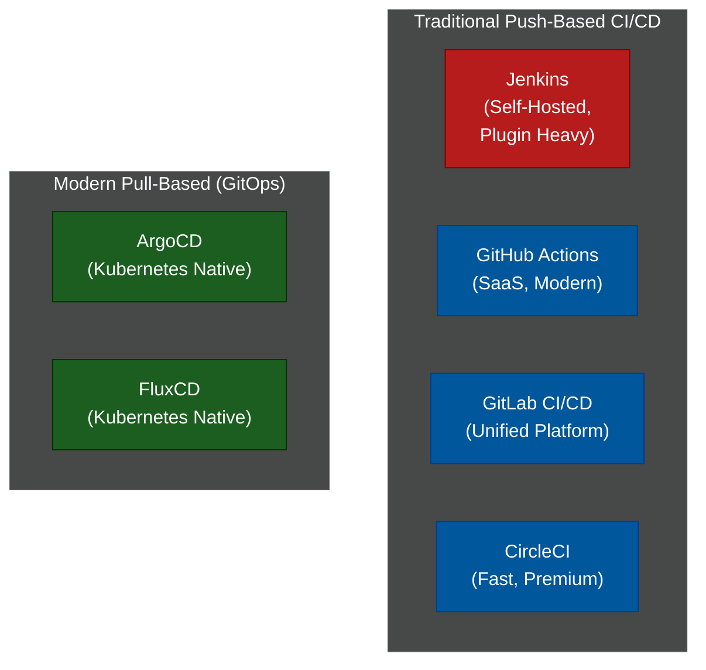

# 🚀 CI/CD Pipelines & GitOps

A comprehensive series on automating the testing, building, and deployment of modern software. The goal of CI/CD is to move code from a developer's laptop to production as safely and quickly as possible.

---

## 📖 Table of Contents

- [The CI/CD Lifecycle](#the-cicd-lifecycle)
- [📚 Module Index](#module-index)
- [The CI/CD Landscape](#the-cicd-landscape)

---

## The CI/CD Lifecycle

1. **Continuous Integration (CI):** The practice of automating the merging and testing of code. When a developer opens a Pull Request, the CI server automatically builds the app and runs unit tests. If tests fail, the PR cannot be merged.
2. **Continuous Delivery (CD):** Once code is merged, the server automatically builds the production artifacts (e.g., Docker images) and uploads them to a registry.
3. **Continuous Deployment (CD):** The final step where the artifact is automatically deployed to the production environment (AWS, Kubernetes) without human intervention.

---

## 📚 Module Index

| Module | Title | Level | Read Time | Key Topics |
| :--- | :--- | :--- | :--- | :--- |
| **01** | [CI/CD Comparison Matrix](./01-cicd-comparison.md) | Reference | ~10 min | Jenkins, GitHub Actions, GitLab CI, ArgoCD |
| **02** | [Jenkins — The Enterprise Veteran](./02-jenkins.md) | Intermediate | ~10 min | Groovy, Jenkinsfiles, Plugins, Self-Hosted |
| **03** | [GitHub Actions — Modern Standard](./03-github-actions.md) | Intermediate | ~8 min | YAML workflows, Marketplace, Runners |
| **04** | [GitLab CI/CD — The Unified Platform](./04-gitlab-ci.md) | Intermediate | ~8 min | `.gitlab-ci.yml`, Auto DevOps, Runners |
| **05** | [GitOps (ArgoCD & Flux)](./05-gitops-argocd.md) | Advanced | ~10 min | Pull vs Push, Kubernetes declarative state |

---

## The CI/CD Landscape

