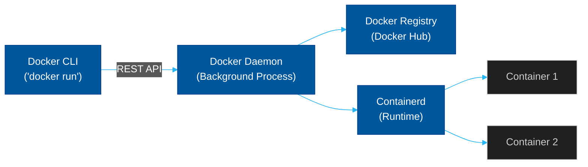

# 🐋 Docker & Container Runtimes

> **Series:** DevOps › Container Orchestration · **Level:** Intermediate · **Read Time:** ~10 min

---

## 📖 Table of Contents

- [1. Containers vs Virtual Machines](#1-containers-vs-virtual-machines)
- [2. How Containers Work (Namespaces & cgroups)](#2-how-containers-work-namespaces-cgroups)
- [3. The Docker Architecture](#3-the-docker-architecture)
- [4. Docker vs Podman](#4-docker-vs-podman)
- [5. CRI (Containerd & CRI-O)](#5-cri-containerd-cri-o)

---

## 1. Containers vs Virtual Machines

**Virtual Machines (VMs)** virtualize the *hardware*. A hypervisor (like VMware or VirtualBox) divides the physical CPU and RAM into smaller chunks. Each VM must boot its own heavy Guest Operating System (Windows, Ubuntu).
- **Pros:** Total isolation. High security.
- **Cons:** Slow to boot (minutes). Heavy resource footprint (GBs of RAM just for the OS).

**Containers** virtualize the *Operating System*. All containers on a server share the exact same underlying OS Kernel.
- **Pros:** Instant boot (milliseconds). Extremely lightweight (MBs of RAM).
- **Cons:** Slightly weaker isolation. A Linux container cannot run on a Windows kernel without a hidden VM (which is what Docker Desktop does).

---

## 2. How Containers Work (Namespaces & cgroups)

Containers are not a distinct "thing" in Linux. They are an illusion created by two core Linux kernel features:

1. **Namespaces:** These restrict what a process can *see*. When you put an app in a network namespace, it thinks it has its own IP address. When you put it in a PID namespace, it thinks it is process ID 1, completely unaware of other apps on the server.
2. **cgroups (Control Groups):** These restrict what a process can *use*. A cgroup ensures a container can only use a maximum of 512MB of RAM or 1 CPU core.

---

## 3. The Docker Architecture

Docker popularized containers in 2013 by providing a developer-friendly CLI. 

**The Dockerfile:** The recipe for building the image. It uses layers, meaning if you change line 50 of the Dockerfile, Docker only rebuilds from line 50 onwards, saving massive amounts of build time.

---

## 4. Docker vs Podman

**Podman** is a daemonless container engine developed by Red Hat. It is designed to be a drop-in replacement for Docker (`alias docker=podman`).

| Feature | Docker | Podman |
| :--- | :--- | :--- |
| **Architecture** | Client/Server (Requires Daemon) | Daemonless (Direct execution) |
| **Security** | Daemon runs as `root` | Rootless by default |
| **Systemd Support**| No | Yes (Native systemd integration) |
| **Ecosystem** | Massive (Docker Desktop, Swarm) | Podman Desktop |

> **Why it matters:** Docker's daemon running as `root` is a security risk. If a hacker breaks out of a container, they gain root access to the host server. Podman's rootless, daemonless architecture is significantly safer for enterprise production servers.

---

## 5. CRI (Containerd & CRI-O)

In the early days, Kubernetes relied entirely on Docker to run containers. However, Docker is a massive, heavy application designed for humans. Kubernetes doesn't need the Docker CLI or Docker Build; it just needs something to run the containers.

Kubernetes created the **CRI (Container Runtime Interface)** to standardize how it talks to runtimes.
Docker eventually extracted its core runtime into a standalone project called **containerd**. 

Today, Kubernetes has completely removed "Docker" support. Instead, modern Kubernetes clusters use **containerd** or **CRI-O** directly. They are much faster, lighter, and more secure than running the full Docker daemon.

*(Note: Docker images are OCI-compliant, meaning an image built with Docker on your laptop runs perfectly on containerd inside Kubernetes).*

---

*← [Series Overview](./README.md) · Next: [Kubernetes Architecture](./02-kubernetes-architecture.md) →*

## Related

- [CI/CD Pipelines](../cicd-pipelines/README.md)
- [Infrastructure as Code](../infrastructure-as-code/README.md)
- [Observability & Monitoring](../observability/README.md)
