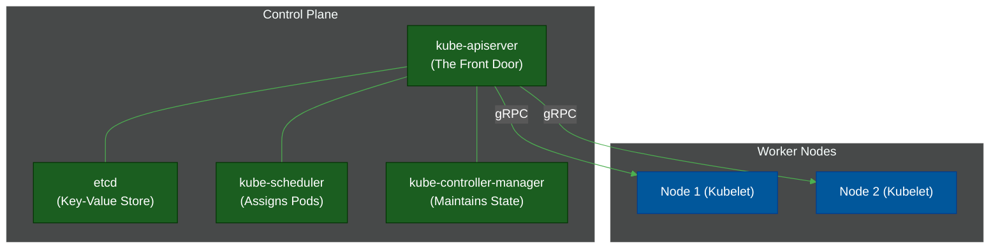

# ☸️ Kubernetes Architecture

> **Series:** DevOps › Container Orchestration · **Level:** Advanced · **Read Time:** ~12 min

---

## 📖 Table of Contents

- [1. What Is Kubernetes?](#1-what-is-kubernetes)
- [2. The Desired State Paradigm](#2-the-desired-state-paradigm)
- [3. The Control Plane (The Brain)](#3-the-control-plane-the-brain)
- [4. The Worker Nodes (The Brawn)](#4-the-worker-nodes-the-brawn)
- [5. Core Kubernetes Objects](#5-core-kubernetes-objects)

---

## 1. What Is Kubernetes?

**Kubernetes (K8s)** is an open-source container orchestration platform originally developed by Google (based on their internal system, Borg). 

If Docker's job is to run a *single* container on a *single* machine, Kubernetes' job is to manage *thousands* of containers across a cluster of *hundreds* of machines, treating the entire datacenter as a single, giant computer.

---

## 2. The Desired State Paradigm

Kubernetes is built entirely on a **declarative, desired-state model**.

You do not tell Kubernetes: *"Start a new container on Server 3."*
Instead, you give Kubernetes a YAML file that says: *"I desire 3 copies of the WebApp container to be running at all times."*

Kubernetes constantly runs reconciliation loops. If a server catches fire and destroys 1 of those containers, Kubernetes notices that the *Current State (2)* does not match the *Desired State (3)*, and it automatically schedules a replacement container on a healthy server.

---

## 3. The Control Plane (The Brain)

The Control Plane is the set of components that make global decisions about the cluster.

1. **kube-apiserver:** The only component that you (or internal components) talk to. All commands go through here.
2. **etcd:** A highly available, distributed key-value store. It is the absolute source of truth for all cluster data. If `etcd` dies, the cluster is dead.
3. **kube-scheduler:** Watches for newly created Pods that have no assigned node, and selects the best node for them to run on (based on CPU/RAM availability).
4. **kube-controller-manager:** Runs the infinite loops that compare Desired State to Current State and makes fixes.

---

## 4. The Worker Nodes (The Brawn)

Worker nodes are the actual servers (EC2 instances, physical hardware) where your application containers run.

1. **kubelet:** The primary agent running on every node. It talks to the `kube-apiserver` and ensures the containers it was assigned are actually running and healthy.
2. **kube-proxy:** Manages networking rules (iptables/IPVS) on the node to allow communication between containers and the internet.
3. **Container Runtime:** The software that actually runs the containers (e.g., `containerd` or `CRI-O`).

---

## 5. Core Kubernetes Objects

You define your desired state using YAML manifests representing K8s Objects.

### 1. Pod
The smallest deployable unit in Kubernetes. A Pod is a wrapper around one or more containers that share the same network IP and storage volumes. (You rarely create single Pods directly; you use Deployments).

### 2. Deployment
A higher-level abstraction that manages ReplicaSets. Deployments allow you to declaratively update your application. When you change the image version from `v1` to `v2`, the Deployment orchestrates a rolling update, bringing up `v2` Pods before terminating `v1` Pods to ensure zero downtime.

### 3. Service
Pods are ephemeral. They die, and when they are reborn, they get a new IP address. A **Service** provides a stable, permanent IP address and load-balances traffic across all healthy Pods. 
*(E.g., The frontend app always talks to `http://backend-service`, and Kubernetes routes that to a live backend Pod).*

### 4. Ingress
An API object that manages external access to the services in a cluster (HTTP/HTTPS). It acts as an API Gateway/Reverse Proxy, handling SSL termination and URL-based routing (e.g., routing `example.com/api` to the backend service, and `example.com/` to the frontend service).

---

*← [Docker & Runtimes](./01-containers-docker.md) · Next: [Helm vs Kustomize](./03-helm-vs-kustomize.md) →*

## Related

- [CI/CD Pipelines](../cicd-pipelines/README.md)
- [Infrastructure as Code](../infrastructure-as-code/README.md)
- [Observability & Monitoring](../observability/README.md)
