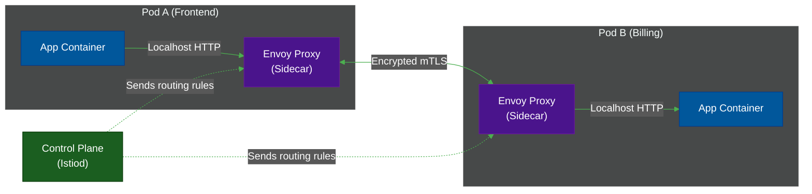

# 🕸️ Service Meshes (Istio)

> **Series:** DevOps › Container Orchestration · **Level:** Advanced · **Read Time:** ~10 min

---

## 📖 Table of Contents

- [1. The Microservice Network Problem](#1-the-microservice-network-problem)
- [2. What Is a Service Mesh?](#2-what-is-a-service-mesh)
- [3. The Sidecar Architecture](#3-the-sidecar-architecture)
- [4. Key Capabilities (mTLS & Routing)](#4-key-capabilities-mtls-routing)
- [5. When to Use (and Avoid) a Service Mesh](#5-when-to-use-and-avoid-a-service-mesh)

---

## 1. The Microservice Network Problem

In a modern Kubernetes cluster, you might have hundreds of microservices talking to each other. 
1. **Security:** How do you ensure that the traffic between `Frontend` and `Billing` is encrypted?
2. **Reliability:** What if the `Inventory` service is slow? How do you implement automatic retries and circuit breakers so the whole app doesn't crash?
3. **Observability:** How do you get a visual map of which services are talking to which, and where the latency is?

Traditionally, developers had to write all this logic *inside* their application code (e.g., using Java libraries like Netflix Hystrix). This meant every team had to maintain complex networking code in Node.js, Python, and Go.

---

## 2. What Is a Service Mesh?

A **Service Mesh** (like **Istio** or **Linkerd**) moves all of that complex networking logic *out* of the application code and pushes it down into the infrastructure layer. 

The developers just write code that makes a dumb HTTP call to `http://billing-service`. The Service Mesh intercepts that call, encrypts it, adds a retry policy, tracks the tracing ID, and securely routes it to the destination.

---

## 3. The Sidecar Architecture

Service Meshes achieve this using the **Sidecar Pattern**.

When a Pod starts, the Service Mesh automatically injects a second container into the Pod (the **Sidecar Proxy**, usually **Envoy**). 
The application container only talks to its local proxy (over localhost). The proxies handle all the actual network communication between Pods.

---

## 4. Key Capabilities (mTLS & Routing)

### Mutual TLS (mTLS)
In a zero-trust network, traffic inside the cluster must be encrypted. A service mesh automatically issues TLS certificates to every proxy. When Pod A talks to Pod B, the proxies automatically establish a secure, encrypted mTLS tunnel. The application code is completely unaware of this encryption.

### Advanced Traffic Routing
Because the proxies control all traffic, you can perform highly advanced routing rules:
- **Canary Deployments:** "Route exactly 5% of traffic to the `v2` version of the Billing service, and 95% to `v1`."
- **Fault Injection:** "Deliberately delay 10% of requests by 5 seconds to test how the frontend handles latency."
- **Circuit Breaking:** "If the Inventory service fails 3 times in a row, stop sending traffic to it for 1 minute to let it recover."

---

## 5. When to Use (and Avoid) a Service Mesh

| Feature | Istio | Linkerd |
| :--- | :--- | :--- |
| **Complexity** | Extremely High | Very Low |
| **Features** | Everything imaginable | Core features only |
| **Resource Usage**| Heavy (Envoy is powerful) | Ultra-lightweight (Rust proxy) |

### Strategic Recommendation
- **Avoid It Initially:** Service Meshes add an incredible amount of complexity and latency (because every network hop now goes through two proxies). If you only have 5 microservices, you do not need a service mesh.
- **Use Linkerd for mTLS:** If your security team mandates that all internal Kubernetes traffic must be encrypted, use **Linkerd**. It is dramatically easier to install and manage than Istio.
- **Use Istio for Enterprise Scale:** If you have 500 microservices, dedicated platform engineering teams, and require advanced traffic splitting for canary deployments, **Istio** is the industry standard.

*(Note: The industry is slowly moving toward "Sidecarless" data planes like Istio Ambient Mesh and Cilium, leveraging eBPF in the Linux kernel to achieve these features without injecting a proxy into every single Pod).*

---

*← [Helm vs Kustomize](./03-helm-vs-kustomize.md) · [Back to Series Overview](./README.md) →*

## Related

- [CI/CD Pipelines](../cicd-pipelines/README.md)
- [Infrastructure as Code](../infrastructure-as-code/README.md)
- [Observability & Monitoring](../observability/README.md)
